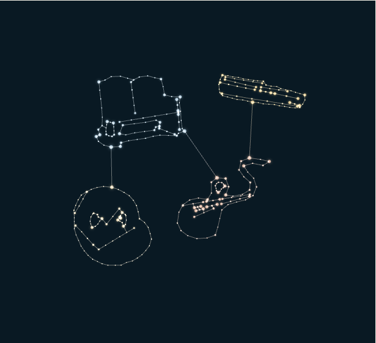
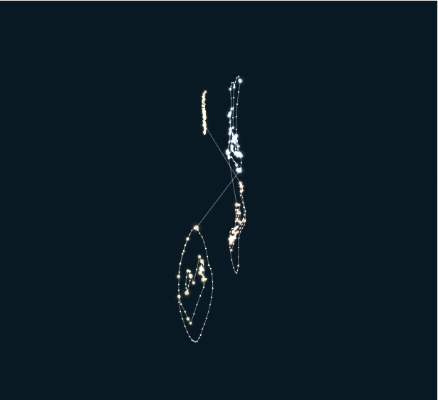
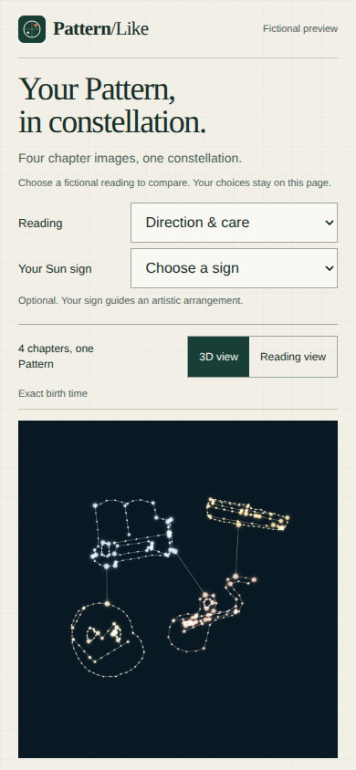
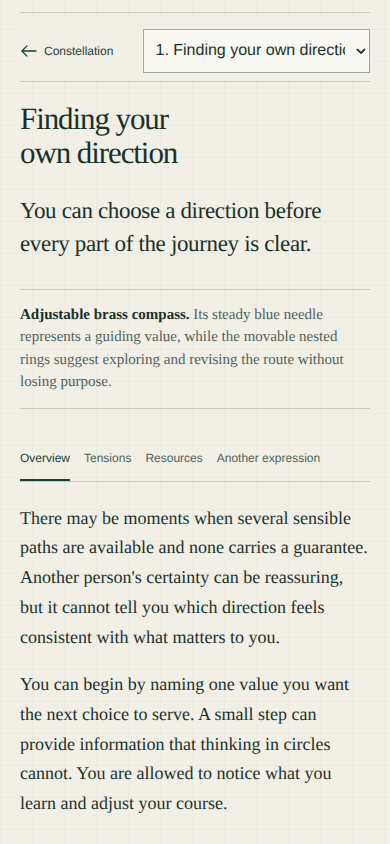
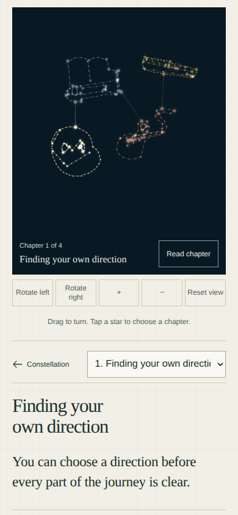

# Pattern portrait: rendering, interaction, and experience review

Date: 2026-09-06. Status: review complete; redesign proposed; implementation unchanged.

The current portrait has a useful reading and accessibility foundation, but the 3D experience is too shallow to carry the product. Rotation reveals the limits of the contour drawing, while most interaction happens in the adjacent reader. The next iteration should be a volumetric portrait with a hierarchy of exploration: whole portrait → chapter → reading facet → exact passage, with an explicit return path.

The [redesign specification](../superpowers/specs/2026-09-06-pattern-portrait-experience-redesign.md) defines the recommended replacement, its asset requirements, interaction states, mobile behavior, and acceptance gates.

## Scope and evidence

- Reviewed source: `codex/pattern-portrait`, commit `82d5dd9fd3ff406bcec985411dc58fcbf2bf3432`, in `.worktrees/pattern-portrait`. This feature is absent from the current root checkout's `main` at `e3d794d`.
- Rendered target: [public fictional preview](https://patternlike-portrait-preview.lfd.workers.dev/), “Direction & care,” with the default arrangement.
- Browser: installed Chromium through Playwright CLI; the Browser plugin was unavailable. Rendering used SwiftShader, so this is not a hardware performance benchmark.
- Viewports: 1440 × 1000, 390 × 844 with touch emulation, and a 320 × 740 reflow check.
- The live entry HTML, entry JavaScript, and stylesheet matched the local `dist-portrait` files byte for byte. See [asset verification](artifacts/2026-09-06-portrait-review/asset-verification.json). This is asset evidence, not a fresh build or production account deployment attestation.
- All screenshots linked below were captured and inspected during this review. Mobile screenshots were recaptured after scrolling settled.
- Account creation, authenticated downloads, all twelve Sun arrangements, physical mobile devices, Safari, and screen-reader operation were not exercised. Account and source-binding observations are source review only.

Captured flow:

1. Open the desktop and mobile entry screens and inspect the first viewport.
2. Reset, rotate through a quarter-turn, and zoom the model.
3. Choose a chapter, switch to Tensions, and advance to the next chapter.
4. Open the complete reading and return to 3D.
5. Repeat chapter/reader/constellation navigation on mobile and verify native vertical scrolling.
6. Exercise keyboard selection, run a scoped accessibility scan, and force graphics-context loss.

## Findings, ordered by impact

### 1. High — rotation exposes thin profiles rather than substantial objects

Reproduction: reset the view and press **Rotate left** four times. Each press turns 22.5 degrees. At the resulting quarter-turn, the four forms become narrow traces; there is little surface or depth to inspect.

The implementation renders points and line segments, with no mesh surface. Local depth comes from a shallow luminance-dependent relief: `0.07 * sin(...) * cos(...) + (light - 0.5) * 0.04`. The scene has real 3D coordinates, but its object representations remain essentially contour drawings.

Source: [portrait-graph.ts](../../packages/shared/src/portrait-graph.ts#L263), [PatternSculpture.tsx](../../apps/web/src/components/PatternSculpture.tsx#L233).

Consequence: the action offered most prominently—turning the portrait—does not reveal enough new information or physical form to reward exploration. Increasing particle brightness or adding camera buttons will not resolve this limitation.

Required redesign: actual volumetric chapter assets, composed into one portrait, with useful silhouettes and material response from front, side, and rear views.

### 2. High — the reading facets have no spatial counterpart

Reproduction: select “Finding your own direction,” then switch from **Overview** to **Tensions**. The prose changes, but the rendered scene does not. The two stage screenshots were byte-identical, with SHA-256 `a9d921745bd48a444da282ca47d1debe0799231d2e5c8455f4c5103cd4597aa3`.

Evidence: [Overview scene](artifacts/2026-09-06-portrait-review/scene-overview.png), [Tensions scene](artifacts/2026-09-06-portrait-review/scene-tensions.png).

`expression` is held in the reader and never supplied to the renderer. Chapter selection primarily dims the other chapters and moves the camera target 8% toward the selected chapter's center, retaining a whole-model viewing distance.

Source: [PatternPortrait.tsx](../../apps/web/src/components/PatternPortrait.tsx#L133), [expression controls](../../apps/web/src/components/PatternPortrait.tsx#L181), [camera framing](../../apps/web/src/components/PatternSculpture.tsx#L140).

Consequence: the visual experience stops at chapter selection. Tensions, Resources, and Another expression feel like text tabs beside a decorative model.

Required redesign: selecting a facet opens exact-text annotations associated with that chapter; annotation and passage selection work in both directions. Camera, labels, and emphasis respond to deliberate exploration without inventing psychological measurements.

### 3. Medium — the first viewport obscures the means of exploration

At 390 × 844, the scene starts at `y=460.89` and ends at `y=830.89`. Camera controls start at `y=838.89`; the chapter index starts at `y=942.89`. The first screen shows the shape, but the controls, instructions, and named chapter choices require scrolling. At 1440 × 1000, the scene starts around `y=574` and extends beyond the bottom of the viewport.

Source: [preview introduction and controls](../../apps/web/src/preview/pattern-portrait-preview.tsx#L53), [stage sizing](../../apps/web/src/components/pattern-portrait.css#L13), [mobile sizing](../../apps/web/src/components/pattern-portrait.css#L74).

Consequence: the introductory page structure consumes the space the interactive artifact needs. This finding concerns the public preview's entry layout; the account entry was not rendered in this audit.

Required redesign: compact product header, visible scene controls, and labelled chapter navigation within the first viewport. Keep fictional comparison controls in a secondary preview disclosure.

### 4. Medium — mobile reading removes the visual chapter map

Choosing a chapter correctly focuses and scrolls to its reader. On mobile, however, the entire chapter index and explanatory legend become `display: none`. **Constellation** returns to the stage while retaining selection, so the index stays hidden. Switching through the reader's dropdown or clearing selection with Reset remains possible, but the visible overview has disappeared.

The settled capture moved from `scrollY=995` in the reader to `scrollY=449` at the stage. The Tensions selection survived, which is good; the missing chapter overview is the design issue.

Source: [navigation behavior](../../apps/web/src/components/PatternPortrait.tsx#L92), [mobile selected layout](../../apps/web/src/components/pattern-portrait.css#L81).

Required redesign: a persistent labelled chapter rail and a reading panel that can expand without discarding the route back to the whole. Separate **Whole portrait**, **Frame chapter**, and **Reset camera** actions.

### 5. Medium — switching presentation loses the camera pose

Reproduction: reset; rotate left four times; zoom in; choose **Reading view**; return to **3D view**. The prior side view returns to a front-oriented view. The selected chapter can persist, but the full viewing pose does not.

Evidence: [before Reading view](artifacts/2026-09-06-portrait-review/camera-before-reading.png), [after returning](artifacts/2026-09-06-portrait-review/camera-after-reading.png).

Reading view unmounts the scene. Camera position and target live inside the renderer, while the parent retains only the last camera command. Replaying one command does not restore the user's accumulated orbit and zoom.

Source: [conditional presentations](../../apps/web/src/components/PatternPortrait.tsx#L123), [renderer initialization](../../apps/web/src/components/PatternSculpture.tsx#L345), [camera commands](../../apps/web/src/components/PatternSculpture.tsx#L169).

Required redesign: keep a semantic navigation state and explicit camera bookmarks above renderer lifecycle. Returning from reading, comparison, or an expanded scene must restore the prior pose and selection for the same document revision.

### 6. Medium — the canvas does not explain its selectable regions before selection

The scene has no chapter labels or hover/focus previews. Selection targets the nearest star, with an 8 CSS-pixel mouse radius and a 20 CSS-pixel touch radius. The cursor stays `grab`. Clicking a shape's interior is not equivalent to selecting the chapter. The text index provides an alternative, but is below the stage and disappears in the selected mobile layout.

Source: [star picking](../../apps/web/src/components/PatternSculpture.tsx#L46), [cursor](../../apps/web/src/components/PatternSculpture.tsx#L229), [pointer handling](../../apps/web/src/components/PatternSculpture.tsx#L296).

Required redesign: select the visible chapter body; reveal its title on hover or keyboard focus; provide persistent labelled HTML controls and collision-aware scene labels. Do not require users to infer a chapter from color or memorize the source-image silhouette.

## What should be retained

- The complete reading view displayed all four chapters and twelve facet headings. In source, summaries, section paragraphs, tensions, resources, counter-expression, additional signatures, and uncertainty remain available.
- Native chapter and expression controls work independently of the canvas. A keyboard Tab/Enter check reached Tensions, showed a solid focus outline, and changed the displayed prose.
- A native vertical touch swipe over the canvas scrolled the page from `449` to `813` without changing the chapter. Preserve this gesture separation.
- Forced WebGL context loss produced a readable fallback, disabled scene controls, and preserved the selected chapter and Tensions prose.
- The tested 390- and 320-pixel layouts did not overflow horizontally.
- The source uses lazy loading, rendering on demand, bounded zoom, explicit buffer disposal, and reduced-motion handling. These are useful foundations, not proof of physical-device performance.
- The preview identifies its content as fictional and its arrangement as artistic. The redesign must maintain that distinction.

## Verification record and limits

The [structured evidence record](artifacts/2026-09-06-portrait-review/review-evidence.json) contains viewport measurements, observed outcomes, and SHA-256 hashes for the saved evidence files.

| Check | Result |
| --- | --- |
| Page identity and meaningful first render | Passed on the live fictional preview |
| Framework error overlay / uncaught browser errors | None observed in the tested flows |
| Rotation, zoom, chapter choice, Tensions, next chapter | Controls responded; design limitations documented above |
| Complete reading | Four chapter articles, twelve facet headings, no canvas while in Reading view |
| Keyboard expression change and visible focus | Passed the focused check |
| Native vertical touch scrolling | Passed the focused check |
| 390px and 320px horizontal reflow | No horizontal overflow in tested states |
| Graphics-loss recovery | Reading preserved; 3D controls disabled |
| Automated accessibility, selected portrait region | axe: 26 passing rules, zero reported violations; `aria-prohibited-attr` and `color-contrast` had incomplete checks |
| Console | Repeated `THREE.Clock` deprecation warning on renderer initialization; intentional context-loss logs |
| Hardware frame rate, memory plateau, real mobile gestures | Not measured |
| Production account generation, storage, download, and release | Not verified |

The accessibility scan is limited to one selected portrait state and does not establish WCAG conformance. The original unit suite and aggregate `ci:local` merge gate were not rerun for this documentation-only review. No source code, account state, feature flags, migration, deployment, commit, or push was changed.

## Recommended decision

Treat this version as a preserved reading experience with an early spatial illustration. Build the next iteration around a volumetric artifact and meaningful navigation through its source material. Require both the 3D asset quality gate and the interaction acceptance gate in the specification; either one alone would leave the underlying product problem unresolved.
