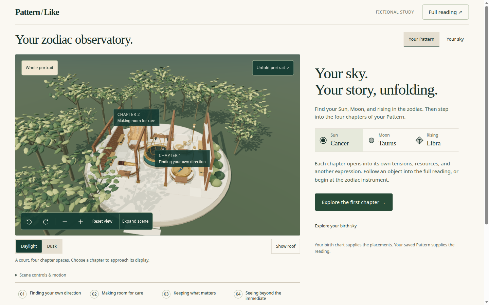
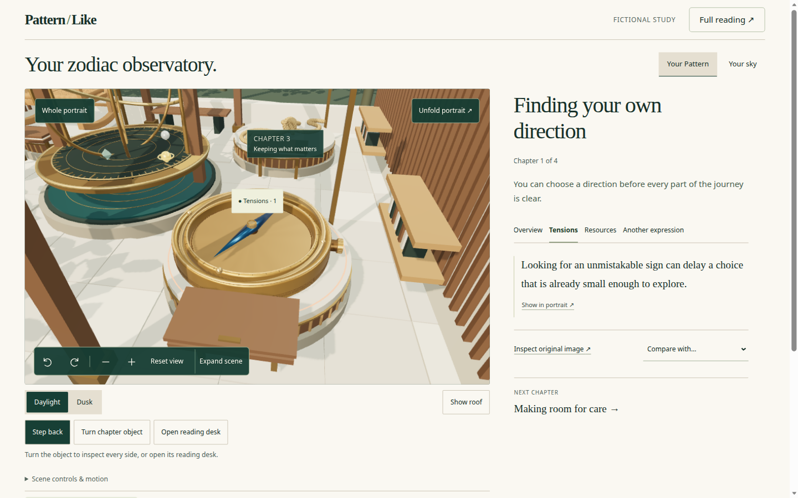
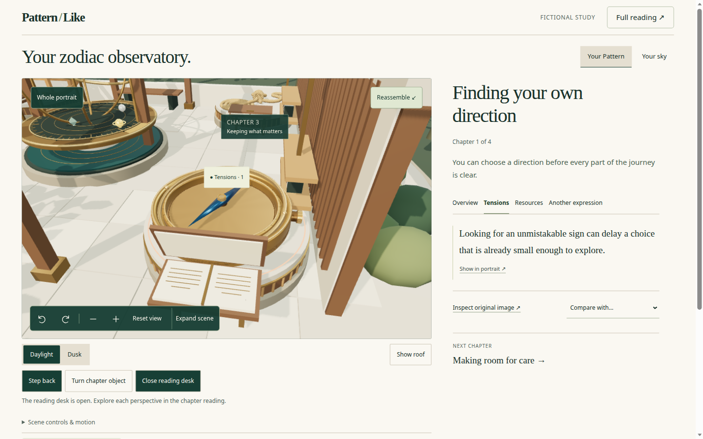
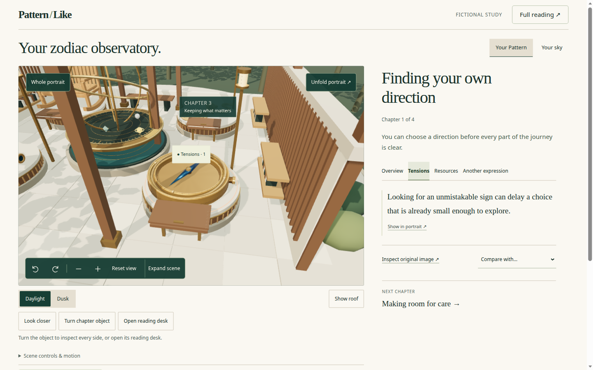
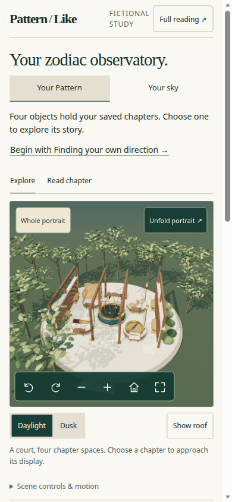
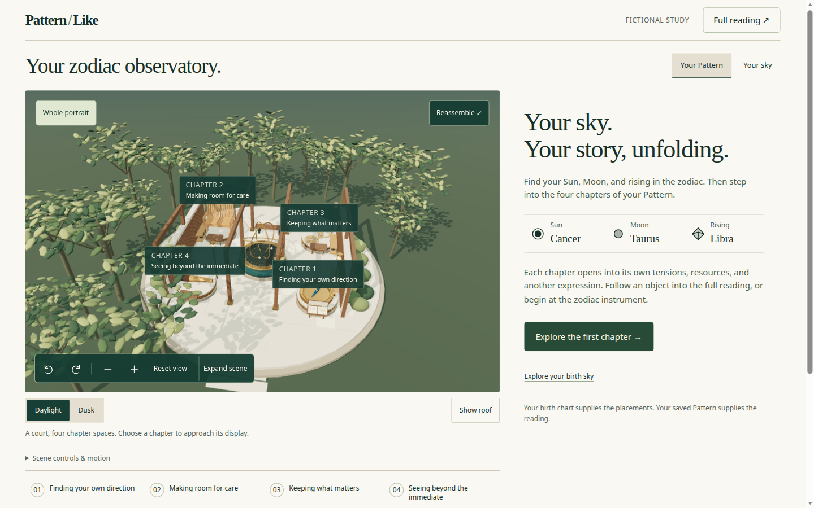
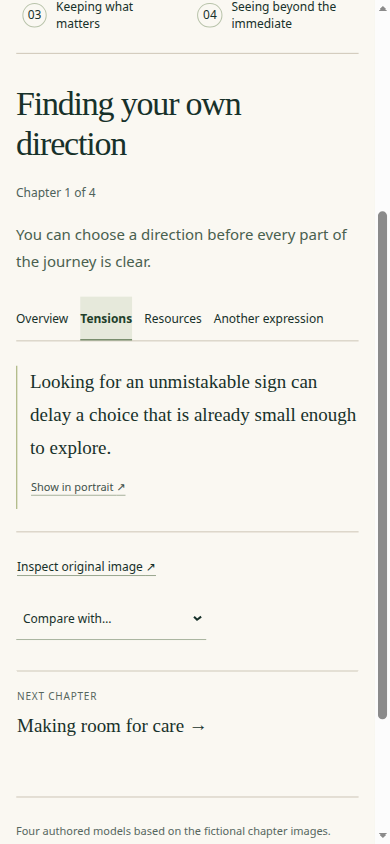
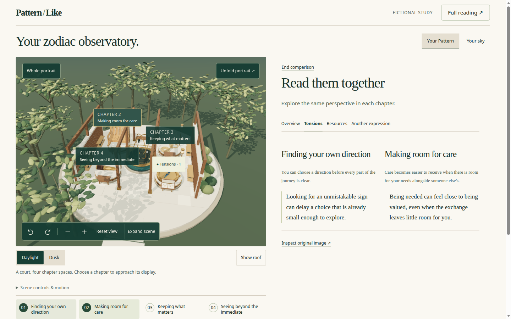
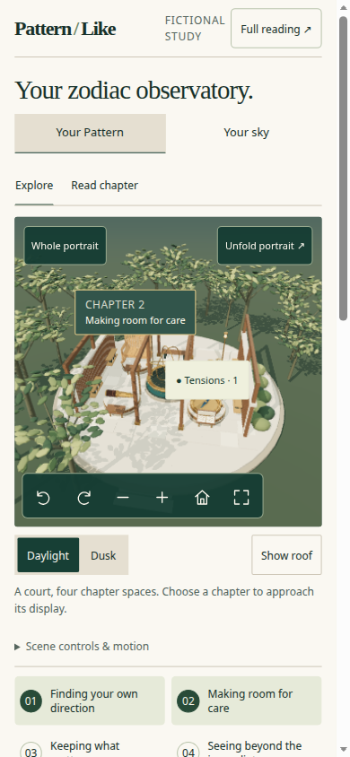
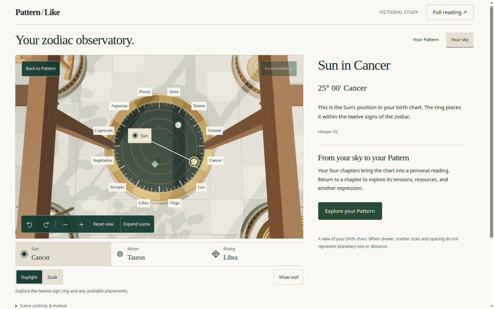

> **Historical preservation notice — 2026-09-08.** This report and its
> linked captures describe the September 7 source state. They are not
> a current defect list or new production/browser verification.
> Preserved from `cursor/3d-model-ui-workflows-review-d137` at `591d073bcb9261bc823f4dc220f1191574674fad`;
> the report identifies source `76b4671cb3392dec1424aab18929927613d72011`.
> The original body below and the captured artifacts are unchanged.
> See the [integration review](2026-09-08-branch-cleanup-and-review-integration.md)
> and [current priorities](2026-09-07-portrait-remaining-priorities.md)
> for the subsequent fixes and remaining work.

<!-- ORIGINAL BODY STARTS BELOW. DO NOT EDIT. -->
# 3D model interaction, UI, and user workflows

Date: 2026-09-07. Status: review complete; source unchanged.

The portrait explorer is a working reading companion with real volumetric chapter meshes, bidirectional passage links, comparison, guidance, and a separate calibrated sky view. The product problem is no longer “the 3D is a flat contour.” It is that **the courtyard, the control surface, and a second natal-sky product now compete with investigating the four chapter objects.** Facet exploration still lives almost entirely in the text panel.

This review covers the current `PortraitExplorer` observatory on `main` (`76b4671`), not the retired graph constellation. It does not authorize a redesign, provider, migration, or production change.

Prior work: [2026-09-06 experience review](2026-09-06-pattern-portrait-experience-review.md), [redesign spec](../superpowers/specs/2026-09-06-pattern-portrait-experience-redesign.md), [explorer implementation](2026-09-06-portrait-explorer-implementation.md), [observatory merge](2026-09-07-portrait-observatory-merge.md). The observatory direction itself records that the courtyard was an implementation assumption, not a user-approved concept.

## Scope and evidence

- Reviewed source: repository `main` at `76b4671`. Primary surfaces: `apps/web/src/components/portrait-explorer/`, `AccountPortraitExplorer.tsx`, `AccountPatternPortrait.tsx`.
- Rendered target: local fictional preview `http://127.0.0.1:5174/pattern-portrait.html` (`npm run dev:portrait -w @patternlike/web`).
- Browser: Playwright Chromium with SwiftShader. This is interaction and layout evidence, not a hardware frame-rate or memory measurement.
- Viewports: 1440 × 900, 390 × 844, 320 × 740.
- Account sign-in, authenticated model download, VoiceOver/NVDA, Safari, and physical phones were not exercised. Account workflow comments are source review plus the preview’s embedded patterns.
- Structured measurements: [measurements.json](artifacts/2026-09-07-3d-model-ui-workflows/measurements.json).

Walked flows:

1. Desktop first viewport, then chapter 1.
2. Overview → Tensions (scene vs reader).
3. Look closer, open reading desk, unfold, Whole portrait.
4. Your sky (Sun in Cancer), return to Pattern.
5. Two-chapter comparison on Tensions.
6. Phone Explore (whole portrait) and Read chapter.

## What a reader can do today

There are three nested products on one page:

| Product | Job | Entry |
| --- | --- | --- |
| Your Pattern chapters | Read four published chapters and their facets | Chapter rail, scene labels, **Explore the first chapter** |
| Observatory set | Visit a courtyard, change light/roof, turn objects, open desks | Daylight / Dusk / Show roof / Look closer / Turn / Open reading desk |
| Your sky | Inspect Sun, Moon, and rising on a twelve-sign dial | **Your sky**, placement strip, in-scene markers |

The written Pattern remains the source of meaning. Account embedding keeps that reading as the default: 3D is behind **Explore your 3D portrait**, generation status, and a four-chapter eligibility gate. The preview opens the explorer immediately.

Intended core loop from the 2026-09-06 spec: **whole portrait → chapter → facet → exact passage → return**. That loop exists in the reader. In the scene it is mostly camera framing plus a facet chip overlay.

## Findings, ordered by impact

### 1. High — the courtyard is the 3D subject; the chapter objects are props

At 1440 × 900 the first view is a circular pavilion, trees, water, plinths, desks, and a bronze instrument. Chapter 1 and 2 labels sit on stations inside that set. The four authored meshes (compass, bench, rope, spyglass) are present and have thickness once framed closely, but the default composition does not read as “four chapter forms, one portrait.”



**Look closer** is the strongest 3D action: the compass fills the frame and its needle, gimbal, and case become inspectable. That is the experience the redesign asked for. It is one control among Daylight, Dusk, Show roof, Turn chapter object, and Open reading desk, under a scene that still includes neighboring architecture.



Opening the reading desk adds a hinged lid in front of the object. It does not reveal a passage, change a facet, or teach the metaphor. The reader was already showing the chapter.



The 2026-09-06 spec’s visual identity rule was: the artifact takes priority over introductory copy; avoid celestial spectacle. The observatory inverts that: the set and the sky instrument are the spectacle; the meshes wait inside it.

### 2. High — facets still do not change the model

Selecting **Tensions** updates the reader and retitles the in-scene chip from “Overview · 1” to “Tensions · 1”. The camera, materials, and object pose do not otherwise change. This is the same product gap as finding 2 in the September 6 review, now with volumetric assets.



`facet` is passed into `PortraitScene` and used for the overlay label and `aria-label`. Emphasis is selection/hover only. There is no per-facet camera bookmark, annotation anchor on a mesh feature, or visual treatment of Tensions versus Resources.

“Show in portrait” focuses the existing chip and frames the selected chapter. That is useful, but it is not a spatial counterpart for the facet.

### 3. High — the first viewport is a control surface, not an exploration invitation

**Desktop 1440 × 900**

- 31 fully visible buttons/links before scrolling.
- Scene top 160, height 535: the canvas itself is large enough.
- Atmosphere row (Daylight / Dusk / Show roof) is fully in view (top 695).
- Chapter rail starts at y=844 and ends at 911: the named chapter index is clipped. **Guide me through** is below the fold.
- The right column leads with Sun / Moon / Rising and “Explore your birth sky,” not with a chapter.

The spec required the first 1440 × 900 view to contain the whole portrait, chapter choices, a primary exploration action, and scene controls. Chapter choices are only partially there. Lighting and roof are fully there.

**Phone 390 × 844, whole portrait**

- Chrome above the canvas: header, title, Pattern/Sky, “Begin with…” invitation, Explore / Read chapter. Scene starts at y=338.
- Scene height 345px. **Expand scene** is a full-width second toolbar row on the canvas.
- Daylight / Dusk / Show roof sit in the first viewport under the scene.
- Chapter rail top 841 / viewport 844: about 3px of the named chapters are in view. Selecting a named chapter requires scrolling.

The spec required an identifiable portrait, named chapter selection, and scene manipulation without scrolling. Named chapter selection fails that gate. Atmosphere controls take the slot.



No horizontal overflow at 390 or 320.

### 4. Medium — selection hides the chapter map

On chapter 1, most floating chapter labels hide (occlusion and overlap). The selected object’s title is replaced by the facet chip. Persistent identity then depends on the rail, which is clipped on desktop and off-screen on phone until the user scrolls.

Clicking an already-selected mesh toggles the reading desk (`onPointerUp` → `onOperate`). A second tap meant to confirm or re-frame the object instead animates furniture.

### 5. Medium — semantic navigation does not own presentation state

These states are split:

| State | Where it lives | Consequence |
| --- | --- | --- |
| Chapter / facet / passage / unfold / presentation | `explorerReducer` + history | Back can restore them |
| Sky vs Pattern | `skyView` React state | Browser Back does not restore this view |
| Roof, lighting, inspect, desks, turns | `experience` React state | Survives Whole portrait; inspect keeps close-framing after leaving a chapter |

Observed:

- **Unfold** while **Look closer** is on leaves the camera on the selected object, so unfold does not show four separated stations.
- A Whole-portrait capture taken from that unfolded-inspect pose was **byte-identical** to the pre-click canvas (`SHA-256 086625bd58ae57db717247a86fae4a6743ca5b3acd991ad937ee089b661b1bde`). Whole portrait did not produce a new overview.
- After Whole portrait, **Reassemble** remains the canvas action: assembly is orthogonal, so “Whole portrait” does not mean “one assembled portrait.”
- Your sky correctly disables Unfold and hides the chapter rail. Returning to Pattern restores the previous chapter only if the user uses **Back to Pattern** / **Your Pattern**, not the browser Back stack.



### 6. Medium — mobile Read chapter drops the return path

On 390 × 844, **Read chapter** hides the canvas (`display: none`) and scrolls the chapter heading into view. After that scroll:

- `.explorer-mobile-modes` (the **Return to portrait** control) was at y=−137.
- The chapter rail occupied y=−80…54, so only a sliver of chapters 3–4 remained at the top.
- The reader started at y=78.

The spec’s Read-chapter state required a compact return strip and visible chapter identity. The written chapter is excellent; the way back to the portrait is not on screen.



### 7. Medium — comparison is a strong reader, a weak scene

Two-chapter comparison places both Tensions texts side by side, without inventing a relationship. Both chapter rail buttons stay pressed. That matches the spec’s reading contract.

The scene still shows the whole courtyard. Non-compared chapters keep floating labels. The selected chapter’s identity is the Tensions chip, which can sit visually near another station depending on projection. Comparison is not “frame these two forms.”



On phone, comparison puts **End comparison** and the two texts below a 345px scene plus atmosphere controls. The 3D does not earn that scroll.



### 8. Medium — Your sky is a second product inside the portrait

The sky view is the most coherent 3D interaction on the page: overhead framing, twelve sign labels, a leader to the Sun marker, native Sun/Moon/Rising controls, house and qualification copy, and an explicit return. Unknown birth-time handling is specified and previously verified.



The cost is a competing primary task. The Pattern first viewport already advertises Sun/Moon/Rising and “Explore your birth sky.” PRODUCT.md’s voice rule is calm, non-mystifying, and against cosmic spectacle. The 2026-09-06 redesign repeated that. Nesting a natal instrument inside “explore your four objects” makes the opening question “am I here to read chapters, tour a garden, or look at the chart?”

Account copy still says “Your 3D portrait” / “Four chapters, a shape of your own.” The explorer heading says “Your zodiac observatory.” Those are different promises.

### 9. Low — account re-entry and vocabulary

From source: a ready explorer downloads four images and four GLBs only after **Explore your 3D portrait**. Closing the explorer revokes object URLs. Reopening re-downloads. That is honest about private bytes; it also means “Back to reading” is a full teardown, not a pause.

Generation, failure, and four-chapter eligibility keep the written Pattern available. That boundary is sound and should stay.

## Workflow map (as implemented)

```
Account Pattern page
  written chapters (always)
  opt-in automatic 3D → generating | failed | ready
  ready → Explore your 3D portrait → PortraitExplorer (embedded)

PortraitExplorer
  Your Pattern
    whole → intro + sky placements + Explore first chapter
    chapter → facets, passages, Show in portrait, inspect image, compare, next
    guided → stops 1–4, exit
    compare → two facets, End comparison
    unfold / reassemble (orthogonal)
    look closer / turn / desk / roof / dusk (orthogonal, not in history)
  Your sky
    Sun | Moon | Rising → facts; Explore your Pattern
  Full reading → every chapter field; Return to portrait
  Phone: Explore | Read chapter | Expand scene
```

The missing arrows are the ones the spec treated as the product: facet → spatial change; Whole portrait → assembled overview; Read chapter → visible return; first viewport → named chapters.

## What to retain

- Four genuine GLB fixtures with thickness, hash binding, and no external glTF URLs.
- Complete chapter fields, facet tabs, exact passages, original-image inspection, full reading, uncertainty.
- Bidirectional annotation / “Show in portrait.”
- Native 44px chapter rail and 3D control group; arrow keys only when that group is focused.
- Embedded view keeps wheel as page scroll; pinch zoom only in the expanded dialog.
- Demand rendering, reduced motion, low-power mode, graphics-loss copy (previously verified).
- Sky view’s calibrated placements, qualifications, and unavailable states.
- Account: written Pattern first; 3D opt-in; no silent meaning from size, color, or arrangement.

Do not retain as first-class chrome: Daylight/Dusk/Show roof, Open reading desk, and the natal placement strip on the Pattern home view. They can remain behind **Scene options** or inside **Your sky**.

## Recommended decision

Treat the current observatory as a rich prototype that proved volumetric assets and a complete reader, then **narrow the live task back to investigating four chapter objects.**

Concrete product cuts, not a new engine:

1. First viewport: persistent named chapter rail and one primary action (**Explore a chapter**). Move atmosphere and workbench controls into **Scene options**. On phone, do not spend the band under the canvas on Daylight/Dusk/Show roof.
2. Make **Look closer** (or automatic chapter framing) the default chapter camera. Keep Whole portrait as the assembled overview; Whole portrait should reassemble and clear inspect.
3. Give each facet a spatial change the reader can notice: keep the chapter title on the object; use the facet chip as a second label; frame or emphasize the bound annotation. Do not morph the mesh into a diagnosis.
4. Pin **Return to portrait** and the chapter rail when Read chapter is active. Do not scroll them away with the heading.
5. Keep Your sky, but do not recruit for it from the Pattern home intro. Pattern vs sky is a mode switch, not two simultaneous primary tasks.
6. Put sky/inspect/desk/lighting into the same restoration story as chapter state, or document them as ephemeral and reset them on Whole portrait.

Do not add more scene verbs (physics, idle spin, generated cross-chapter claims) until the core loop is visible in the first viewport and facets move something in the model.

## Verification limits

- SwiftShader desktop Chromium; not Safari, not a physical phone GPU.
- Fictional preview, not a signed-in account explorer session.
- No new `ci:local` run; this is a documentation review of already-merged UI.
- Accessibility was not re-scanned with axe or a screen reader in this pass.
- Console: React DevTools hint and SwiftShader `ReadPixels` GPU stall warnings only; no page errors.

No application source, contract, migration, flag, or deployment was changed.
