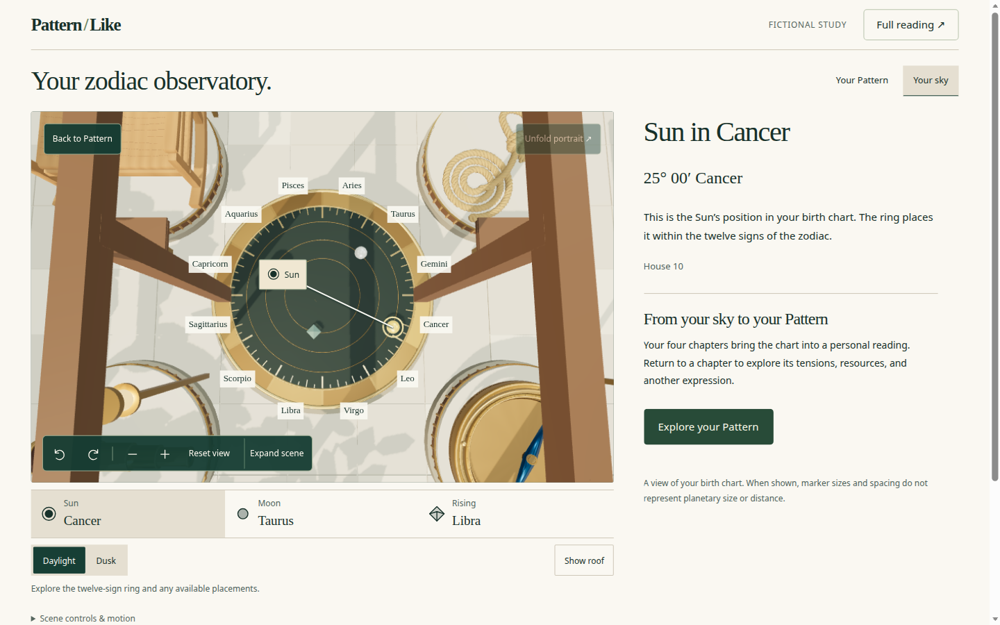
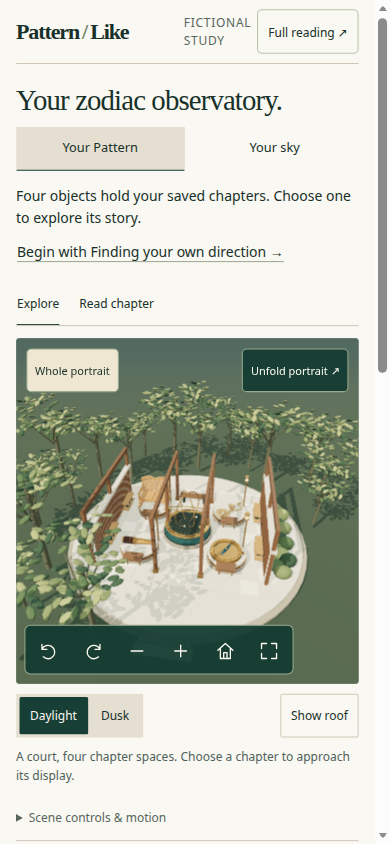
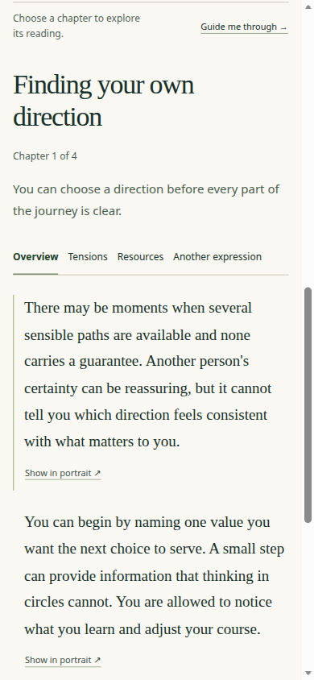
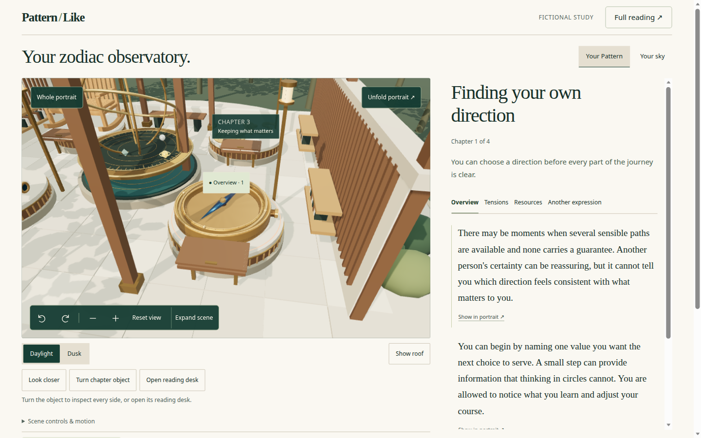

# 3D model interaction, UI, and user workflows

Date: 2026-09-07. Status: review complete; no product source changed.

Reviewed checkout: `main` at `76b4671cb3392dec1424aab18929927613d72011`. Target: local fictional preview `http://127.0.0.1:5174/pattern-portrait.html` (`npm run dev:portrait -w @patternlike/web`). This is the current observatory explorer on `main` after [#45](https://github.com/henryperkins/patternlike-app/pull/45), not the 2026-09-06 constellation preview.

The volumetric chapter objects, bidirectional reading links, and Your sky instrument are real. The courtyard and dual Pattern/sky identity have crowded the first viewport and weakened the chapter journey the redesign was meant to carry, especially on a phone.

## Scope and method

- Surface: standalone `PortraitExplorer` with authored fixtures and the fictional Cancer/Taurus/Libra sky. Account embedding, signed-in generation, Safari, VoiceOver/NVDA, and physical GPU performance were not exercised.
- Browser: Chromium through Playwright. Later desktop steps used `prefers-reduced-motion: reduce` so camera poses would settle. This is not a hardware frame-time measurement.
- Viewports: 1440 × 900, 390 × 844, 320 × 740, 844 × 390.
- Specs compared: [experience redesign](../superpowers/specs/2026-09-06-pattern-portrait-experience-redesign.md) §§4–9, [observatory](../superpowers/specs/2026-09-06-portrait-observatory-design.md), [zodiac](../superpowers/specs/2026-09-06-zodiac-observatory-design.md), and local [DESIGN.md](../../apps/web/src/components/portrait-explorer/DESIGN.md).
- Measurements: [measurements.json](artifacts/2026-09-07-3d-ui-review/measurements.json). Screenshot hashes are in that folder.

Captured flow:

1. Desktop entry, chapter select, Tensions, Show in portrait, two-chapter comparison, Your sky, browser Back.
2. Look closer, turn object, open desk, unfold, canvas pick, full reading return, guided start.
3. Phone entry, canvas pick, Begin with chapter, Read chapter, Expand scene, Your sky, 320px and landscape.

## What works

The core loop exists and is wired to source text, not to a decorative canvas.

- Selecting a named chapter or a visible label frames that station, shows title/summary/facet tabs, and turns the selected floating control into a facet annotation (`Overview · 1`, then `Tensions · 1`).
- Facet tabs follow the WAI-ARIA tabs pattern. `Show in portrait` focuses the annotation; the annotation returns to the exact paragraph. Original-image inspection is a labelled metaphor dialog with the bound compass image.
- Comparison keeps two chapter identities and the same facet in two columns, with no generated relationship claim. Full reading unmounts the canvas, shows four chapter articles, and restores chapter, desk, inspect, and unfold on return.
- Your sky is the strongest 3D interaction: overhead twelve-sign ring, Sun readout with leader, native Sun/Moon/rising strip, degree/house/qualification, and an explicit return to Pattern. Unknown-time handling is specified in source and was not re-probed here.
- Reset view and Whole portrait are distinct. 3D toolbar shortcuts only run while that group is focused. 320px did not overflow horizontally. Guide, comparison, and image inspection have exit controls.




## Findings, ordered by impact

### 1. High — on a phone, the first viewport cannot name the four chapters in the scene

At 390 × 844 the canvas is fully on screen (345px tall, top 338.5). Scene controls, Pattern/sky tabs, and “Begin with Finding your own direction” are also on screen. The four named chapter buttons start at y=850.9, below the fold. Daylight / Dusk / Show roof occupy the band that would have held them.

Every in-scene chapter label is `visibility: hidden`. `PortraitScene` hides unselected labels when the canvas is narrower than 520px and shorter than 420px:

```438:438:apps/web/src/components/portrait-explorer/PortraitScene.tsx
      if (this.width < 520 && this.height < 420 && !this.props.selectedIds.includes(form.id)) visible = false;
```

The phone canvas is 343 × 345, so the home scene is an unlabeled courtyard. Spec §14.2: at 390 × 844, named chapter selection must be visible with the initial artifact. The invitation names one chapter; it does not present four identifiable forms.



### 2. High — the visible phone CTA scrolls the model away

“Begin with …” calls `select(id, true)`, which focuses the reader heading. After that click, `scrollY` was 979 and the canvas was entirely above the viewport. The reader, facet tabs, and `Show in portrait` remain; Explore / Read chapter and the chapter rail have scrolled off.

Spec §4: selecting a chapter must not scroll the page away from the model on desktop; on phone, Explore should keep a visible scene plus chapter rail. The original 2026-09-06 finding that mobile reading discards the visual map still holds for this path. Read chapter then sets `.explorer-scene { display: none }` with no compact scene strip. Standalone Explore/Read controls are not sticky; stickiness exists only in the account container query.



### 3. High — courtyard chrome pushes chapter choices off the specified desktop viewport once exploration starts

At 1440 × 900, entry almost meets spec §4: scene, 3D controls, and “Explore the first chapter” are in view. The chapter rail bottom is 910.9 (11px past the fold). Guide me through is fully below.

Selecting a chapter inserts Look closer / Turn chapter object / Open reading desk. The rail then starts at 888.3 and is fully below the fold. Atmosphere controls sit between the model and the chapter index on every Pattern view.

The observatory furniture is specified, but it now outranks the journey whole → chapter → facet → passage. Lighting and roof are ambient; they should not displace named chapters from the first working surface.



### 4. High — Pattern’s whole state introduces the sky, while the court hides two of four chapter identities

With Your Pattern pressed, the reader heading is still “Your sky. Your story, unfolding.” Sun/Moon/rising sit above “Explore the first chapter.” The bronze instrument is the visual center of the home camera. On desktop, only chapters 1 and 2 have visible floating labels; 3 and 4 are hidden by occlusion or collision placement.

The product therefore teaches “look at the sky” before “these four objects are your chapters.” Zodiac direction said Your Pattern returns to the chapter workspace; it did not say the Pattern home copy should lead with natal placements.

### 5. Medium — facet changes still have almost no spatial counterpart

Tensions replaces the annotation caption (`Overview · 1` → `Tensions · 1`) and the prose. The compass, lighting, and camera do not otherwise change. `04-desktop-show-passage.png` is visually the same station as the Tensions shot. That matches the first-model “one chapter-level anchor” allowance, but it leaves Overview / Tensions / Resources / Another expression feeling like reader tabs beside a courtyard.

Look closer multiplies framing distance by 1.05 versus 1.5, so the rest of the court remains in frame. Unfold and an open desk do change the scene; they are courtyard operations, not facet operations.


### 6. Medium — Your Pattern / Your sky is not on the browser history stack

`skyView` is React state in `ReadyExplorer`, not an `ExplorerAction`. After Your sky, `history.back()` left Your sky pressed. Screenshots `06-desktop-sky.png` and `07-desktop-back-from-sky.png` are byte-identical (SHA-256 `2e7faff4…`). Spec §8: Back restores the previous portrait state; hover and camera ticks must not create history, but deliberate semantic navigation should.

Unfold, inspect, desk, and lighting likewise sit outside the snapshot that Full reading restores only in part (chapter/facet/unfold/desk/inspect did restore; sky did not).

### 7. Medium — guided exploration inherits furniture and does not walk facets

Guide me through becomes “Stop 1 of 4” on the current chapter without resetting unfold, Look closer, or an open desk. It advances chapters only. Spec §5: a deliberate sequence of chapter framing steps that also introduces facets; skip/exit remain available and were not the failure.

### 8. Medium — short landscape and expanded-scene chrome

At 844 × 390, default scene height is 480px (`observatory.css` tablet rule), so the canvas bottom is 640 and the toolbar is off-screen until the user scrolls or expands. Expanded scene on a phone still mounts Daylight/Dusk/Show roof/Look closer above the chapter rail inside the dialog.

Sky view keeps a disabled Unfold portrait control in the canvas corner. It does not apply; it still reads as an available Pattern action.

### 9. Medium — account entry is a third reading surface with mismatched language

`AccountPortraitExplorer` still sells “Your 3D portrait” / “Four chapters, a shape of your own,” then mounts an explorer titled “Your zodiac observatory.” Closing calls `discardArtifacts()`, so every Explore re-downloads private GLBs. Full reading inside the explorer duplicates the account Pattern already on the page. This was source review only.

## Interaction-contract checklist

| Specified action | Observed |
| --- | --- |
| Hover/focus preview without camera move | Pointer hover lights a ring; keyboard focus on the rail does not. No one-line summary preview. |
| Select body or labelled chapter | Works when the label or rail is reachable. Phone home has no body labels. |
| Unfold / Reassemble | Works; state survives full reading. |
| Facet → labelled annotation | Caption and prose update; geometry does not. |
| Annotation ↔ exact passage | Works on a single chapter. Disabled during comparison. |
| Inspect original image | Works; labelled visual metaphor; Escape closes. |
| Compare two chapters | Works; camera pulls back; both rail buttons pressed. |
| Guide | Starts; does not reset assembly/inspect; facets not sequenced. |
| Whole portrait vs Reset view | Distinct controls. |
| Full reading | Four articles; canvas gone; chapter state restored. |
| Phone Explore / Read / Expand | Present. Read hides the scene. Begin with scrolls off Explore. |
| Keyboard 3D group | Toolbar focuses; ArrowLeft does not announce a chapter change (correct). Tilt/Frame live under nested Scene options. |

## Recommended direction

Do not add more courtyard verbs. Recover the chapter journey that the volumetric assets were built to support.

1. **First viewport is chapter-first.** Keep named chapter controls (rail or four visible scene labels) in the opening 1440 × 900 and 390 × 844 surfaces. Put Daylight, roof, desk, and turn behind Scene options until a chapter is selected—or keep them, but do not let them displace the rail.
2. **Phone Explore must keep the model.** Choosing a chapter from the invitation or a label should frame the object without jumping to a reader-only scroll position. Read chapter should retain a compact scene/return strip, as specified.
3. **Pattern home copy should describe the four objects.** Move Sun/Moon/rising primacy to Your sky. Show all four labels at home, including on a 345px-tall phone canvas.
4. **Put Your Pattern / Your sky on the same in-memory history as chapter/facet/presentation.** Back from sky must restore Pattern.
5. **Start Guide from assembled whole framing** and either walk one facet per stop or say in the UI that facets are optional.
6. **Account language and lifecycle.** One name (portrait or observatory), and do not discard verified meshes on close unless privacy requires it.

Sky can stay as a sibling view. It already does the calibrated-instrument job. It should not own the Pattern landing.

## Limits

Chromium/software rendering; reduced motion on later desktop shots; fictional fixtures; no signed-in account, Safari, screen reader, or physical-device gesture pass. No `ci:local` rerun: this review changes no runtime source. Previous observatory merge reviews remain valid for graphics-loss recovery, sky collision placement, and projection minimization; this pass is about whether a reader can actually use the 3D object as the way through the four chapters.
