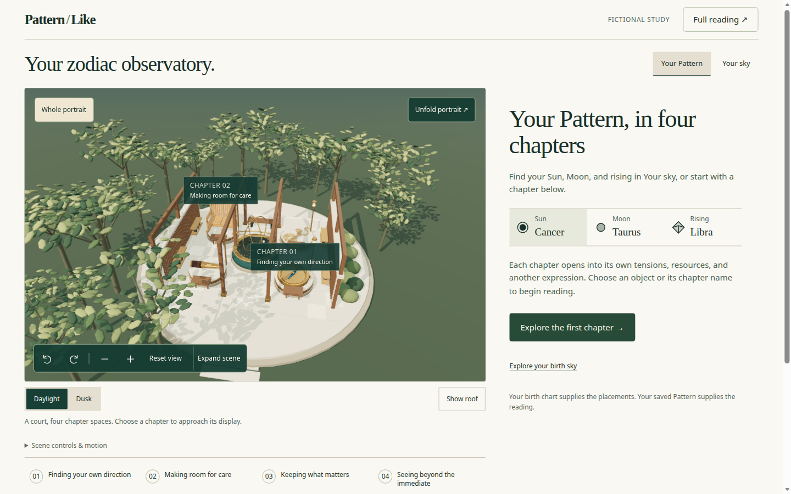
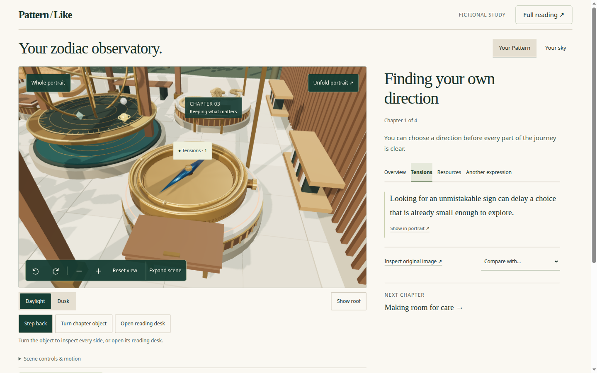
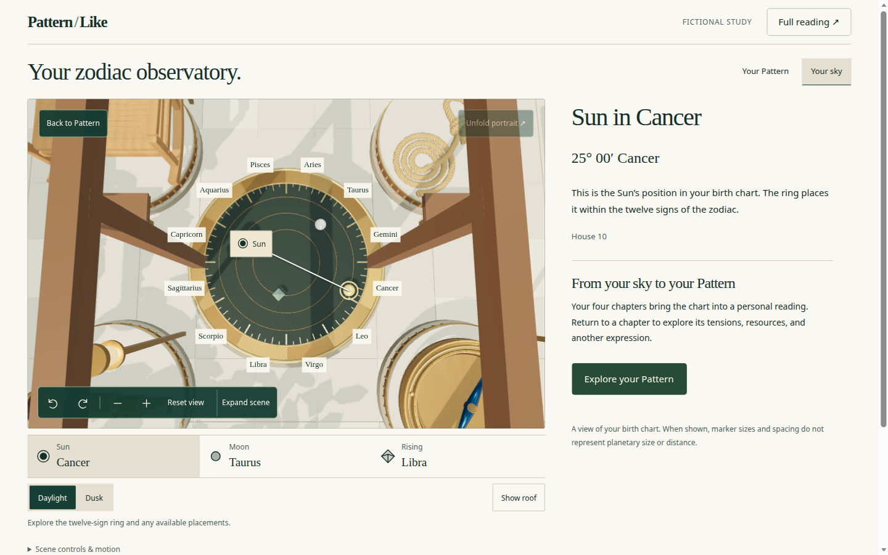
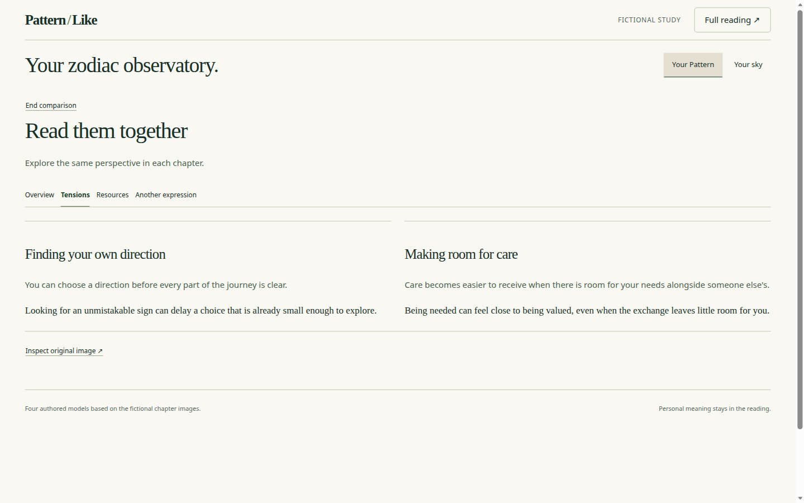
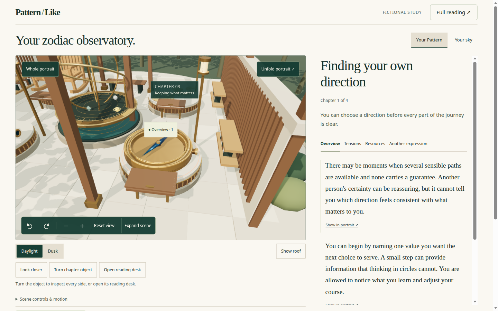
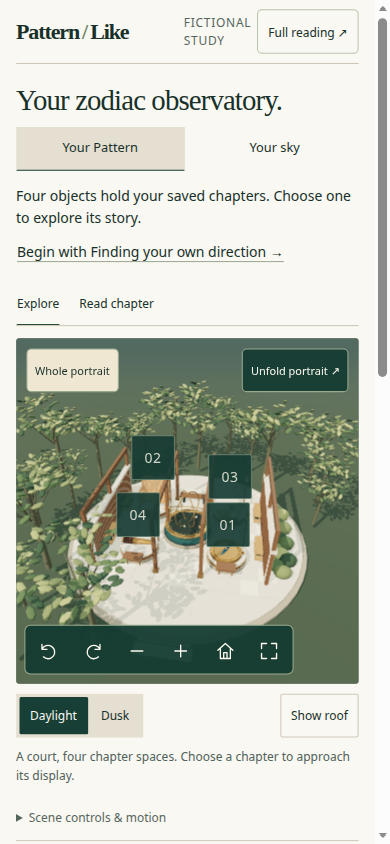
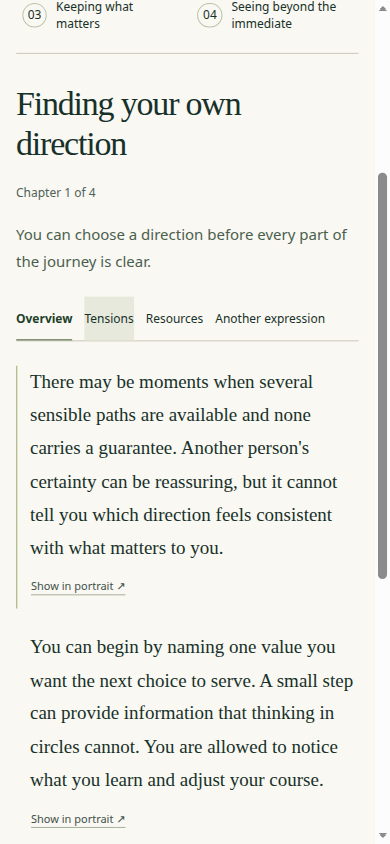

# 3D model interaction, UI, and user workflows

Date: 2026-09-07. Status: review complete; implementation unchanged.

This is a live review of the current observatory on `main` (`6e706741f03253f2807d33380afb529161f3481f`), not a redesign proposal. It asks whether a reader can investigate the portrait: rotate it, identify chapters, reach published prose, and return without losing their place.

The interaction contract remains [the 2026-09-06 experience redesign](../superpowers/specs/2026-09-06-pattern-portrait-experience-redesign.md). Local surface rules are in [`apps/web/src/components/portrait-explorer/DESIGN.md`](../../apps/web/src/components/portrait-explorer/DESIGN.md). Account session work from the same-day follow-up (`web: improve portrait reading, navigation, and recovery`) is included.

## Scope and evidence

- Source: current `main`. The fictional preview is `apps/web/src/preview/pattern-portrait-preview.tsx` serving `PortraitExplorer`. Account embedding is `AccountPortraitExplorer` plus the legacy constellation fallback.
- Rendered target: local `npm run dev:portrait -w @patternlike/web` at `http://127.0.0.1:5174/pattern-portrait.html`, Direction & care fixtures, exact birth-time sky.
- Browser: Chromium through Playwright. WebGL ran (canvas present, SwiftShader GPU stall warnings only). This is not a hardware frame-time or Safari/VoiceOver attestation.
- Viewports: 1440 × 900, 390 × 844, 320 × 740. Touch, physical phones, and signed-in account flows were not exercised in this pass.
- Measurements: [browser-measurements.json](artifacts/2026-09-07-portrait-3d-workflows/browser-measurements.json).

Captured loop:

1. Desktop whole portrait, chapter select, Look closer, Tensions, annotation ↔ passage.
2. Your sky, native Back, Your Pattern return.
3. Two-chapter comparison and End comparison.
4. Guided stops, unfold, desk/turn, full-reading round trip.
5. Phone Explore, Read chapter, expanded scene, 320px reflow.

## What works

The observatory is a real spatial reader, not a decorative canvas beside the text.

- Four volumetric chapter objects sit in an authored courtyard with a calibrated twelve-sign instrument. Rotation shows thickness and rear faces instead of the earlier contour drawing.
- The core loop is present: named chapter or body → facet tabs → scene annotation → exact source paragraph → Show in portrait. The Tensions annotation focused the published sentence “Looking for an unmistakable sign can delay a choice that is already small enough to explore.”
- Your Pattern / Your sky is a clean product split. Sky plots only supported longitudes, shows House 10 for the fixture Sun, and keeps a visible disclaimer that markers are not planetary scale. Unfold is disabled in sky. Explicit **Your Pattern** restores the prior Tensions facet.
- Guide me through, original-image inspection (metaphor labelled separately from published prose), full reading, reduced-motion and low-power settings, and graphics-loss recovery all remain reachable without WebGL.
- Desktop 1440 × 900 puts the scene, 3D toolbar, and four named chapter buttons inside the first viewport (chapter rail bottom 805px). Toolbar targets are 44px tall.
- Phone 390 × 844 and 320 × 740 did not overflow horizontally. Compact 44px ordinals stay on the four objects. Expanded scene is a labelled dialog with chapter rail and camera controls.
- Account work on this commit keeps verified meshes and explorer history in an in-memory session across Today, and clears that session on chart/account invalidation.

## Findings, ordered by impact

### 1. High — browser Back does not leave Your sky, and it silently undoes the Pattern

Reproduction at 1440 × 900:

1. Select **Finding your own direction**, then **Tensions**.
2. Click **Your sky**. The live region reads “Your sky. Sun in Cancer.” All twelve sign labels are visible.
3. Press the browser Back control.

Observed: **Your sky** stays pressed, the reader still shows “Sun in Cancer”, and Tensions tabs are gone (`no-tab`). Back did not exit the instrument.

4. Click **Your Pattern**.

Observed: the chapter returns, but the facet is **Overview**, not Tensions.

Cause: `skyView` is React local state in `ReadyExplorer`, not an `ExplorerAction` and not a history entry. Native Back pops the last remembered chapter/facet snapshot while the instrument stays on screen. The reader then looks unchanged until Pattern return reveals the lost facet.

Source: [`PortraitExplorer.tsx`](../../apps/web/src/components/portrait-explorer/PortraitExplorer.tsx) (`skyView` / `openSky`), [`use-explorer-navigation.ts`](../../apps/web/src/components/portrait-explorer/use-explorer-navigation.ts).

Why it matters: Back is the normal undo for “I went one step too far.” Here it appears to do nothing, then later drops the reader’s perspective. The explicit **Your Pattern** path is correct; the browser path is not.

Fix direction: treat Pattern/Sky as semantic navigation (push a history entry, restore `skyView` from the snapshot) **or** ignore Back while sky is up and route it to `setSkyView(false)` without consuming chapter/facet history. Phone reading that temporarily reveals the scene can still avoid unwinding comparison/reading, but it must not steal the previous Pattern step.

### 2. High — comparison abandons the model

Selecting **Compare with… → Making room for care** hides `.explorer-visual` (`display: none`). The reader becomes a two-column Tensions view titled “Read them together.” End comparison restores the scene, Tensions, and Look closer.

That is a good text comparison. It is not the specified spatial task: “Frame the two selected contributions with persistent labels.” A reader who came to inspect two objects side by side is dropped into prose with no portrait, no camera, and no chapter bodies.

Source: [`observatory.css`](../../apps/web/src/components/portrait-explorer/observatory.css) (`.explorer-is-comparing > .explorer-visual { display:none }`), introduced to give comparison the full reading width.

Why it matters: comparison is one of the four deeper tasks in the redesign. Hiding the artifact retrains the portrait as illustration for every other mode, then removes it for the mode that most needs juxtaposition.

Fix direction: keep a reduced scene that frames the two selected stations, or a labelled split view, and let the reader use the remaining width. If full-width prose is required on phones, hide the scene only below the stacked breakpoint, not at desktop 1440px.

### 3. High — selection and Look closer barely isolate the object

Chapter selection approaches the courtyard station; neighboring objects, trees, and the instrument stay in frame. **Look closer** (`observatoryFrame` inspect offset `1.05` vs approach `1.5`) still shows the rest of the court. The selected compass is larger, not inspectable as a single object.

Source: [`observatory-world.ts`](../../apps/web/src/components/portrait-explorer/observatory-world.ts) `observatoryFrame`, [`PortraitScene.tsx`](../../apps/web/src/components/portrait-explorer/PortraitScene.tsx) camera bookmarks.

Why it matters: the promised journey is whole → chapter → facet → passage. If the camera never commits to the chapter form, rotation and Turn chapter object feel like wallpaper controls. Look closer is the inspect verb; it currently does not inspect.

Fix direction: inspect should frame the selected mesh bounds with a much smaller margin, hide or dim unselected stations, and keep a one-control return (**Step back** already exists). Approach can stay contextual.

### 4. Medium — phone first viewport does not show named chapters

At 390 × 844 the scene runs 338–683px. 3D controls sit in view (bottom 674px). The named chapter rail starts at **840.9px** and ends at **974.9px**, so only a sliver of the first row is in the opening screen. In-scene labels are compact `01`–`04` squares without titles.

The invitation, Pattern/Sky, and Explore/Read chapter chrome consume the space the redesign reserved for “named chapter selection and usable scene controls” in the first phone viewport.

Source: [`observatory.css`](../../apps/web/src/components/portrait-explorer/observatory.css) invitation/title rules, [`explorer.css`](../../apps/web/src/components/portrait-explorer/explorer.css) mobile scene height 345px.

Why it matters: compact ordinals are reachable, but a first-time reader cannot name the four chapters without scrolling. That was finding 3 of the original experience review, only partly spent.

### 5. Medium — tilt, frame, and motion live behind a closed disclosure

The labelled **3D controls** group has rotate, zoom, reset, and expand. Tilt up/down and Frame selection live inside **Scene controls & motion**, which starts closed. Arrow-key tilt only runs when the toolbar *group* itself is focused (`event.target === currentTarget`), not when a rotate button is focused — and nothing tells the reader that the group is a widget.

Source: [`PortraitExplorer.tsx`](../../apps/web/src/components/portrait-explorer/PortraitExplorer.tsx) toolbar vs `.explorer-settings`.

Why it matters: the spec’s 3D control set is rotate, tilt, zoom, frame, reset, exit. Three of those verbs are undiscoverable. Horizontal orbit is easy; vertical inspection is not.

Fix direction: put Tilt and Frame in the same toolbar as rotate/zoom, or open the disclosure when a chapter is selected. Keep arrow shortcuts on the focused group and name that in the visible hint.

### 6. Medium — a second tap on the selected object opens the reading desk

Pointer pick on an already-selected mesh calls `onOperate`, which toggles the hinged desk. The desk is furniture, not a reading gate — the DESIGN.md is explicit — but the gesture collides with “tap the thing I am looking at.” Accidental second taps animate a lid the reader did not ask for.

Source: [`PortraitScene.tsx`](../../apps/web/src/components/portrait-explorer/PortraitScene.tsx) `onPointerUp`.

Why it matters: picking should mean select / keep selected / maybe inspect. Opening a desk from the same hit target makes the model feel unpredictable. Native **Open reading desk** is enough.

Fix direction: keep desk toggle on the named control only. A second tap can no-op, Look closer, or select Whole portrait — not animate furniture.

### 7. Medium — Read chapter on the phone drops the portrait

Mobile Read chapter sets `display: none` on `.explorer-scene`. The heading, facets, Show in portrait, and chapter rail remain. There is no compact scene strip or **Return to portrait** affordance in the first reading viewport besides the Explore/Read toggle.

Source: [`explorer.css`](../../apps/web/src/components/portrait-explorer/explorer.css) `.explorer-presentation-reading .explorer-scene`. Local DESIGN.md accepts this; the redesign spec does not.

Why it matters: **Show in portrait** then has to resurrect a hidden canvas. The spatial map disappears exactly when the reader follows a passage. Acceptable as a density choice if Explore/Read stays obvious; still a gap versus the specified compact strip.

### 8. Medium — account session restores the reader, not the investigation

`PortraitSession` / `ExplorerMemory` keep view, facets, passages, unfolded, presentation, inspect-image, and scroll. They do not keep `skyView`, camera bookmarks, lighting, roof, desks, turns, or Look closer. Those live in `ReadyExplorer` refs/state and die with the canvas.

A Today round-trip can reopen the same chapter and Tensions while resetting the instrument, orbit, and desk. Closing via **Back to reading** is better than the previous full asset discard, but the investigation still resets.

Source: [`portrait-session.tsx`](../../apps/web/src/components/portrait-explorer/portrait-session.tsx), [`use-explorer-navigation.ts`](../../apps/web/src/components/portrait-explorer/use-explorer-navigation.ts), `ReadyExplorer` local state.

### 9. Low — naming and duplicate invitations

- **Look closer** (camera inspect) sits next to **Inspect original image** (reference PNG). Different jobs, similar verbs.
- Desktop hides the entry invitation; the reader still offers **Explore the first chapter** and **Explore your birth sky**. Phone shows **Begin with Finding your own direction** *and* the reader CTAs.
- Chapter-rail focus does not highlight the corresponding mesh (overlay labels do). Hover preview is therefore pointer-only for the primary named controls.

## Workflow map

| Workflow | Result | Notes |
| --- | --- | --- |
| Whole portrait → named chapter | Works | Camera stays courtyard-wide |
| Facet → annotation → passage → Show in portrait | Works | Exact source text, bidirectional |
| Your Pattern ↔ Your sky via buttons | Works | Facet preserved |
| Browser Back from sky | Fails | Sky stays; facet can be lost |
| Compare two chapters | Partial | Excellent prose; 3D removed |
| Guide me through / Exit | Works | Restores originating chapter and facet |
| Unfold / Reassemble | Works | Furniture follows objects |
| Open desk / Turn object | Works | Second mesh tap also toggles desk |
| Full reading round trip | Works | Canvas unmounts; desk and unfold restored |
| Expand scene (phone) | Works | Dialog, chapter rail, camera bar |
| Graphics pause / Continue reading | Covered by existing tests | Not re-forced in this browser pass |
| Account Explore / Today return | Code review only | Reader memory yes; camera/sky/desk no |
| Legacy constellation fallback | Code review only | Still a second 3D language if explorer 404s |

## Recommendations

1. Put Pattern/Sky on the same history stack as chapter/facet, or make Back mean “leave sky.”
2. Keep two chapter bodies on screen during desktop comparison.
3. Make Look closer a true object inspect; keep Whole portrait / Step back as the wide shot.
4. On 390px, collapse the invitation and Pattern/Sky into the existing header so the four titled chapter buttons clear the first viewport.
5. Promote Tilt and Frame into the 3D toolbar.
6. Stop using mesh re-tap as Open reading desk.
7. Extend session memory with camera bookmarks and sky/experience, or document that those reset on route change.

Do not add idle spin, particles, or a second generation provider to paper over these gaps. The missing work is navigation honesty and camera commitment, not spectacle.

## Assessment

The observatory is ready to demonstrate and to keep iterating. It is not yet a complete investigation surface:

- Reading, fallback, sky facts, and the annotation loop are in good shape.
- Back, comparison, and inspect framing still fight the “object you can investigate” brief.
- Phone first view still buries named chapters.

**Ready to treat as the product 3D path?** Yes, with the high items scheduled before calling the interaction contract done.

**Ready to stop reviewing and ship UX as-is?** No. The high items are user-visible navigation and inspection failures, not polish.
