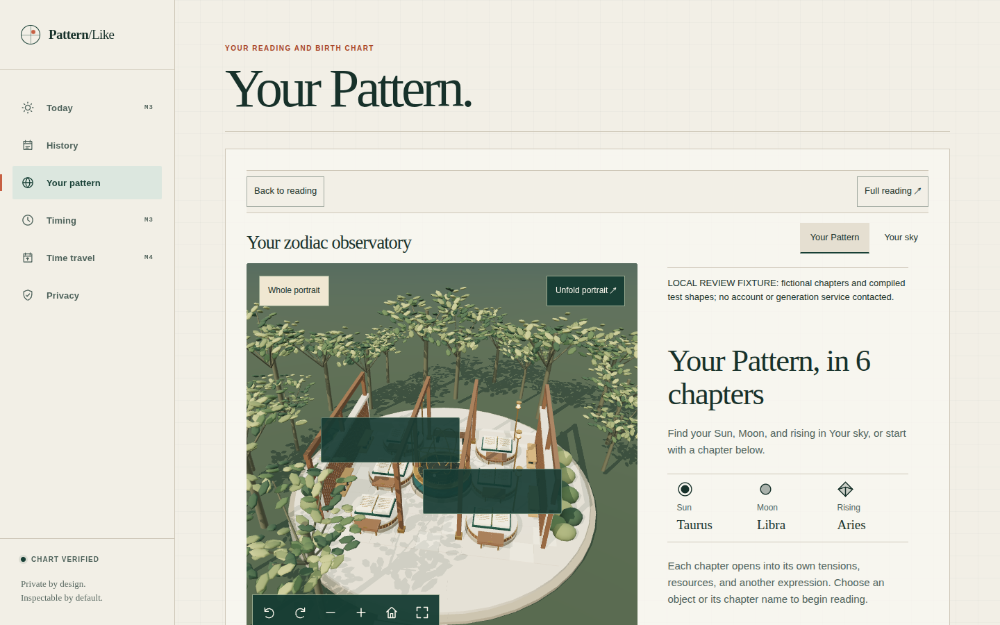
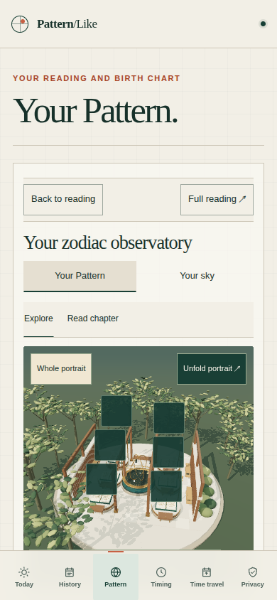

# Default Pattern observatory

The observatory was coupled to the optional generated-artwork pipeline. `AccountPortraitExplorer` required exactly four chapters, a ready explorer response, all image and model assets, and an explicit open action. The renderer also refused to start without model assets. Finally, `ChartView` placed the entire Pattern experience after the calculation wheel and planetary table; a real browser measured the scene starting 1,746.5px below the top on desktop even after it mounted. A published Pattern can contain three through six chapters, so the four-chapter condition excluded legitimate readings before WebGL could run.

The interrupted investigation's recovered read-only production checks found two current artwork outbox entries marked `unsupported`. Its independent checks traced that state to `currentPattern()` rejecting readings without exactly four chapters. Its earlier public HTTPS checks found the scene and dependency chunks deployed successfully. Those are investigation observations, not a claim that this implementation has been deployed or that production data was queried again during implementation.

## Resulting behavior

- The Pattern experience now leads the page, with a compact page heading and the calculated chart facts below it. The scene is visible on first entry on desktop and portrait phones. Short landscape still needs a brief scroll past the controls.
- A matching published Pattern opens the existing zodiac observatory automatically, with one reading station for every chapter (three through six).
- Authored open-book folios provide substantial, selectable reading stations without a provider request. These are room furniture, not generated personal metaphors. All original chapter text, additional signatures, uncertainty, and source identity remain in the reader.
- Verified saved personal artwork replaces folios when available. Source, image, mesh, compiler, and revision verification remain enforced. Artwork status, failures, and downloads appear below the room.
- `unavailable`, `not_started`, `generating`, `failed`, missing endpoints, delayed requests, and failed asset verification no longer hide the room. Unauthorized requests still clear private artwork and notify the account shell.
- A deliberate return to reading survives status refreshes and same-source route remounts. Explicit reopening retains navigation and reading position. The initial automatic opening does not move keyboard focus or scroll the page.
- The optional v1 artwork generator still requires consent and exactly four chapters. Readers can still turn off an existing artwork grant even when their current chapter count is unsupported. This change removes that restriction from display; it does not modify generation contracts, database checks, or consent records.

## Verification

Regression tests first reproduced failure to mount the account explorer and render the room for missing artwork and non-four-chapter readings. Tests cover three through six stations, source retention, private asset verification and disposal, automatic entry, explicit return/reopen, and artwork recovery. Existing scene, navigation, and account tests remain part of the web suite.

Browser evidence for the original checkout is under `output/playwright/portrait-default/`; the isolated release is separately checked under `output/playwright/portrait-default-release/` in the original checkout. The account harness intercepts API requests with fictional published readings and the existing compiler fixtures; it uses the real React account shell, source validators, Three.js renderer, and Chromium with software WebGL. It checks desktop, 390px and 320px phones, short landscape, all chapter counts, unavailable/not-started/generating/missing/stalled artwork delivery, complete reading, and return/reopen. It also checks upgrading from local stations to verified saved artwork without losing the selected reading perspective or lighting.

The release is isolated on `codex/default-pattern-observatory`, based on `4cb884394feb700455bf7b3e80b460dadbd99c40`. The earlier uncommitted observatory refinements remain in the original checkout. The final isolated gate passed all 14 lanes, including 691 web tests across 51 files and 2,525 API tests across 144 files. The recorded source remained unchanged throughout the gate; deployment verification follows publication.

The isolated browser pass completed all nine interaction scenarios with no page errors. Initial entry remained at `scrollY = 0`, with no horizontal overflow. The scene began at 378.6px on desktop (1440×900), 486.6px on a 390×844 phone, 478.2px at 320×844, and 330.7px in 844×390 landscape. The short-landscape coordinate falls within the viewport but behind the fixed bottom navigation: its screenshot requires a brief scroll to see the 3D room. This is a remaining layout limitation, separate from the fixed rendering and artwork gates. The saved-artwork upgrade fetched exactly four private images and four models, preserving the selected Resources perspective and Dusk lighting.

Independent code review also reproduced a verified model that failed the renderer's stricter geometry bounds. The recovery now substitutes a folio for an optional model that cannot load, keeps the scene usable, and displays a notice below the canvas. Source verification, geometry rejection, and cancellation remain enforced. The real-compiler regression first failed with `unavailable` instead of `ready`, then passed; all 20 runtime tests passed. A tenth browser scenario using that exact thin-box compiler output retained the observatory, selected reading perspective, and lighting with no page errors. Its artifacts are in `output/playwright/portrait-default-failed-artwork/` in the original checkout.

The independent focused re-review resolved that finding and checked mixed successful/failed models, subsequent successful replacement, resource disposal, cancellation, and unchanged rejection outside the observatory. The isolated checkout then received a fresh `npm ci` from the unchanged lockfile; the full monorepo typecheck passed. Interrupted and dependency-incomplete aggregate runs are retained separately as superseded evidence and are not passing gates.

These screenshots show the initial account view using a fictional six-chapter reading and unavailable artwork. They verify the real local renderer and account layout; they are not screenshots of a production user's private Pattern.

The authoritative gate receipt is `output/release-verification/portrait-default/local-gate-verified.json` in the isolated checkout. Its frozen source manifest SHA-256 is `692a19bdd3eb393c444104150c512fe9e05d3d86682d63beab72530f9c009c7e`. The receipt verifier passed with no problems. Node was v22.23.2, npm 10.9.8, and local Python 3.14.4 (the CI workflow pins Python 3.12).
