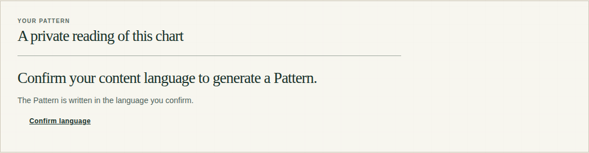
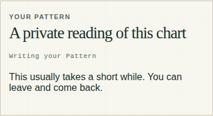
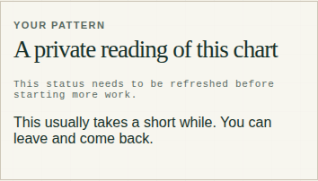
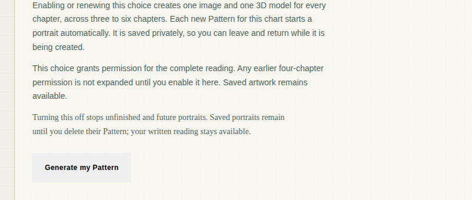
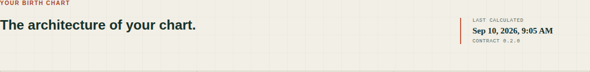
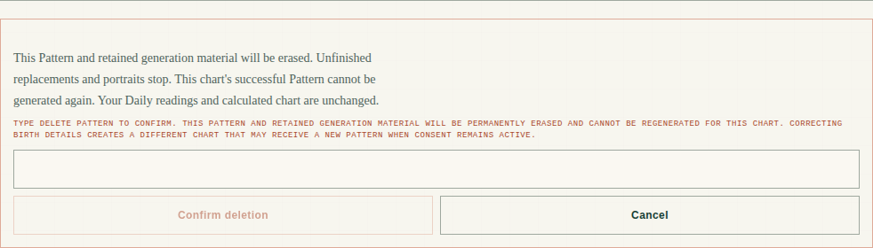
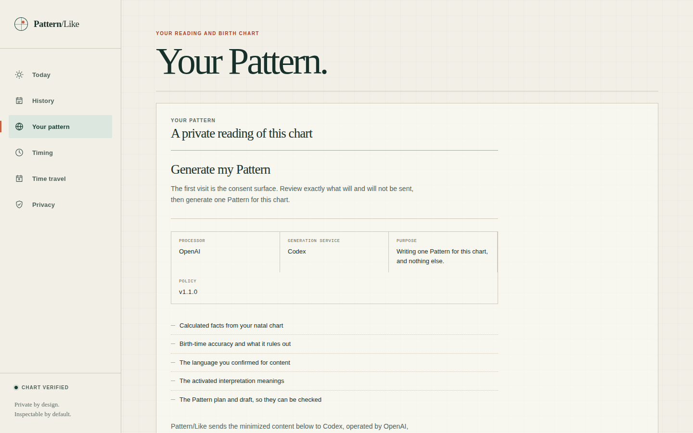
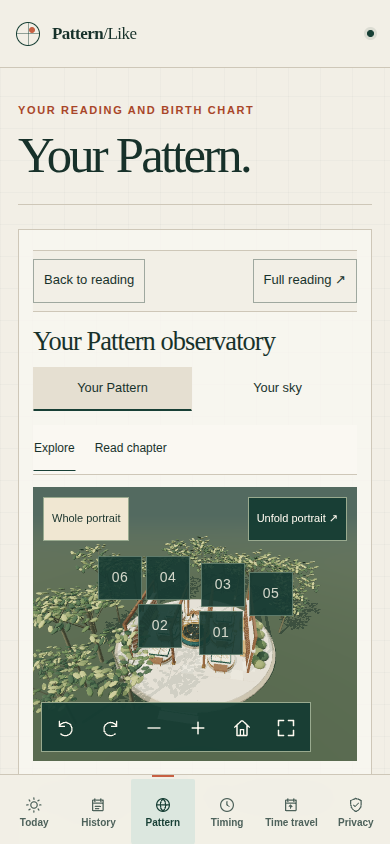

# Pattern page: UI review

Date: 2026-09-25. Status: review complete. No product code changed. Reviewed at `267487e`.

The Pattern page (`#pattern`, the default route) is well built underneath. Stale responses are fenced correctly, the 3D observatory never blocks the text, assets are verified and released correctly, and reduced motion is handled with care. The high-stakes safety copy is honest ("Your current Pattern stays readable until the replacement succeeds").

Three problems hold the page back:

1. **The readiness model changes the UI by removing or disabling it.** Every 2-second poll and the 60-second freshness clock treat "we are re-checking" as "the reader must stop". Consent terms vanish mid-read. Status text flickers to a false "needs to be refreshed". The delete field is disabled under the cursor. Focus drops to `<body>`. About a dozen findings trace back to this one design choice.
2. **The language gate is a dead end, and a confirmed non-`en-US` language cannot succeed.** "Confirm language" sends the reader to Today, which never asks for the language once the device sync has run. A reader who does confirm any tag other than exactly `en-US` passes every gate, then every generation fails at publication.
3. **Several consent and privacy statements say more than the server does.** Three examples:
   - The purpose line says the grant covers "one Pattern for this chart, and nothing else", but the grant is standing and covers corrected charts.
   - The provenance line says birth details "were not sent", but the precise positions sent can be used to reconstruct them.
   - Deletion says "permanently erased", but encrypted provider copies remain until the 30-day sweep.

There are also inexpensive visual regressions:
- The primary "Generate my Pattern" button renders as the browser's grey default.
- The chart-facts heading lost its display style when the Pattern moved above it.
- The delete warning is set as 9px uppercase monospace.

**Totals: 67 findings — 5 high, 35 medium, 27 low.** 66 came through the multi-reviewer pass and survived adversarial verification. One (H3) was traced separately during this review. One further candidate was refuted (see the end of this document). Where a verifier corrected a finding's scope or severity, this document uses the corrected version.

## Scope and method

- **Source review:**
  - `ChartView`, `PatternExperience`, `PatternConsent`, `PortraitAutomationControl` and `ReaderReadiness`
  - the reader-readiness, consequence and route libraries
  - `AccountPatternPortrait`, `AccountPortraitExplorer` and everything under `components/portrait-explorer/`
  - the legacy `PatternPortrait` and `PatternSculpture`
  - the relevant rules in `styles.css` and the component stylesheets

  Findings were checked against `apps/web/DESIGN.md`, `apps/web/PRODUCT.md` and `portrait-explorer/DESIGN.md`. The Pattern specs were also consulted (2026-08-14 as amended, 2026-08-29 regeneration, 2026-09-08 adaptive observatory), along with `docs/deploy/consent-disclosures.md` and, for every claim the UI makes, the API handlers.
- **Rendered review:**
  - **Harness.** The real `apps/web` ran in Chromium 1194 with software WebGL (SwiftShader). Every `/v1/*` request was answered from fictional fixtures via Playwright route interception, and Auth0 and all external hosts were blocked.
  - **Scenarios.** 20 in total:
    - ready with 3 and 6 chapters
    - replacement eligible, active and failed
    - `consent_required`, `available` and `writing`
    - failed, retryable and not retryable
    - `deleted`, `withdrawn`, `ontology_unavailable` and `locale_confirmation_required`
    - load error
    - open delete and replace confirmations, after-delete, full reading, and the plain chapter list
  - **Viewports.** 55 captures across 1440×900, 834×1112, 390×844, 320×640 and 844×390.
  - **Checks.** axe-core (WCAG 2.2 AA and best practice) on every capture, keyboard walks, forced colours, reduced motion, 200–400% zoom, print output and a no-WebGL run.
- **Verification:**
  - **Review lenses.** Eight independent lenses covered state logic, source accessibility, visual/CSS, copy and flow, consent honesty, the observatory, rendered visuals and rendered accessibility, followed by a completeness critic.
  - **Merging and refutation.** Duplicate findings were merged. Every finding then went to verifiers told to refute it: two for high-severity findings, with a tiebreak when they split, and one for the rest.
  - **Throwaway tests.** Many claims were reproduced with throwaway vitest or Playwright scripts, all deleted afterwards. `git status` stayed clean.
- **Baseline:** `npm test -w @patternlike/web` passed before review (63 files, 901 tests).
- **Not covered:**
  - real screen readers (NVDA, JAWS, VoiceOver) and real iOS/Android devices
  - the live API
  - the verified saved-artwork (v2 images and meshes) path with real assets
  - text-only 200% zoom
  - non-English and RTL content
  - a 401 arriving mid-confirmation
  - switching accounts across tabs
  - slow networks while the 3D chunk loads

All screenshots below show fictional fixture data rendered by the real app. None is production data.

## What to fix first

1. **Separate background refresh from user action** (H1, M1, M2, M4, M29, L25). Keep the last known state on screen while polling. Check freshness when the reader submits, not by unmounting the form. This one change removes most of the flicker, focus-loss and announcement defects.
2. **Make the language gate completable** (H2, H3). Put the language confirmation inline on the Pattern page. Stop offering or accepting a locale the serving ontology cannot publish.
3. **Bring consent, provenance and deletion copy in line with server behaviour** (H4, H5, M9–M12, L15, L16, L26). Some of these may need a consent-policy version assessment under `consent-disclosures.md`.
4. **Focus and announcements** (M13–M16). Keep one persistent status region and one alert region. Move focus deliberately after open, cancel and submit.
5. **Quick visual repairs** (M19–M23). Each is a class name or a few CSS rules.
6. **The observatory on phones** (M28, M30, M31, L7). Put chapter content in the first viewport and cut the stacked sticky rows.

## High

### H1. The 60-second freshness rule removes the consent terms mid-read and silently disables deletion

**Where:** [PatternExperience.tsx:676-702](../../apps/web/src/components/PatternExperience.tsx#L676), [:299](../../apps/web/src/components/PatternExperience.tsx#L299), [:306/:331](../../apps/web/src/components/PatternExperience.tsx#L306); [reader-readiness.ts:44](../../apps/web/src/lib/reader-readiness.ts#L44).

**Evidence:**
- `READER_OBSERVATION_MAX_AGE_MS = 60_000`. A timer re-renders at `observedAt + 60_001`, and from then on `fresh` is false.
- `canGenerate` is the only gate for `PatternConsentTerms`, `PortraitAutomationControl` and the Generate button.
- **Consent screen, measured in Chromium.** The panel shrinks from 1,859px to 296px, focus falls to `<body>`, and nothing is announced. The h3 becomes "This status needs to be refreshed before starting more work." The paragraph above it still says "Review exactly what will and will not be sent". There is a 58s/61s screenshot pair.
- **Scale of the problem.** The terms and the automation control run to roughly 330–440 words, which takes 75–110 s to read. Careful readers, the ones the copy invites, lose the page.
- **Other states:**
  - `deleted` loses its heading.
  - A retryable `failed` state switches to "A retry is not available right now", because `canRetry` reads the stale presentation.
  - A 503 cause is replaced by "Current status could not be checked".
  - On every ready Pattern, "This status needs to be refreshed…" plus "Check again" appears after one minute and comes back every minute after each refresh.
- **Delete confirmation.** A confirmation left open for more than 60 s keeps its input enabled. Enter does nothing, Confirm is disabled, and no reason is shown.

**Impact:** This is a WCAG 2.2.1 (Timing Adjustable, Level A) failure on the main consent flow. It hits hardest at screen-reader, zoom and cognitive-accessibility users. The server already re-validates every mutation (`consent_policy_version_stale`, the regeneration re-check), so the client timeout protects nothing it needs to.

**Fix:**
- Keep the state heading, terms and forms mounted regardless of freshness.
- On submit, re-fetch `/v1/pattern-state` the way `regenerate()` already does. If anything changed, show what changed inside the form, linked by `aria-describedby`.
- Show replacement readiness only when a replacement exists or a destructive form is open.

### H2. The gate actions lead nowhere: "Confirm language" never lets the reader confirm, and "Open birth details" reloads the same page

**Where:** [reader-routes.ts:6-7](../../apps/web/src/lib/reader-routes.ts#L6), [PatternExperience.tsx:687](../../apps/web/src/components/PatternExperience.tsx#L687).

**Evidence:** The two gates disagree on what counts as a confirmed language, and the Pattern page offers no way to satisfy its own gate.

| Surface | Evidence |
| --- | --- |
| Confirm language link | `case "confirm_locale": return READER_ROUTES.today;` |
| Device sync | Runs on every validated session: `App.tsx` `sync()` calls `setContentLocale(locale, "device_derived")`. `locked()` in `db/preferences.ts` protects only `user_confirmed`, so this overwrites `default_unconfirmed`. |
| Today | Asks only while the source is `default_unconfirmed` (`routes/readings.ts:463`, `ensure-today-reading.ts:125`), so it publishes without ever showing `PreferenceConfirm`. |
| Pattern | Requires `user_confirmed` (`pattern-state.ts:163`, `pattern-enqueue.ts:186`); portrait artwork has the same gate. |
| Only `user_confirmed` writer | `PreferenceConfirm`, which only `TodayView` renders. |
| Open birth details link | `case "open_birth_details": return READER_ROUTES.pattern;`, the page already shown. Birth correction actually lives in Privacy. |
| Chart mismatch | "Try again" repeats the identical check. `ReaderRefreshChartContext` exists but is not used here. |
| `editorial_catalog` | Would show "Current status could not be checked" with no button at all. The server does not currently emit this state. |

**Impact:** A reader whose language came from the device sync is told to confirm their language and given one button to a page that never asks. That covers practically every reader who has not already confirmed on Today. From the UI they cannot generate a Pattern or artwork. The locale gate renders as shown below; see M19 for why its only action looks like a stray link.

**Fix:**
- Render the `PreferenceConfirm` language form inline in `locale_confirmation_required` and return to `#pattern` on save. Alternatively, add a language control to Privacy, or align the Daily and Pattern gates.
- Point `open_birth_details` at the Privacy birth-correction flow.
- Always render "Check again" when the presentation includes `reload_status`.
- On a chart mismatch, refresh the chart rather than the Pattern.
- Add an App-level test that goes from `locale_confirmation_required` to a generate-ready state.

### H3. A confirmed language other than exactly `en-US` passes every gate, and then every generation fails terminally

**Where:**
- Gate: [pattern-state.ts:163](../../apps/api/src/services/pattern-state.ts#L163) and [pattern-enqueue.ts:186](../../apps/api/src/services/pattern-enqueue.ts#L186) check only `localeSource`.
- Failure: [pattern-execute.ts:1663-1669](../../apps/api/src/services/pattern-execute.ts#L1663) and [:1702-1705](../../apps/api/src/services/pattern-execute.ts#L1702).
- UI copy: [PatternExperience.tsx:662](../../apps/web/src/components/PatternExperience.tsx#L662).

**Evidence:** traced in code during this review, not executed end to end.
- There is a single active ontology pointer (`loadActiveOntology`), and every corpus fragment is `en-US`.
- Neither `pattern-state` nor `pattern-enqueue` compares the reader's locale with the ontology's.
- At publication, `sourceFragmentIds` is filled only when `corpus.release.locale === command.locale`. Otherwise it stays empty.
- `sourceDependencyResolver` then rejects every `source_supported` record and every `derived_synthesis` built on them. Every cited unit gets `source_dependency_failure`.
- That failure is explicitly non-correctable ("Broken source authority cannot improve through a writer rewrite"), so the job ends `publication_safety_failed`.
- `PreferenceConfirm` pre-fills `navigator.language` and the API accepts any well-formed tag. `en-GB`, `en-CA` and `fr-FR` readers therefore confirm a value that can never publish.
- Every Pattern API test confirms `en-US` (`test/helpers.ts`), so this path has no coverage.

**Impact:** The page says "The Pattern is written in the language you confirm", accepts the reader's language, charges a full provider run, and fails. It then invites a retry that fails the same way. Combined with H2, the only readers who reach the generate state reliably are those whose device locale is exactly `en-US`.

**Fix:**
- Gate `available` on an ontology whose locale serves the reader's confirmed locale. Return `locale_unsupported` (or map `en-*` to `en-US` deliberately) before enqueue and before the provider is paid.
- Say in the confirmation which languages Patterns can be written in.
- Add an API test with `confirmPreferences(…, "en-GB")`.

### H4. The consent copy limits the grant to "one Pattern for this chart, and nothing else", but the grant is standing and covers corrected charts

**Where:** [PatternConsent.tsx:13-17](../../apps/web/src/components/PatternConsent.tsx#L13), [PatternExperience.tsx:669-672](../../apps/web/src/components/PatternExperience.tsx#L669).

**Evidence:**
- `PATTERN_CONSENT_PURPOSE = "Writing one Pattern for this chart, and nothing else."` The processor note repeats "one Pattern for this chart".
- The grant is not tied to a chart (`insertPatternConsentGrant` stores no chart binding).
- After every birth correction, `reconcilePatternAfterChartCorrection` (`routes/birth.ts:1648` → `pattern-lifecycle.ts`) loads the existing grant and enqueues a `chart_correction` generation without asking the reader.
- The server's consent document carries `purpose: "one_pattern_per_chart"`, but the UI hardcodes the narrower sentence.
- **The specs require the disclosure.** Spec §8.4 says the grant "authorizes automatic generation for a later corrected chart". §9.2 requires the first-open panel to say that a correction "may generate a successor for the corrected chart while consent remains active". Neither appears.
- **What partly covers it.** The `available` state does say "Standing consent is already granted" but never explains "standing". The only nods to the standing scope are the word "future" in the revoke note and a hedged line in the correction form.

**Impact:** The reader agrees under wording narrower than what the grant authorizes. A routine birth-time fix later sends a different chart's derived features to Codex, operated by OpenAI, with no new prompt.

**Fix:**
- Derive the purpose from `consent.purpose` and state the standing scope. For example: "Writing your Pattern, one per chart. This stays on until you withdraw it. If you correct your birth details, a Pattern for the corrected chart is written automatically, and the same kind of minimized content is sent again."
- Match the correction-form copy to it.
- Assess whether the wording change needs a policy version bump.

### H5. The provenance line says birth details "were not sent", but the positions sent reconstruct them

**Where:** [PatternExperience.tsx:287-290](../../apps/web/src/components/PatternExperience.tsx#L287), [PatternConsent.tsx:22-23](../../apps/web/src/components/PatternConsent.tsx#L22), [PatternExperience.tsx:669-670](../../apps/web/src/components/PatternExperience.tsx#L669).

**Evidence:**
- **Ready-Pattern copy.** Every ready Pattern states: "Your birth date, time, birthplace, and coordinates were not sent to the model (Codex)."
- **Consent note.** It warns only that features "may support inferences about birth timing". It says nothing about place.
- **Server path:**
  - Calc rounds every longitude to 6 decimals (`calc-stub/src/engine.ts:807`, and `:919-929` for cusps, ascendant and midheaven).
  - `natal-features.ts:139/173/185` passes them through unrounded.
  - `copyFact` in `pattern-packet.ts` allowlists `longitude`, and the boundary policy permits `features.*.fact.longitude`.
  - Angles and cusps are included whenever birth time is not unknown.
- **Reconstruction test.** A scratch sweph script used a fictional 1990-06-15 14:37 UT birth in Chicago. From the Sun, Moon and Saturn longitudes plus ASC and MC alone, it recovered the instant to 0.00 s and the coordinates to four decimals.
- **The spec the sentence contradicts.** Spec §8.2 says Pattern/Like "does not describe the provider packet as anonymous or impossible to reverse". An unqualified "were not sent" reads as exactly that.

**Impact:** The reassurance shown on every ready Pattern is technically true (the fields are not sent) but misleading. The consent decision is made on a disclosure that mentions timing and not location.

**Fix:**
- Qualify both lines. For example: "…were not sent as fields. The calculated positions that were sent can be used to reconstruct them."
- Drop "exactly" from the `consent_required` detail.
- Alternatively, coarsen `longitude` in `copyFact`. That changes `PATTERN_CREATION_SOURCE_HASH` and needs its own consent assessment.

## Medium

### State, polling and recovery

**M1. Each 2-second poll flips the progress status to a false "needs to be refreshed", and during a replacement it disables the delete field under the cursor.**
[PatternExperience.tsx:388-391](../../apps/web/src/components/PatternExperience.tsx#L388), [:653](../../apps/web/src/components/PatternExperience.tsx#L653), [:299](../../apps/web/src/components/PatternExperience.tsx#L299), [:318-353](../../apps/web/src/components/PatternExperience.tsx#L318).
- **Cause.** `load()` bumps `requestGeneration`, sets `busy`, and downgrades `observation.evidence` before awaiting. With real latency, the `role=status` progress line reads "This status needs to be refreshed before starting more work." for the length of each request (captured on screen at 915–1,719 ms), and a second status line with "Check again" appears in replacement mode.
- **Delete field.** During an active replacement it is disabled on each poll. Chromium moves focus to `<body>` and later keystrokes are lost: "DELETE PAT" stopped at "DE".
- **Spec conflict.** Spec §20.8 says "no repeated polling announcements", and §20.3 requires bounded backoff.
- **Fix.** Give polls their own `refreshing` flag and never touch `busy`, `evidence` or `requestGeneration` during a poll. Render progress from the durable stage. Never disable a focused control; guard in the handler instead.

| Settled | Mid-poll (same state, same stage) |
| --- | --- |
|  |  |

**M2. When a replacement lands during a poll, the reading collapses and can briefly show "could not be loaded".**
[PatternExperience.tsx:407-418](../../apps/web/src/components/PatternExperience.tsx#L407).
- **Cause.** Each ready poll always fetches `/v1/pattern` after `/v1/pattern-state`. If publication commits between the two requests, the mismatch throws into the full-page error branch.
- **Even without the race.** A changed `pattern_id` clears the document, remounts the observatory, drops focus and announces nothing. This happens exactly when "Your current Pattern stays readable until the replacement succeeds" should pay off.
- **Fix.** Skip the document fetch when the state still matches. Swap documents atomically once the new one has validated. Announce "Your Pattern was updated".

**M3. Failed deletions and failed progress polls never show their error or request ID.**
[PatternExperience.tsx:291-298](../../apps/web/src/components/PatternExperience.tsx#L291), [:537](../../apps/web/src/components/PatternExperience.tsx#L537), [:649-657](../../apps/web/src/components/PatternExperience.tsx#L649).
- **Deletion.** In the ready view, `error` reaches only `PatternRegenerationPanel`, which returns `null` unless a replacement is eligible or failed. `erase()` never calls `setRequestId`. A 500 on DELETE shows only "Current status could not be checked…" with Confirm disabled.
- **Progress polls.** The progress branch never renders `error`.
- **Fix.** Render the error with its request ID inside the delete form (`role="alert"`) and in the progress branch.

**M4. Pressing "Generate my Pattern" unmounts the button and the terms, and a failure does not bring them back.**
[PatternExperience.tsx:491](../../apps/web/src/components/PatternExperience.tsx#L491), [:677](../../apps/web/src/components/PatternExperience.tsx#L677), [:703-711](../../apps/web/src/components/PatternExperience.tsx#L703).
- **What happens.** `setBusy(true)` makes `fresh` false, so the clicked button is detached, focus drops to `<body>`, and an enabled "Check again" appears. Pressing it during the POST clears `busy` early.
- **On failure.** The disclosure stays hidden until "Check again" is pressed. Spec §20.8 requires focus restoration after failed actions.
- **Fix.** Keep the button mounted, disabled and marked "in progress". Focus the result. Disable Check again while a mutation runs.

**M5. The replacement confirmation stays open and pre-typed after an update fails, making the retry one click.**
[PatternExperience.tsx:101-102](../../apps/web/src/components/PatternExperience.tsx#L101).
- **What happens.** `confirming` and `confirmText` survive the active-generation branch. After a retryable failure the form still holds `REGENERATE MY PATTERN` with "Replace my Pattern" enabled, and "Try the update again" never shows. That one click sends chart-derived content to OpenAI again.
- **Spec conflict.** It skips the dedicated action and typed confirmation the regeneration spec requires.
- **Fix.** Reset both values when a submission is accepted, or key the panel on the generation id.

**M6. Idempotency keys survive a change of intent, so a retry can fail on every click.**
[PatternExperience.tsx:493](../../apps/web/src/components/PatternExperience.tsx#L493), [:558](../../apps/web/src/components/PatternExperience.tsx#L558); [pattern-enqueue.ts:143-150](../../apps/api/src/services/pattern-enqueue.ts#L143).
- **What happens.** `generateKey` is kept after any failure, even when `reason` changes from `first_open` to `failed_attempt_retry`. The server answers `409 idempotency_key_reused` ("Idempotency-Key was already used for a different Pattern action") on every retry until a reload.
- **Fix.** Bind the key to its intent (reason plus the observed generation). Clear it on any definitive server answer, and keep it only across transport failures.

**M7. After a birth correction in another tab or device, the page shows a permanent "could not be loaded", and "Try again" repeats it.**
[PatternExperience.tsx:395-400](../../apps/web/src/components/PatternExperience.tsx#L395), [:609](../../apps/web/src/components/PatternExperience.tsx#L609).
- **What happens.** The chart-id mismatch throws. The only control re-runs `load()` with the same stale `chartId`, and App loads the chart only on mount. The old chart's facts stay on screen.
- **Fix.** Treat a mismatch as a chart change. Have App re-run its chart `load()`, which remounts the keyed experience. Say "Your Pattern was removed because its birth chart changed" (spec §20.7).

**M8. A ready Pattern is never re-checked, so one deleted, replaced or recalled elsewhere stays readable in an open tab or resumed PWA.**
[PatternExperience.tsx:456-475](../../apps/web/src/components/PatternExperience.tsx#L456).
- **What happens.** The only visibility listener lives inside the progress-polling effect. A probe marked the Pattern deleted server-side, then fired `visibilitychange`, `focus` and `pageshow`. The full prose stayed on screen.
- **Fix.** Re-load on visible and on `pageshow` for every state, throttled to about one call per 30 s, and clear the document on any terminal answer.

### Consent, privacy and destructive-action honesty

**M9. Delete and replacement copy implies generation material is erased at once, but encrypted Codex request/response copies, including the prose, remain until the 30-day sweep.**
[PatternExperience.tsx:143-144, 158-161, 312-316](../../apps/web/src/components/PatternExperience.tsx#L312); [reader-consequences.ts:12](../../apps/web/src/lib/reader-consequences.ts#L12).
- **What the server does.** `deleteCurrentPattern` and the regeneration erase path never touch `codex_provider_jobs`. The objects under `codex-provider-jobs/` are removed only by the routine sweep (`codex-provider-maintenance.ts:204-216`).
- **What the specs say.** The retention matrix (2026-08-14 §30) and the Codex design both say "Erase immediately" on explicit deletion.
- **Mitigation.** The 30-day retention is disclosed at consent time (`PatternConsent.tsx:29`), so this is overclaiming at deletion time rather than hidden state.
- **Fix.** Delete the pattern-pipeline Codex jobs in the same flows. Until that ships, say that encrypted provider copies follow the 30-day schedule.

**M10. Replacing a Pattern permanently erases its saved artwork, but the replacement copy mentions only "this version".**
[PatternExperience.tsx:141-161](../../apps/web/src/components/PatternExperience.tsx#L141).
- **What the server does.** On a source-update publish, the prior document is deleted (`pattern-execute.ts:1889-1898`). The `0033` erasure triggers then cancel its portraits and meshes and schedule the assets for cleanup.
- **What the page says.** It calls the artwork "Your saved artwork" and offers "Download complete portrait", with no prompt to download before replacing.
- **Consequences.** A 4-chapter Pattern replaced by a different count also cannot get new artwork while v2 reservations are off.
- **Fix.** Name artwork in the replace (and delete) consequences, and suggest downloading it first.

**M11. After a failed withdrawal, the artwork control still says "Your artwork choice is saved".**
[PortraitAutomationControl.tsx:59-65, 95](../../apps/web/src/components/PortraitAutomationControl.tsx#L95).
- **What happens.** `saved` is never reset. After enable succeeds and disable fails, the success receipt and the error sit side by side while automation stays on. That is a misleading success message on a consent withdrawal.
- **Fix.** Reset `saved` at the start of the change and in the catch. State the saved value ("Automatic artwork is off.").

**M12. The replacement panel reports an old failed update as if it were the current one.**
[pattern-state.ts:283-293](../../apps/api/src/services/pattern-state.ts#L283).
- **What happens.** The failure lookup takes the latest failed `source_update` job for the chart, with no tie to the current document or source hash, and failed rows persist. A reader can see "Pattern update not completed. Your Pattern was not changed." about an attempt that predates their current Pattern.
- **Fix.** Restrict the lookup to failures created after the current document, or to the current source hash.

### Accessibility

**M13. Opening, cancelling or confirming Delete or Replace, starting generation, or toggling automation drops focus to `<body>`; `aria-expanded` is always false.**
[PatternExperience.tsx:203-211](../../apps/web/src/components/PatternExperience.tsx#L203), [:349-357](../../apps/web/src/components/PatternExperience.tsx#L349); [PortraitAutomationControl.tsx:81](../../apps/web/src/components/PortraitAutomationControl.tsx#L81).
- **What happens.** Each trigger is replaced by its form, so the element holding focus disappears, and its `aria-expanded` can only ever be `false`. The automation checkbox is disabled while it saves, which also drops focus. Measured in a user-event test and in Chromium. This fails WCAG 2.4.3 and 4.1.2.
- **Fix.** Keep the toggle mounted with `aria-controls`, or drop the attribute. Focus the confirm input on open and the toggle on cancel. After a mutation, focus the new state's heading.

**M14. Deletion receipts, errors and the end of generation are not reliably announced.**
[PatternExperience.tsx:686-688](../../apps/web/src/components/PatternExperience.tsx#L686), [:147](../../apps/web/src/components/PatternExperience.tsx#L147), [:653](../../apps/web/src/components/PatternExperience.tsx#L653), [:604-613](../../apps/web/src/components/PatternExperience.tsx#L604).
- **What happens.** Every live region is created already holding its text, inside a freshly mounted branch. When generation finishes, the progress status is simply unmounted. The load-failure view has no role at all.
- **Fix.** Mount one persistent visually-hidden `role=status` and one `role=alert` at the root of the experience, and write each transition into them: ready, update applied or failed, deletion accepted, and errors.

**M15. At ≤960px, focused controls can sit fully behind the fixed mobile header and tab bar (WCAG 2.4.11).**
[styles.css:5508-5532](../../apps/web/src/styles.css#L5508).
- **What happens.** Nothing sets `scroll-padding`. The explorer's per-element `scroll-margin` never applies to focus that is already inside the scrollport. In Chromium, tabbing to a button under the 70px tab bar did not scroll it into view.
- **Affected controls.** Generate, the automation checkbox, Delete, the confirm inputs, chapter buttons and tabs. This also applies at 150%+ desktop zoom.
- **Fix.** Inside the 960px block, set `html { scroll-padding-block: var(--mobile-header) calc(var(--mobile-nav) + env(safe-area-inset-bottom)); }`, plus the stuck explorer rows' heights.

**M16. Type-to-confirm fails silently on any case or spacing mismatch.** Still open from the 2026-09-09 review.
[PatternExperience.tsx:83-84, 153, 176, 306, 331](../../apps/web/src/components/PatternExperience.tsx#L306).
- **What happens.** "delete pattern", a trailing space, or auto-capitalized mobile input leaves Confirm disabled, with no message and no `aria-invalid`. This fails WCAG 3.3.1.
- **Label problem.** The whole 257-character consequence paragraph is the `<label>`, so it becomes the input's accessible name.
- **Fix.** Trim, ignore case and collapse whitespace. Show an inline linked error on a mismatch. Shorten the label and move the consequences into `aria-describedby`. Add `autoCapitalize="characters"` and `spellCheck={false}`.

**M17. "Compare with…" starts a comparison on the first arrow key (WCAG 3.2.2).**
[PortraitExplorer.tsx:450](../../apps/web/src/components/portrait-explorer/PortraitExplorer.tsx#L450).
- **What happens.** `onChange` dispatches `compare` and moves focus. In Chromium on Linux (and on Windows), ArrowDown on the focused select switches to "Read them together", focuses "End comparison", and adds a history entry.
- **Fix.** Pair the select with an explicit Compare button, or use a menu that commits on activation.

**M18. In forced-colors mode the selected state of most observatory toggles disappears.**
[observatory.css:8, 18, 48](../../apps/web/src/components/portrait-explorer/observatory.css#L8); [explorer.css:232, 265-268](../../apps/web/src/components/portrait-explorer/explorer.css#L265).
- **What happens.** The pressed state of these toggles is drawn only with background or border colour, which forced colours override: Your Pattern / Your sky, Explore / Read chapter, Sun / Moon / Rising, and Daylight / Dusk. The forced-colors block restores only the chapter rail and the facet tabs.
- **Fix.** Extend it to every `[aria-pressed="true"]` in the explorer, for example `Highlight`/`HighlightText` or a 2px Highlight outline.

### Visual design

**M19. The primary Pattern actions render as the browser's grey default button.**
[PatternExperience.tsx:174, 609, 687, 694](../../apps/web/src/components/PatternExperience.tsx#L694); [styles.css:408-422](../../apps/web/src/styles.css#L408).
- **Cause.** The base `.button` sets no `color` or `background`. "Generate my Pattern", "Try again" and "Replace my Pattern" use a bare `className="button"` and compute to `rgb(239,239,239)` on `#f7f5ee`, a 1.05:1 edge.
- **Other cases.** "Confirm language" and "Open birth details" are anchors and render as indented underlined text (see the H2 screenshot). The secondary "Check again" beside Generate looks more authoritative than the commit action. Every other page uses `button button--primary`, as does "Explore your 3D portrait" on this page.
- **Fix.** Add the variants: primary for Generate, Try again and the gate links, and danger for Replace. Give the base `.button` a safe default. Add a `design-system.test.ts` rule rejecting a bare `button` class.

**M20. The chart-facts header lost its display style and spacing when the Pattern moved above it.** This is a regression from `e4ba2f9`.
[ChartView.tsx:70-74](../../apps/web/src/components/ChartView.tsx#L70).
- **Cause.** The h1 became an h2, but display type exists only for `.page-header h1`, and no rule targets `.page-header h2` or `.chart-page__header`. The heading computes to 24px bold Avenir. The other section headings on the page are Iowan 27–32px at weight 500.
- **Spacing.** `.pattern-chapters` has no bottom margin, so the coral "YOUR BIRTH CHART" eyebrow touches the Pattern panel (0px gap measured).
- **Fix.** Add a `.chart-page__header` margin of about 48px, style `.page-header h2` in the serif display scale, and drop the redundant `aria-label`.

**M21. The irreversible-deletion text is a 9px uppercase monospace label running about 157 characters per line.**
[PatternExperience.tsx:311-317](../../apps/web/src/components/PatternExperience.tsx#L311).
- **Cause.** The delete form reuses `.privacy-action__confirm label` (mono, `--label-sm`, uppercase, coral). The only sentence that says "permanently" and explains the birth-correction consequence is therefore the smallest, most tracked text on the page, with a measure far beyond readable. At 320px it runs to about 10 lines of capitals.
- **Fix.** Keep a short caps instruction ("Type DELETE PATTERN to confirm"). Move the consequences into a 14px paragraph of about 65ch, or merge them into the `ReaderConsequences` text above.

**M22. The consent-terms block breaks on the Pattern page.**
[styles.css:2870-2885](../../apps/web/src/styles.css#L2870); [PatternConsent.tsx:42-59](../../apps/web/src/components/PatternConsent.tsx#L42).
- **Grid.** Four facts sit in a three-column grid built for the Daily consent, so "Policy" wraps alone onto a second row with no rule, and Purpose doubles the right border.
- **Notes.** Inside the Pattern panel, `.pattern-chapters__empty p` (0,1,1) beats `.ai-consent-note` (0,1,0), so the notes render at 14px instead of 12px.
- **Fix.** Use a 4-up grid (2×2 on narrow screens), or `auto-fit` with shared rules. Scope the panel's `p` rule to direct children. Update the DESIGN.md Consent Terms spec to four cells.

**M23. The progress state has an inverted hierarchy.**
[PatternExperience.tsx:649-656](../../apps/web/src/components/PatternExperience.tsx#L649); [styles.css:4058-4065](../../apps/web/src/styles.css#L4058).
- **What it looks like.** The stage ("Writing your Pattern") is 9px faint mono, and the helper line below it is an unclassed 16px ink paragraph. Every other state gets a 27px serif h3. There is no stepper or progress cue, and the heading above still reads "A private reading of this chart" (see the M1 screenshots).
- **Fix.** Render the stage as the same h3 the other states use, show the three stages as a small ordered list with the current one marked, and give the helper line the 14px soft style.

**M24. The observatory's "Full reading" sets every paragraph in 15px sans at 95–107 characters per line on desktop and tablet.**
[explorer.css:1, 102, 107](../../apps/web/src/components/portrait-explorer/explorer.css#L102); [ExplorerReader.tsx:111-128](../../apps/web/src/components/portrait-explorer/ExplorerReader.tsx#L111).
- **Cause.** The plain `
` elements inherit `.portrait-explorer`'s 15px sans inside a 740px column. The station reader and the plain chapter list use serif (19px and 17px), and the explorer's own DESIGN.md assigns the `reading` role to source paragraphs.
- **Scope.** Full reading is one click away rather than the default. Phones are unaffected (about 51 characters per line).
- **Fix.** Apply the `reading` role inside `.explorer-complete`, and cap paragraphs at about 68ch.

### Copy and flow

**M25. Readers who already consented see the full consent terms again, and the retry is labelled "Generate my Pattern".**
[PatternExperience.tsx:689-701](../../apps/web/src/components/PatternExperience.tsx#L689).
- **What happens.** The block is not gated on `consent.status`. In `available` and in a retryable `failed` state, the reader scrolls past about 1,600px of terms they already accepted on a phone (Generate at y≈2,560–2,578). The button is labelled as a first-time action, although spec §9.5 and §20.5 call it "Try again".
- **Loop.** If consent was withdrawn after a failure, the page keeps offering "Check again" and nothing changes.
- **Fix.** When consent is granted, show a one-line summary with a link to the terms in Privacy. Label the retry "Try again" and name the stage that failed. Map `failed` plus not-granted to the consent form.

**M26. The unavailable and withdrawn states point to chart facts "above", which are now below, and leave out what happened.**
[PatternExperience.tsx:663-665, 685](../../apps/web/src/components/PatternExperience.tsx#L663).
- **What it says.** "No activated interpretation meanings are available. Chart facts above are unaffected." / "The meanings used to write it were recalled. Chart facts above are unaffected." `ChartView` renders the Pattern before the chart facts, and this copy was not updated when the Pattern moved to the top.
- **What it leaves out.** Withdrawn never says a new Pattern cannot be written for this chart (spec §9.6).
- **Fix.** Drop the directional word, and state the consequence in reader terms.

**M27. Internal and engineering vocabulary is shown to readers.**
[PatternExperience.tsx:621, 663, 664, 670, 672](../../apps/web/src/components/PatternExperience.tsx#L670); [PatternConsent.tsx:72-74](../../apps/web/src/components/PatternConsent.tsx#L72); [reader-readiness.ts:52-53](../../apps/web/src/lib/reader-readiness.ts#L52).
- **Examples.** "The first visit is the consent surface." "Standing consent is already granted." "Reading Pattern state." "No activated interpretation meanings are available." "consumes this chart's one generation." "retained generation material." "…before starting more work." "A successful Pattern is not a rerollable reading."
- **Why it matters.** PRODUCT.md asks for a calm, direct, non-mystifying voice with no gamification ("rerollable").
- **Fix.** Rewrite in reader terms, and map API error codes to reader copy rather than showing server messages.

**M28. "Back to reading" is the first observatory control on arrival, "↗" marks in-page toggles, and "reading" names four different things.**
[PortraitExplorer.tsx:394, 455, 458, 464](../../apps/web/src/components/portrait-explorer/PortraitExplorer.tsx#L458).
- **"Back to reading".** The observatory opens by default, so the first control says "back" to a place the reader has never been. It stays visible while they are already reading ("Read chapter", Full reading).
- **"↗".** It conventionally means an external link or new window, but here it marks in-page toggles: "Full reading ↗", "Unfold portrait ↗", "Show passage N in portrait ↗".
- **"Reading".** The word is used for the Pattern, the Daily reading, and two differently named full-text views.
- **Fix.**
  - Use "Pattern" for this document and keep "reading" for Daily.
  - Rename the close control to what it does ("Chapter list").
  - Drop the glyph on in-page toggles.
  - Merge the two full-text views, or name them distinctly.

**M29. The artwork status line under the room shows failure or stale wording in routine states, with a "Check again" that cannot change anything.**
[AccountPortraitExplorer.tsx:191-197](../../apps/web/src/components/AccountPortraitExplorer.tsx#L191); [reader-readiness.ts:134-138](../../apps/web/src/lib/reader-readiness.ts#L134).
- **While loading.** A null observation reads "Current status could not be checked. Reload status before starting more work."
- **Once loaded.**
  - Not started, failed, and unavailable-by-deployment (v2 reservations are off in production) all read "Optional artwork is unavailable".
  - After 60 s even a ready observation goes stale.
  - A 404/503 leaves `response` null with no further polling.
- **Fix.** Show nothing (or "Checking saved artwork…") until the first answer. Write distinct copy per status. Offer Check again only when it can help. Do not apply the 60 s action-freshness rule to this passive line.

### Observatory

**M30. On a phone, the first viewport of a ready Pattern shows three rows of controls and a canvas of numbered squares, with no chapter title or prose.**
[PortraitExplorer.tsx:435, 443-446](../../apps/web/src/components/portrait-explorer/PortraitExplorer.tsx#L443); [observatory.css:79-81](../../apps/web/src/components/portrait-explorer/observatory.css#L79).
- **What the phone shows.** At 390×844 the first screen holds the Back/Full bar, the h2, and the Your Pattern/Your sky and Explore/Read chapter tabs, then the scene with only "06 04 03 05 02 01". The station list starts behind the tab bar.
- **Where the content is.** The introduction ("Your Pattern, in 6 chapters", the explanation and "Explore the first chapter") comes after the scene in DOM order: y=1,441 on a 390×844 phone and 1,650 at 320px.
- **Fix.** Under the container breakpoint, place the introduction (heading, one line and CTA) before the scene, or show the first chapter's title and summary above it.

**M31. In short landscape and at 200–400% zoom, stacked sticky rows leave little room for prose.**
[observatory.css:127](../../apps/web/src/components/portrait-explorer/observatory.css#L127); [explorer.css:195](../../apps/web/src/components/portrait-explorer/explorer.css#L195).
- **Measurements.** In "Read chapter", the 62px bar, the 117px three-row modes strip and the 70px tab bar leave 141px of 390 at 844×390, 111px at 640×360 and 7px at 320×256. At 812×375 the 260px scene floor exceeds the 193px window between the chrome, so no scroll position shows the whole scene.
- **Mitigations.** Portrait phones keep 62–70% free. The sticky strip is a documented choice (`portrait-explorer/DESIGN.md:177`), and "Full reading" or "Back to reading" are available workarounds. The 2026-09-08 short-landscape limitation is still open.
- **Fix.** Under `(max-height: 480px)`, make the bar and modes strip static (or hide them on scroll), and size the scene against the real chrome.

**M32. The automatic opening and perspective tabs add browser-history entries, so Back does not leave the page.**
[use-explorer-navigation.ts:168-180](../../apps/web/src/components/portrait-explorer/use-explorer-navigation.ts#L168); [explorer-state.ts:121](../../apps/web/src/components/portrait-explorer/explorer-state.ts#L121).
- **What happens.** `history.length` is 3 right after load, and the first Back only closes the room. Arrow-keying through the facet tabs adds a Back step per tab.
- **Fix.** Record the automatic open with `replaceState`, and fold facet changes into the current entry.

**M33. Every "Expand scene" and "Close expanded scene" rebuilds the WebGL renderer and reloads every model.**
[PortraitExplorer.tsx:469-470](../../apps/web/src/components/portrait-explorer/PortraitExplorer.tsx#L469).
- **Cause.** The same `scenePanel` renders under two different parents, so each switch remounts it: one WebGL context after load, two after expand, three after close. Each switch shows "Preparing your observatory…" and disables the camera controls until the reload completes.
- **Fix.** Keep one scene instance and portal it into the dialog, or expand with CSS.

**M34. Without WebGL, the fallback says "The portrait is taking a pause" and offers a retry that cannot succeed.**
[PortraitExplorer.tsx:402-404](../../apps/web/src/components/portrait-explorer/PortraitExplorer.tsx#L402).
- **What happens.** With `--disable-webgl`, the default route opens to this panel, and "Try 3D again" produces the same message. The observatory DESIGN.md asks for an honest status.
- **Fix.** Distinguish the causes (no WebGL, lost context, model failure). Hide the retry when renderer creation failed, and do not auto-open the room on a no-WebGL device.

**M35. For unknown-time charts, the chart facts show the noon-epoch Moon as a precise fact, while the observatory above says the Moon is unavailable.**
[ChartView.tsx:90, 189](../../apps/web/src/components/ChartView.tsx#L90); [portrait-sky.ts:35-41](../../apps/web/src/lib/portrait-sky.ts#L35).
- **What happens.** Calc returns the Moon at the synthetic noon epoch "for completeness" and marks it suppressed. The observatory honours `moon_time_sensitive`, but the anchor strip and positions list print "Sign 12.3 deg" anyway.
- **Why it matters.** The Moon moves about 13° a day, so the sign is uncertain on roughly 40% of days. CLAUDE.md's unknown-birth-time invariant says time-sensitive Moon claims are suppressed.
- **Fix.** Reuse the portrait-sky suppression in `ChartView` ("Birth time unknown"), and qualify the degree in the positions list and wheel.

## Low

| # | Finding | Where | Fix |
| --- | --- | --- | --- |
| L1 | Headings name actions or status, not content: the consent h3 repeats the button label "Generate my Pattern", and "Your Pattern" appears three to five times before content. The same h2 heads states with no reading. Heading-outline polish, not a WCAG failure. | `PatternExperience.tsx:597, 684`; `reader-readiness.ts:48` | Make the region heading describe the state ("Before your Pattern is written"); give the consent h3 a content title. |
| L2 | The cobalt focus ring on scene annotations drops to about 1.4:1 when the camera tilts toward the horizon. Default views measure about 5–6:1. | `observatory.css:58` | Two-tone ring (paper outline with a cobalt inset), or `--night-focus`. |
| L3 | The replacement offer gives "source code" as its reason for an irreversible erase, and names the action four ways (update, method, replace, regenerate). | `PatternExperience.tsx:132-139, 178, 210` | Explain it in reader terms without promising improvement; use one verb throughout. |
| L4 | Observatory semantics: a tabbable `role=group` "3D controls" with undocumented arrow keys (tabbable even when all its buttons are disabled); `nav`/`aside` landmarks around toggles and the reading; duplicate chapter focus stops. | `PortraitExplorer.tsx:385, 406-410, 434, 454` | Drop the group's `tabIndex` or document its keys; use `role=group` or `section`, not `nav`/`aside`. |
| L5 | The unreachable legacy constellation wrapper (`LegacyAccountPatternPortrait`, `PatternPortrait`, `PatternSculpture`) and dead `.pattern-chapter__why/__evidence/…`, `.pattern-omissions` and `.pattern-chapters__request` CSS still ship. The design test guards the dead path, and "constellation" error copy leaks into the live explorer. | `AccountPatternPortrait.tsx:9, 197-201`; `styles.css:4100-4327` | Move the legacy path behind the preview entry or delete it; remove the dead selectors; rename the file. |
| L6 | Observatory toggles change their label *and* set `aria-pressed`, and the roof toggle reports the opposite state ("Cut away roof, pressed" while the roof is shown). | `ObservatoryControls.tsx:26, 31, 35`; `PortraitExplorer.tsx:464` | Fixed label with `aria-pressed`, or a changing label without it. |
| L7 | Below about a 386px viewport (360px and 375px phones), the 319px container threshold wraps the camera bar into three columns, although six 44px buttons fit in 286px. 390px and wider are unaffected. | `explorer.css:243`; `styles.css:6072` | Lower the threshold to about 290px. |
| L8 | Additional signatures and tension/resource items fall back to unstyled sans (h4 in browser-default bold) inside an otherwise serif reading. | `PatternExperience.tsx:266-276`; `styles.css:4171, 4335` | `title` role for signature titles, `body-serif` for their text. |
| L9 | Ruled elements in one reading column end at five different right edges (884, 899, 847, 1035, 1337px at 1440 wide). | `styles.css:4171` | Put `max-width` on the list, not the `li`; share one measure. |
| L10 | The `pat_…` id in the provenance line and long unbroken tokens in chapter text have no overflow guard in the plain reading. An 80-character token caused page-level horizontal scroll at 320px. | `PatternExperience.tsx:285`; `.pattern-chapter` | `overflow-wrap: anywhere` on the id; `break-word` on chapters and signatures. |
| L11 | The live observatory renders undocumented scene-chrome colours (explorer.css has about 55 hex values; two are tokens). | `observatory.css:31, 65`; `explorer.css:33, 55` | Tokenize the needed ones in the explorer DESIGN.md; extend `design-system.test.ts`. |
| L12 | Consent terms: "the minimized content below" refers to a list that sits *above* it; the list has no label; the withdrawal sentence appears twice; "Context & privacy" is neither a link nor the nav label ("Privacy"). | `PatternConsent.tsx:16-17, 31-32, 60-64, 77-81` | Label the list, say "listed above", keep one sentence and make it `<a href="#privacy">`. |
| L13 | The first-run automation control shows copy about earlier four-chapter grants and saved artwork the reader does not have, says "cancellation" after opting in, and does not say that ticking saves a separate consent immediately. | `PortraitAutomationControl.tsx:86-95` | Show legacy and disable copy only when it applies; distinct saved messages. |
| L14 | The progress message never changes on long or paused waits ("a short while"), unlike Today's 15-second "taking longer than usual". The replacement status repeats its own heading. | `PatternExperience.tsx:114-116, 654` | Elapsed-time copy; reduce the status line to the stage name. |
| L15 | Withdrawing Pattern consent silently turns off automatic artwork (trigger `0033:253-257`), while the consequence copy says that choice is unchanged. Regranting does not restore it. | `reader-consequences.ts:9, 32` | Say it; set `effects.artwork.future` to `requires_permission`. |
| L16 | The replacement confirmation promises "the same" content, but the source files that trigger regeneration include the ones that decide what is sent. | `PatternExperience.tsx:158` | "Content in the same permitted categories…" |
| L17 | During a replacement or artwork generation, every poll redraws the whole WebGL scene even when it is scrolled far off screen (4 polls in 10 s drew 6 frames, 5,196 draw calls, 1,630px offscreen). | `PortraitScene.tsx:711`, `:632-635` | Diff props before `invalidate()`; add an IntersectionObserver. |
| L18 | The complete-reading heading still depends on four chapters ("Four chapters. One portrait." even with no artwork). | `ExplorerReader.tsx:123` | One count-independent heading. |
| L19 | The download gives no format or size note (a JSON file up to 48 MB). After a failed download, "Retry artwork" refreshes status instead of retrying, and the error then disappears. | `AccountPortraitExplorer.tsx:198-202` | Bind the retry to `download()`; add a one-line format and size note. |
| L20 | Additional signatures are reachable only via "Full reading" or the closed-observatory list; the station-by-station flow never mentions them. | `ExplorerReader.tsx:126`; `PortraitExplorer.tsx:443-446` | Mention them in the introduction or at the end of the chapter sequence. |
| L21 | Colliding station labels are hidden rather than condensed: only 2 of 6 chapters are labelled at 834px wide, and 4 of 6 on desktop and at 320px. | `PortraitScene.tsx:544-548` | Frame the camera to the courtyard at mid widths; fall back to compact labels. |
| L22 | Two unnamed complementary landmarks (the app sidebar and `.chart-side`) fail axe `landmark-unique`, the only axe violation across the 55 captures. The explorer reader is a nested `aside`. | `ChartView.tsx:121`; `AppShell.tsx:58`; `PortraitExplorer.tsx:434` | Name them or use `div`/`section`. |
| L23 | After a same-tab birth correction, nothing says the previous Pattern was removed because the chart changed (spec §20.7). The reader gets "first visit" consent copy or a bare progress state. | `PatternExperience.tsx:669`; `App.tsx:390` | Carry a one-shot "chart corrected" flag and say it. |
| L24 | Printing or saving as PDF produces the scene, controls and navigation but 0 of 6 chapter texts; the sheets contain no `@media print` rules. | `AccountPortraitExplorer.tsx:196` | Print stylesheet with a print-only complete reading. |
| L25 | Progress polling is a fixed 2 s with no backoff (spec §20.3), and during a replacement every poll also downloads the full document (about 30 decrypting fetches a minute). | `PatternExperience.tsx:412, 466` | Back off 2→4→8→15→30 s; skip the document fetch when unchanged. |
| L26 | The ready Pattern has no link to its consent and privacy controls (spec §20.4), although the grant is standing (H4). | `PatternExperience.tsx:284-359` | "Pattern permission: on · Manage in Privacy". |
| L27 | The observatory's sky strip and the chart facts show the same placements with different names and formats ("Rising", "24° 07′" vs "Ascendant", "24.1 deg"). | `SkyReader.tsx:4, 35-38`; `ChartView.tsx:21, 31` | Share one label set and one formatter. |

## Status of the 2026-09-09 review

Verified against current source; old line numbers in that review are stale.

| 2026-09-09 finding | Status now | Evidence |
| --- | --- | --- |
| 1. Consent is a wall, not a staircase | Still open | `PatternConsent.tsx:39-83` unchanged since `875c09b`; see M22, M25. |
| 2. Fragmented vocabulary | Still open | "portrait", "constellation", "artwork", "observatory", "reading" all still user-facing; see M28, L5. |
| 3. Portrait CSS runs a private design system | Partially fixed | `c31cf41` tokenized the night stage (`--night-*`, documented in DESIGN.md and tested) and squared the radius. Off-ramp font sizes remain and the live observatory adds its own palette (L11). |
| 4. Exact-uppercase type-to-confirm | Still open | M16. |
| 5a. Irreversible actions end silently | Partially fixed | `b1f3fae` added the deletion receipt; it is not reliably announced (M14) and starting a replacement has no closure. |
| 5b. Background-refresh errors are swallowed | Partially fixed | Replacement errors render in the panel; deletion and progress errors still do not (M3). |
| 6.1 Delete trigger not danger-styled | Still open | `PatternExperience.tsx:349-357` still `button--secondary`. |
| 6.2 "Four images" legend | Fixed | `bcaf9f5`; a four-only heading survives elsewhere (L18). |
| 6.3 `key={text}` collisions | Still open | `PatternExperience.tsx:60, 70, 270`; duplicates are admissible by the contract and produce React key warnings. |
| 6.4 Provenance vs consent phrasing | Still open | The provider is always "Codex" now; see H5 for the more serious problem with that line. |
| 6.5 Two fixed polling timers | Still open | 2 s and 3 s; see L25. |
| 6.6 Five camera controls | Still open | Now six toolbar buttons plus two scene-top buttons. |
| 6.7 "Tracing the four chapter images…" | No longer applicable | Only in the unreachable legacy path. |
| 6.8 Misleading `AccountPatternPortrait.tsx` filename | Still open | L5. |
| 2026-09-08 short-landscape limitation | Still open | Scene at 330.7px with the tab bar at 320px on 844×390; see M31. |

## What's working

- **Correctness fencing.** Abort controllers plus a request-generation counter and scope-keyed remounts mean an old chart's reading is never revealed after a correction or account change. `patternMatchesDocument` binds the rendered document to the exact state revision.
- **Server-authoritative consent.** Categories, provider and policy version come from the consent document, and generate and regenerate echo the displayed `policy_version`, so a stale version is refused (`consent_policy_version_stale`). `regenerate()` re-reads state before posting.
- **Honest safety wording at the high-stakes moments.** "Your current Pattern stays readable until the replacement succeeds." "A failed attempt does not use up this chart's one Pattern." "This is not a receipt for completed storage or provider erasure." The retention and training notes match `consent-disclosures.md`.
- **The observatory never gates the text.** Every chapter's full text is reachable without WebGL, 3–6 chapters are supported, and optional artwork degrades per chapter to local reading folios.
- **Careful resource handling.** Demand rendering drew 0 frames over 6 s idle. SHA-256 and structure checks run before display. Models, shadow maps and PMREM targets are disposed, the context is force-lost on dispose, and object URLs are revoked.
- **Motion and focus craft in the explorer.**
  - Reduced motion is respected end to end, with an in-app toggle.
  - The expanded-scene dialog traps focus, handles Escape and restores the opener.
  - The facet tabs follow the APG pattern.
  - The automatic open neither steals focus nor scrolls.
  - Every Tab stop in a 38-stop desktop walk showed a visible focus ring.
- **Layout robustness.** No horizontal overflow in any of the 55 captures. Controls keep 44–50px targets. Text tokens pass AA as used. The only axe violation on the whole page is L22.

## Refuted candidate

"Generated Pattern prose is not marked with its own language (WCAG 3.1.2)" was refuted. H3 explains why: only an `en-US` corpus exists, and any other locale fails before publication, so published prose is always English and matches `<html lang="en">`. Bind `lang={document.locale}` on the prose container when a second locale ships.

## Reproducing the rendered evidence

The browser harness lived in session scratch space and is not committed. To rebuild it:
1. Start the `apps/web` Vite dev server.
2. In Playwright, answer every `**/v1/**` request from fixtures, reusing the shapes in `src/test/*fixture*.ts` and the Pattern component tests. `GET /v1/chart` returning 200 is what makes the shell treat the session as signed in. Abort requests to the Auth0 domain.
3. Launch Chromium with `--use-gl=angle --use-angle=swiftshader --enable-unsafe-swiftshader --ignore-gpu-blocklist` so the Three.js observatory renders.
4. Wait for `section.pattern-chapters` to leave "Reading Pattern state." and for `#portrait-start` to settle before capturing.

Committing the harness (for example under `apps/web/scripts/`) would make these UI reviews repeatable, and would give the H3 and M1 regressions a browser-level test.
