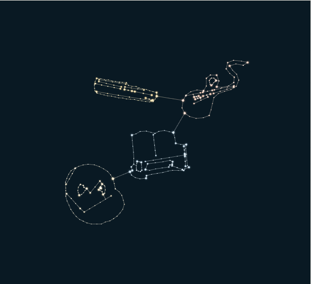
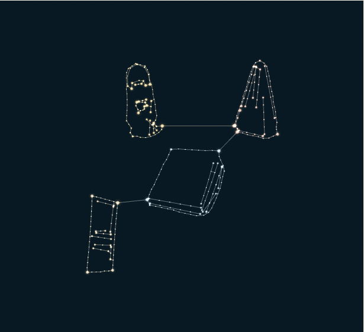
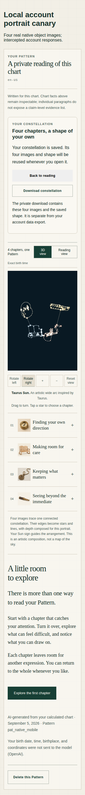

# Personalized portrait delivery

The account reader can create and reopen one saved constellation from four complete chapter images through ChatGPT-authenticated Codex. Each invocation receives one full chapter and generates one recognizable object. Its actual decoded pixels determine the chapter's stars and lines; the accepted chart's calculated Sun sign determines the artistic arrangement. Opening the portrait reuses the saved graph and images.

The separate public preview at https://patternlike-portrait-preview.lfd.workers.dev compares two authored fictional readings. “Direction & care” uses the four new native images: brass compass, rocking bench, knotted rope, and brass spyglass. “Space & change” retains the earlier generated door, notebook, metronome, and lantern. Neither preview is an account reading or a calculated personal chart.

## Provider and image evidence

- Codex CLI 0.153.3, existing ChatGPT login, `gpt-5.6-sol` orchestration with `xhigh`, and the reviewed native `gpt-image-2` tool pin. No OpenAI API key or alternate provider is used.
- Four real native image turns completed. Each receipt includes the original and saved image hashes, exact own-chapter hash, native image item ID, and thread/turn IDs. These are native event identifiers, not ImageGen HTTP request IDs; the installed tool does not independently attest the underlying image model in each response.
- A final native invocation also passed after the configuration and tool checks were finished. It generated a fifth compass image solely to verify the finished runner; that image is excluded from both preview constellations. The original four chapter images remained unchanged. The final run verified disabled inherited MCP servers, one successful native image, matching turn completion, exact decoded samples, and cleanup.
- Runner validation requires one successful native image event and one successful matching turn. It verifies decoded PNG bytes, bounds output, strips image metadata, saves a derivative up to 512 pixels per side, and derives exactly 128×128 RGBA samples from that saved image. Managed native files are cleaned after invocation.
- The four new PNG derivatives total **1,168,411 bytes**. Their saved Sagittarius example contains **318 stars and 326 connections**, serialized in **29,409 bytes**. Replacing each image changes its own shape while preserving the other three chapter shapes.

See [native receipts](artifacts/pattern-portrait/native-image-receipts.json), [final runner probe](artifacts/pattern-portrait/native-final-provider-probe.json), [image causality](artifacts/pattern-portrait/native-image-causality.json), [comparison evidence](artifacts/pattern-portrait/native-comparison.json), and the [runner contract and host requirements](../../apps/codex-runner/README.md).

## Account behavior and storage

Creation is explicit and bound to the current account, active chart, accepted Pattern ID, generated timestamp, document hash, and four exact chapter texts. Completed slots are immutable and reused. One durable outbox has four independently leased jobs, at most three attempts per slot, and a saved graph assembled only after all four images are accepted.

Images, pixel samples, labels, rationale, and graph are encrypted in the existing private ARTIFACTS bucket using the accepted Pattern content key, fresh nonces, and distinct authenticated metadata. Object inventory is registered before upload. Current identity and consent are checked again after uploads. Expired or stale completion cannot replace an accepted result.

Pattern erasure, source replacement, chart correction, recall, signed erasure replay, and account deletion invalidate access and retain cleanup inventory long enough to remove late uploads. Consent revocation cancels unfinished work while preserving an accepted portrait consistently with the accepted reading. The separate private portrait download includes four saved PNGs and the graph; the frozen account export format is unchanged.

Temporary account freezing pauses portrait work and retains saved artifacts. Existing account deletion also works before migration 0026, when the portrait tables are absent. Blank or insufficient-contrast image samples are rejected before acceptance, so a retry preserves the other completed chapters.

The account reader remains available during generation. A saved graph can render before any thumbnail bytes arrive. Image downloads use authenticated requests, verify each image hash, and release their blob URLs on source replacement or unmount. Slow status responses finish before another poll starts. Chapter choice, expression, and camera are preserved during thumbnail hydration.

## Verification

- Full web suite: **470 tests passed**; shared graph tests prove roundtrip validation and independent image causality.
- Runner suite: **53 tests passed**, plus typecheck, build, and a direct Node import of the compiled runner. A definitive invalid-image rejection is recorded immediately; uncertain transport outcomes cannot overwrite an accepted result.
- Focused API suite: **26 portrait integration tests passed**, plus **90 existing privacy, deletion, and replay tests** and API typecheck.
- Account mobile browser checks: **34/34 passed** at 390 and 320 pixels, including a deliberately slow ready response, graph before thumbnails, expression preservation, chapter navigation, reopening without regeneration, and blob cleanup.
- Public preview mobile checks: **66/66 passed locally and on the deployed URL**, including touch selection, drag/scroll separation, reading and constellation navigation, all chapter choices, graphics-loss fallback, idle rendering, and no overflow or browser errors.
- A separate real D1/R2 canary accepted all four native PNGs and their exact source hashes through the machine completion routes, saved nine encrypted artifacts, served the private bytes, and reopened the same graph. The accepted document was a local fictional fixture; this was not a production account run.
- Device checks use Chromium emulation. Physical iPhone/Android testing has not been performed.

The public preview is version `bbb3f9cf-1f63-49af-bf0a-7629a64289ad`, deployment `8faf11e1-11a5-4ab0-ad26-0d8ac497bc59`, verified at 100% traffic. See the [deployment receipt](artifacts/pattern-portrait/native-preview-deployment.json) and [live mobile checks](artifacts/pattern-portrait/native-public-mobile.json). The full repository gate completed with exit **0** and **all 14 lanes passed**. See the [paste-ready CI summary](artifacts/pattern-portrait/native-ci-summary.txt). The run covered these uncommitted feature changes on baseline `e3b8082`; all **79 source and fixture hashes** in the [verification manifest](artifacts/pattern-portrait/native-ci-source-hashes.json) were checked unchanged after the gate. Local Python was 3.14.4; CI configuration pins 3.12.

## Production release boundary

This feature branch does not enable account image generation in production. Migration **0026**, the compatible Worker, and the compatible outbound runner require a separate release. Keep creation off until those are installed and verified. Back up D1, apply 0026 after 0025, deploy the compatible Worker, verify the ChatGPT-authenticated runner host requirements, and then explicitly enable `PATTERN_PORTRAIT_ENABLED=1` and `CODEX_RUNNER_PORTRAITS=1` for the approved rollout. Disabling the flags stops new generation; cleanup remains available after migration.

This milestone admits exactly four core chapters. Three-, five-, and six-chapter Patterns retain their existing reader; no chapter is discarded or invented. A later product decision is required to extend that scope. The larger preexisting preview images remain unchanged and load only when their example is selected.

## Screenshots

