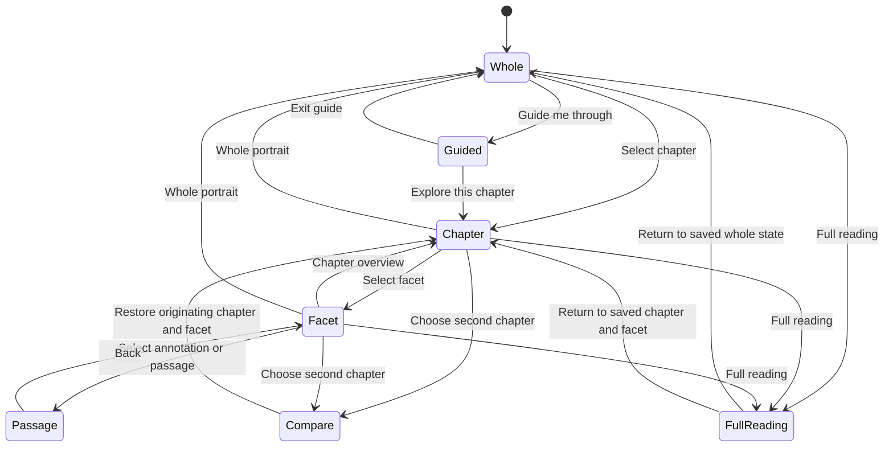

# Pattern portrait: substantial 3D exploration redesign

Date: 2026-09-06. Status: proposed design specification; not implemented or approved for production rollout.

Requested outcome: a substantially more interactive and physically convincing experience than the current portrait. This document completes the requested review and specifies a recommended redesign. It does not authorize a new generation provider, migration, deployment, or replacement of saved portraits.

Companion: [current experience review and browser evidence](../../reviews/2026-09-06-pattern-portrait-experience-review.md).

## 1. Product decision

Make the portrait an object the reader can investigate. Its core journey is **whole portrait → chapter → facet → source passage → return to the whole**. Every deliberate action should reveal content, clarify which chapter contributed to the portrait, or help the reader compare published material.

The visual identity stays within Pattern/Like: warm paper, forest ink, restrained coral emphasis, serif reading text, precise sans-serif controls, and a deep blue-green scene. The artifact takes priority over introductory copy. Avoid celestial spectacle, personality scores, and game-like rewards.

The recommended target is one composed portrait containing four substantive 3D chapter forms. “One portrait” means a coherent assembly with a shared composition; it need not be a single fused manifold. Each chapter must remain independently identifiable, selectable, and inspectable.

### Approaches considered

| Approach | Benefit | Limitation | Decision |
| --- | --- | --- | --- |
| Polish the existing stars and camera controls | Smallest change; retains current graph delivery | Leaves thin side views and shallow content interaction | Insufficient for this request |
| Thicken the contour into ribbons or shallow extrusions | Can reuse the current image-derived graph | Can still read as four flat cutouts; cannot establish unseen object structure | Useful experiment, not the target quality bar |
| Volumetric chapter assets with semantic exploration | Rotation reveals form; the model supports chapter, facet, and comparison tasks | Requires a new 3D asset contract and a verified authoring/generation path | Recommended target |

A more sophisticated shader cannot manufacture reliable object geometry from the existing sparse graph. Asset creation is substantive work alongside interaction design.

## 2. Outcomes and boundaries

The reader should be able to identify all four chapters immediately, understand how a selected form relates to its published chapter, inspect every facet, compare two chapters, and return to a familiar overview without losing their place.

Preserve these invariants:

1. The accepted written Pattern remains the source of meaning. Preserve every chapter title, summary, section, tension, resource, counter-expression, additional signature, uncertainty statement, and source identity.
2. Camera angle, color, size, material, distance, and assembly order express presentation choices. They do not measure personality, compatibility, psychological severity, or astrological strength.
3. A generated object and its rationale remain an artistic interpretation. Do not describe a model as a recovered physical object or a calculated chart feature.
4. The calculated Sun sign may influence an artistic arrangement. It must not alter the underlying reading or imply additional chart evidence.
5. The four-chapter milestone remains explicit. Three-, five-, and six-chapter documents retain the existing reader until a separate layout and asset contract supports them.
6. Exploration is local UI state. It does not regenerate artwork, call a model, rewrite published prose, or silently persist sensitive reading activity.

The first redesign does not include chat, generated cross-chapter conclusions, audio narration, social sharing, journaling, physics toys, or automatic interpretation of gestures. These would dilute the core exploration task or require separate product contracts.

## 3. Model and rendering direction

### Geometry

Use real triangle meshes for the four chapter forms. For the fictional “Direction & care” study, preserve the approved compass, rocking bench, rope, and spyglass references and their chapter association. Each should have a readable side and rear, convincing thickness, deliberate openings, and a coherent silhouette. An abstract interpretation is acceptable when it is clearly intentional and still traceable to its source image.

Compose the four forms into a balanced sculptural assembly with depth between contributions. Arrange them to read as one portrait from the home view. Thin guides may indicate chapter order while navigating; they must not look like asserted psychological relationships. Avoid a permanent arbitrary chain that encourages readers to infer unsupported connections.

The default rendering uses solid or mostly opaque surfaces, controlled roughness, subtle edge detail, and directional/environment lighting. Give the scene enough lighting variation to reveal depth during rotation. Color supports chapter identity but never carries it alone. Keep the unselected chapters recognizable instead of reducing them to nearly invisible fragments.

A limited contour overlay can show the image-derived outline on request. It is an explanatory layer, not the default body of the model. Do not substitute textured image planes, stock primitives, or a decorative star field for the approved 3D forms.

### Asset quality gate

Before integrating the final reader, inspect each chapter and the assembled portrait at front, rear, both sides, both three-quarter views, and elevated/depressed angles. Reject a result with paper-thin side views, holes in unintended places, unreadable silhouettes, normal artifacts, intersecting surfaces that obscure meaning, or important detail that disappears on a phone.

Use consistent world units, origin conventions, bounding boxes, chapter IDs, and named mesh nodes. Normalize viewing scale without implying that a larger object represents a stronger chapter. Freeze source image hashes, model hashes, and the corresponding reading revision.

### Delivery and feasibility

Use versioned GLB assets for the target representation. Three.js supplies a glTF 2.0 loader and parsing of binary data; physically based materials are available through its metallic/roughness material system. These are rendering capabilities, not an existing project mesh-generation pipeline. [GLTFLoader](https://threejs.org/docs/pages/GLTFLoader.html), [MeshStandardMaterial](https://threejs.org/docs/pages/MeshStandardMaterial.html).

For the first future implementation, author and approve four genuine 3D fixture assets against the existing fictional image references. This proves the visual and interaction target without assuming that today's PNG generator produces usable meshes. The automated per-account mesh authoring route remains a production dependency to evaluate against exactly the same quality gate. No additional provider is selected by this specification, and no personal chapter text should be sent to a new service by default.

Retain the existing graph representation as a supported version for already-saved portraits. If meshes are unavailable, present the saved constellation or complete reading with an accurate label. Do not quietly pass a stock mesh off as the user's portrait.

## 4. Primary layout

### Desktop, 1024px and wider

Use a compact header and one working surface. The left roughly 60% holds the persistent scene; the right roughly 40% holds the reader, with a practical reading width of 360–460px where space permits. The four labelled chapter controls remain visible beneath the scene or in a compact adjacent rail.

At 1440 × 900, the first viewport must contain the whole default portrait, chapter choices, a clearly labelled primary exploration action, and the scene controls. Remove the large introductory hero from this workflow. Keep the existing wordmark, an accurate page title, birth-time uncertainty when present, and access to the full reading.

The reader changes within its panel. Selecting a chapter must not scroll the entire page away from the model. Long prose uses the reader's dedicated scroll area on desktop; keyboard users can enter and leave it normally. The scene stays visually available while the reader moves through passages.

### Tablet and narrow desktop, 768–1023px

Use the same information hierarchy in a stacked layout: compact header, scene, chapter rail, reader. Keep the selected chapter identity visible. Allow the reader to expand rather than force a cramped two-column arrangement. Treat these as layout changes, not different navigation states.

### Phone, 320–767px

Use three explicit presentation states:

- **Explore:** a compact header, a scene around 280–340px tall at 390 × 844, visible scene controls, a chapter rail, and the selected chapter's summary panel. At 320px, the scene may reduce to about 240px. These are starting design dimensions, not fixed heights that override available space.
- **Read chapter:** the reading panel expands; a compact scene/return strip keeps chapter identity and a visible **Return to portrait** action. A single primary document scroll surface carries the prose. Do not require manipulating a sheet handle to access content.
- **Expanded scene:** an explicit full-viewport scene mode supports closer inspection. It always shows chapter selection and a labelled exit; Escape and the browser back action return to the previous presentation.

Use native **Expand reading**, **Return to portrait**, and **Expand scene** buttons. Dragging a panel handle may later duplicate these actions, but never becomes the only way to navigate. Avoid competing vertical scroll areas and prevent sticky controls from obscuring focused text.

On a 390 × 844 first view, the reader must see an identifiable portrait, a way to select a named chapter, and a way to manipulate the scene without scrolling. At larger text settings, preserve reading order and reachability rather than shrinking text to retain a screenshot composition.

## 5. Interaction contract

| Action | Scene response | Reading response | State and exit |
| --- | --- | --- | --- |
| Hover a chapter body or focus its label | Gentle outline/emphasis and its chapter title; no camera move | Optional one-line preview using existing summary text | Hover is temporary; selection remains unchanged |
| Select a body or labelled chapter control | Frame the selected chapter and retain context for the other three | Show title, summary, facet navigation, and complete current facet | Selection persists; pointer selection does not unexpectedly steal keyboard focus |
| Unfold portrait | Move the four forms to fixed, inspectable positions while preserving their identities and orientation | Explain that the parts correspond to published chapters | Toggle **Reassemble** restores the prior assembly; no new relationships inferred |
| Select Overview, Tensions, Resources, or Another expression | Reveal that facet's labelled annotations for the selected chapter | Display all original paragraphs belonging to the facet | Store facet separately for each chapter; returning restores it |
| Select an annotation or a linked passage | Emphasize its anchor and, if needed, gently reframe it | Reveal and focus the exact corresponding passage when requested | Never replace the facet with only an excerpt |
| Inspect original image | Show the exact bound reference image in an explanatory panel | Show the existing object rationale, distinctly labelled as a visual metaphor | Closing restores chapter, facet, camera, and reading position |
| Compare with another chapter | Frame the two selected contributions with persistent labels | Align the same facet for both, retaining each complete text | Maximum two chapters; exit restores the originating state |
| Start guided exploration | Present a deliberate sequence of chapter framing steps | Introduce the four chapters and their facets with published text | Manual Next/Previous; skip or exit at any time; no autoplay |
| Whole portrait | Restore the assembly overview and whole-portrait camera bookmark | Show a concise orientation and all chapter choices | Preserve each chapter's last facet and passage position for return |
| Reset camera | Restore the camera for the current semantic state | No text, chapter, facet, or comparison change | Distinct from returning to Whole portrait |
| Full reading | Suspend or unmount 3D rendering after saving its pose | Show every chapter field, signatures, and uncertainty | Open at the selected chapter; return restores full exploration state |

### Why the new actions are substantial

Unfolding makes the composition's chapter contributions inspectable. Facet annotations make the model an entry to the actual reading. Two-way passage linking makes the reading an entry back to the model. Comparison helps readers examine two published chapters without a generated synthesis. A guided path makes the experience approachable without taking away free exploration.

These interactions must be demonstrated with realistic chapter text before visual polish is considered complete. Additional rotation buttons, particles, or idle animation alone do not satisfy this specification.

## 6. Facets and annotations

Retain the reader's existing labels: **Overview**, **Tensions**, **Resources**, and **Another expression**. Use semantic tab behavior for mutually exclusive facet panels, with arrow-key movement, focus handling, and a labelled panel. Follow the WAI-ARIA tabs pattern rather than adding roles to the current buttons without the corresponding behavior. [Tabs pattern](https://www.w3.org/WAI/ARIA/apg/patterns/tabs/).

Each annotation links to an immutable chapter/facet/paragraph location in the accepted reading. The scene label can be short, but its associated passage is exact source text. Store annotation labels and metaphor notes separately from published prose. If a particular mesh feature has no established content-specific metaphor, label the chapter contribution as a whole; do not invent a claim that its seam, bend, or cavity means a personal trait.

For the first model, a facet can use one clearly labelled anchor to its chapter body, with an HTML list of all passages. More granular anchors require explicit source binding and visual rationale. Set a label budget of at most four visible scene annotations; expose additional passages through a labelled list. Hide occluded floating labels in favor of the persistent chapter controls, rather than piling text over the model.

Use focus, framing, modest surface emphasis, and labels to distinguish facets. Do not represent Tensions as cracks or damage, Resources as measured structural strength, or Another expression as a worse/better personality state. Morphing the portrait should communicate navigation and assembly, not ungrounded diagnosis.

## 7. Example journey

1. The reader opens the portrait and sees all four forms with named chapter choices. **Explore a chapter** is the primary invitation; **Guide me through** is optional.
2. They choose **Finding your own direction**. The camera frames the compass contribution, the chapter label stays visible, and the adjacent panel shows the original summary.
3. They choose **Tensions**. A labelled annotation becomes available on that chapter; the panel shows the exact source sentence, “Looking for an unmistakable sign can delay a choice that is already small enough to explore.”
4. They open **Inspect original image** to understand the compass metaphor. The actual saved reference and existing rationale explain the visual choice. Returning restores the Tensions state.
5. They choose **Compare with…** and **Making room for care**. Both contributions stay labelled; the panel places their Tensions text together. The interface does not assert a causal connection or compatibility score.
6. They leave comparison, reassemble the portrait, and open **Full reading**. It opens at their chapter, with all sections available. Returning restores their camera pose and reading facet.

On mobile the same journey uses the expanded reader and scene states. No chapter change removes the labelled chapter rail from the exploration view.

## 8. State, navigation, and camera

Keep durable UI state above the renderer. Suggested responsibilities, not an implemented API:

| State | Required contents |
| --- | --- |
| Source identity | Pattern, chart, document revision/content hash, model manifest version |
| Semantic location | Whole/chapter/comparison/guided, selected chapter IDs, active facet, active passage |
| Presentation | Explore, expanded reading, expanded scene, full reading |
| Assembly | Together/apart, last stable transforms |
| Camera bookmarks | Position, target, zoom/projection, and framing mode for whole, selected chapter, and comparison |
| Reading bookmarks | Facet and scroll/passage location for each chapter |
| Return state | A bounded navigation stack containing the originating state for overlays and comparison |
| Capability | Model loading/ready/unavailable and a selectable graphics quality tier |

The diagram is semantic navigation. Assembly and responsive presentation are orthogonal state, not new chapters. Comparison exit and Full reading return restore the saved facet even when the diagram returns to the Chapter state.

Record camera pose at the end of direct manipulation and before any renderer unmount. Do not rebuild pose by replaying the last button press. New direct input interrupts camera transitions immediately. Frame selected content against its actual bounds and the available viewport after reserving space for labels and controls.

Starting motion targets: 120–180ms for hover/emphasis, 350–500ms for chapter framing, and 450–650ms for unfold/reassemble. Treat these as tuning targets. Reduced-motion mode applies the destination state immediately, with optional short opacity changes. Never move the camera automatically while someone is reading, or add continuous idle spin.

Use the browser history for deliberate semantic navigation, scoped within the existing app route. Hover, camera movement, and every slider tick must not create history entries. Back restores the previous portrait state before leaving the feature. Keep private reading text and identifiers out of public URLs; use in-memory navigation state or opaque local history entries.

Document replacement, invalidated access, logout, or account change clears all model and reading state. Ordinary image hydration, layout changes, and tab visibility changes preserve it. This proposal does not add persistent local reading-history storage.

## 9. Input and accessibility

- Mouse: click a mesh body or label to select; drag to orbit; explicit buttons for rotate, zoom, frame, and reset. Wheel scroll remains page/panel scrolling in the embedded view; wheel zoom is limited to an explicitly engaged expanded scene.
- Touch: tap a labelled chapter or its body; horizontal movement may orbit in embedded Explore. Vertical movement scrolls the page. Two-finger orbit/zoom is reserved for the engaged expanded scene and has button alternatives. Multitouch, canceled gestures, and movement beyond the tap threshold cannot select a chapter accidentally.
- Keyboard: all content can be reached through native chapter controls and facet tabs without entering the canvas. A labelled **3D controls** group supplies rotate, tilt, zoom, frame, reset, and exit. Arrow-key scene shortcuts operate only when that control region is focused, and do not steal keys from selects, tabs, or reading text.
- Selection is communicated through text, state semantics, and an outline or shape treatment, not color alone. Hover previews must also appear on keyboard focus; essential information is never hover-only.
- Use a 44 × 44 CSS-pixel design target for scene labels and controls, with separation around adjacent targets. This is a deliberate product target; WCAG 2.2 AA's target-size criterion has a 24 CSS-pixel minimum and exceptions. [Target Size (Minimum)](https://www.w3.org/WAI/WCAG22/Understanding/target-size-minimum.html).
- Respect reduced motion and provide a visible motion preference within scene settings. The W3C interaction-animation guidance supports disabling nonessential motion; its 2.3.3 criterion is AAA. [Animation from Interactions](https://www.w3.org/WAI/WCAG22/Understanding/animation-from-interactions.html).
- Announce selected chapter/facet succinctly in a polite live region. Do not narrate every camera frame, pointer movement, or animation step.
- For an actual modal expanded scene, contain focus, label the dialog, support Escape, and restore focus to its opener. The normal reading panel is not modal and must not trap focus.
- Preserve content at 200% text sizing and 320 CSS-pixel reflow; allow controls to wrap and reading regions to expand. Validate contrast manually as well as with automation.

## 10. Source and artifact contract

The existing saved portrait contains image references and a numeric graph. The proposed mesh representation requires a separate versioned manifest. Do not silently change the meaning of the existing portrait contract or frozen M0 schemas.

Proposed manifest responsibilities:

| Element | Required data and validation |
| --- | --- |
| Envelope | New representation/schema version; exact accepted Pattern/chart/document identity; immutable source hashes |
| Chapter asset | Chapter ID, source image reference/hash, GLB artifact reference/hash, bounding box, named mesh nodes, material/LOD metadata |
| Composition | Home transform per contribution, unfolded transform, whole/chapter camera framing metadata; artistic arrangement identifier |
| Annotation | Stable annotation ID, chapter ID, facet, source paragraph path(s), mesh node or chapter-level anchor, concise label, separately identified metaphor note |
| Provenance | Asset authoring method/version and image/model derivation; fictional fixture status where applicable |
| Compatibility | Supported renderer version and fallback to the existing graph or complete reading |

Validate annotations against the accepted complete document before rendering. A missing or mismatched paragraph path disables the annotation, not the reading. A missing or mismatched model disables that representation; it must not attach an unrelated asset to the current chapter.

The GPU layer receives geometry, IDs, transforms, and presentation state. The DOM reader owns prose and semantics. Keep exact source text outside geometry algorithms. If metaphor annotation authoring uses a model in a future pipeline, that is a separate generation step bound to source text, with separately validated output; the runtime browser does not infer meanings.

For private assets, extend existing authorized artifact delivery, hash verification, encryption, inventory, invalidation, and erasure behavior to include meshes, textures, annotation manifests, and derivatives. Do not expose private GLB URLs merely to satisfy a loader API. Prefer a bounded, self-contained GLB, loaded from authenticated verified bytes; reject unexpected external asset dependencies. Dispose textures and decoded image resources as well as geometry and materials when ownership ends. Three.js explicitly notes additional disposal needs for image bitmaps loaded with glTF. [GLTFLoader disposal note](https://threejs.org/docs/pages/GLTFLoader.html).

Keep the current download description precise. A future downloadable **complete portrait reading** must include the source reading, uncertainty, signatures, source identity, assets, and viewing manifest. Do not relabel the present image/graph download as a complete archive.

## 11. Loading, failure, and recovery

| Condition | Required experience |
| --- | --- |
| Reading ready; model loading | Show the complete reader and chapter controls immediately; reserve scene space with a factual loading state |
| Only some assets ready | Show a clearly labelled partial visual preview only if chapter identity is reliable; never claim the full portrait is ready |
| Slow generation | Show actual completed stages/counts when available; let the reader leave and return; no invented countdown |
| Asset failure or unsupported version | Retain the reader and saved compatible constellation; explain which visual representation is unavailable; allow an explicit retry |
| WebGL unavailable/context lost | Preserve the semantic location and prose; disable scene-only controls; offer retry without discarding reading state |
| Reduced performance | Lower rendering resolution, texture/mesh detail, and optional lighting effects; preserve interaction and labels |
| Invalidated source or revoked access | Remove old content and assets using the existing source/access rules; do not keep a stale canvas visible |
| Full reading return | Restore chapter, facet, camera, assembly, and reading bookmarks for the same source revision |

Do not turn capability detection into a browser/device judgement. State what is available, offer the reading immediately, and keep recovery local to the failed capability.

## 12. Performance targets

These are proposed engineering budgets to validate on real devices, not measurements of the current renderer:

| Area | Starting budget or gate |
| --- | --- |
| First visual asset payload | Aim for ≤3 MB compressed across the initial portrait LOD; defer high-detail textures/geometry until deliberate inspection |
| Visible geometry | Start around ≤80k triangles for the mobile assembly; use reduced meshes for smaller devices |
| Draw calls | Aim for ≤40 for the active assembly, including labels/outline passes where applicable |
| Texture memory | Aim for ≤64 MB of decoded scene texture memory on the baseline phone |
| Frame time while interacting | Target 60 fps on the reference desktop and a stable 30 fps or better on baseline physical phones; measure frame-time distribution |
| Idle | Stop rendering when interaction, transitions, and loading settle; suspend when hidden |
| Interaction feedback | Show selection/focus feedback within 100ms under the agreed device profile; do not wait for new network requests |
| Loading | Keep the reader usable immediately when its document is available; target initial visual readiness within 3s under a recorded midrange device/network profile |
| Cleanup | Repeated open/close, source replacement, and representation switches must reach a stable memory plateau |

Profile CPU, GPU, decoded textures, and network separately. Software-rendered browser screenshots cannot approve these budgets. Prefer one controlled lighting setup, shared materials, and limited post-processing; add effects only when measured cost permits them.

## 13. Implementation boundaries and sequence

This is a proposed sequence for later authorized implementation, not work completed in this review.

1. **Prove volumetric assets.** Author four fictional fixtures and one assembled portrait; capture the required angles and phone framing. Reject visually shallow assets before building the final experience around them.
2. **Build the complete core loop.** Shared navigation state, persistent chapter rail, camera bookmarks, body picking, whole/chapter framing, unfold/reassemble, and reversible mobile reader/scene states.
3. **Connect content exploration.** Facet-to-scene annotations, exact passage links, original-image inspection, full reading parity, and per-chapter reading bookmarks.
4. **Add the deeper tasks.** Two-chapter comparison and a manually advanced guided journey using the same state and source bindings. Both are part of the specified redesign, not inert placeholder controls.
5. **Harden and validate.** Keyboard and screen-reader coverage, motion controls, graphics-loss recovery, real-device frame/memory checks, long and uncertain readings, and source replacement.
6. **Integrate account delivery separately.** Establish the automated mesh authoring route, extend the versioned artifact contract, validate storage/cleanup/download behavior, and only then consider a production release.

Likely frontend seams are a `PortraitExplorer` controller, a scene renderer, chapter navigation, the facet/passage reader, a camera-state controller, and a representation loader. Reuse source projection and account access boundaries from the existing implementation. Keep `PatternPortrait` compatibility for saved graph portraits while the new representation is introduced.

If implementation changes contracts or storage, provide corresponding version notes, valid/invalid fixtures, migrations when required, and compatibility tests. Run the repository's authoritative `npm run ci:local` gate against the final implementation and paste its summary into the PR before merging. A merge to main can deploy through Workers Builds even when GitHub Actions is unavailable. This document alone provides no release authorization or release evidence.

## 14. Acceptance criteria

The redesign is ready for review only when all required criteria have concrete evidence:

1. **Substantial form:** accepted screenshots of each chapter and the whole portrait at all specified angles; no collapse into flat outlines when rotated sideways.
2. **Immediate discoverability:** at 1440 × 900 and 390 × 844, named chapter selection and usable scene controls are visible with the initial artifact. At 320px and enlarged text, controls and text remain reachable without horizontal page overflow.
3. **Complete interaction loop:** body/label selection → chapter focus → facet → exact passage → whole portrait works with pointer, touch alternatives, and keyboard.
4. **Bidirectional connection:** choosing a scene annotation reveals its exact passage; choosing a linked passage emphasizes the correct chapter/anchor. No fabricated annotations or truncated facet content.
5. **Reversible assembly:** unfold/reassemble preserves identity, reading state, and the expected camera return position.
6. **State restoration:** camera, selected chapter, facet, passage, and assembly survive full reading, expanded scene, comparison, thumbnail hydration, viewport changes, and temporary renderer unmounts for the same revision.
7. **Comparison:** exactly two selected chapters, their identities, and complete chosen-facet text remain clear; changing facets updates both; exiting restores the source state. No generated connection claim appears.
8. **Guidance:** a first-time reader can start, advance, go back, inspect a chapter, and exit the guided journey; free exploration is always reachable.
9. **Reading parity:** every published field and uncertainty statement remains accessible with and without 3D; the full reading opens at the current chapter and preserves source identity.
10. **Accessibility:** keyboard-only task completion, VoiceOver and NVDA checks, focus restoration, text/reflow checks, contrast checks, and reduced-motion behavior. Record automated scan scope and incomplete checks.
11. **Failure recovery:** asset failure, unsupported model version, lost WebGL context, slow loading, access invalidation, and source replacement have verified outcomes with no stale private portrait.
12. **Performance and lifecycle:** recorded hardware/network profiles, frame-time measurements, asset budgets, idle rendering behavior, and stable memory after repeated lifecycle operations.

Before broad release, run task-based sessions with at least five representative readers. As an initial design gate, at least four should independently find a named chapter, explore a facet, inspect its source, compare another chapter, and return to the whole. Record confusion and completion behavior; this is a formative check, not statistical proof. Ask what the geometry and connecting elements mean to them. If they infer scores, causal relationships, or new chart facts, revise the presentation.

## 15. Deliverable boundary

This review supplies current browser evidence and a concrete recommended interaction/asset specification. No replacement frontend, 3D assets, generation pipeline, account behavior, or production configuration has been built. The key next commitment is to prove both substantial volumetric form and the complete exploration loop using fictional source-bound fixtures before extending account generation.
