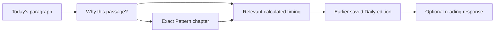

# Slices 4 and 5: reader relationships, provenance, and feedback effects

Date: 2026-09-08

Status (2026-09-09): Slice 4 is deployed through PR #52. Slice 5A and 5B are complete as local software: existing feedback beside check-in, categorical storage/routes/client, bounded compiler, and lifecycle/export integration. Migration 0031 and Slice 5 production deployment remain pending; categorical generation effects default off. Human quality/comprehension review and measured reader benefit remain open.

Execution records: [Slice 4 implementation and release](../plans/2026-09-09-reader-journey-production-implementation.md), [reader-feedback implementation plan](../plans/2026-09-09-reader-feedback-implementation.md), [local feedback browser evidence](../../reviews/artifacts/reader-feedback/2026-09-09-implementation/README.md), and [unfilled human-review worksheet](../../reviews/artifacts/reader-feedback/2026-09-09-implementation/human-review-worksheet.md).

Parent: [12+1 delivery ledger](../plans/2026-09-07-mind-map-alignment-slices.md). Quality criteria: [Slice 3 baseline](2026-09-08-interpretation-quality-baseline-design.md). This specification settles the shared relationship/feedback contracts; Slice 4 and Slice 5 retain separate implementation and release boundaries.

Original source review: commit `6e706741f03253f2807d33380afb529161f3481f` and local files inspected on 2026-09-08. The original proposed contracts were additive design decisions. The dated baseline and prototype observations below remain historical evidence; the execution sections distinguish the subsequent Slice 4 release from the local Slice 5 implementation. The approved design requirements remain applicable.

Reconciled: 2026-09-09 against source commit `d338b86c9444ebe2f372f2a2f3990f4a1270bc80` and the working September 9 revision of the [alignment roadmap](../../reviews/2026-09-07-mind-map-alignment-roadmap.md), especially sections 6.1, 6.2, and 6.4–6.6. That documentation reconciliation incorporated explained navigation branches, existing observatory entry/return, feedback at the point of reading, and permission/retention consequences; it did not itself authorize implementation. The user subsequently authorized the Slice 4 prototype, completion with real authorized reading data, and the next steps recorded in the implementation plan. Deployment remains a separate execution state, recorded below.

## Local prototype result (2026-09-09)

Open `/reader-journey.html` using the existing `npm run dev --workspace @patternlike/web` command. The [standalone entry](../../../apps/web/reader-journey.html), [preview](../../../apps/web/src/preview/reader-journey-preview.tsx), and [pure resolver](../../../apps/web/src/lib/reader-relationships.ts) provide Today → explanation → exact Pattern chapter 3 of 4 → retained Timing pass 2 → saved Daily revision 2 → existing resonance choices, plus a direct Today → Timing branch. All displayed readings and evidence are explicitly fictional; the response remains in page memory only. Complete Pattern text is available without artwork.

Exact target coordinates and typed feature/participant/date evidence determine links. Missing/replaced source or destination editions, ineligible Timing, unknown-time evidence, and absent support produce bounded unavailable/no-connection states. Open destinations are revalidated when the scenario changes. The resolver accepts already-authorized inputs; the scenario eligibility flag is not an account authorization mechanism.

Focused verification passed: 21 resolver tests, nine preview tests, three existing ReadingArticle tests, and web typecheck. Playwright/Chromium at 1440×1000 and 390×844 exercised the complete path, direct Timing branch, complete text, keyboard entry, destination heading focus, browser Back restoration of the originating link and scroll, unavailable/replaced scenarios, and page-only feedback. The observed flow had no application console errors/warnings, framework overlay, horizontal overflow, or API/provider requests; an axe check on the final mobile saved-reading state reported no WCAG A/AA violations. Browser plugin was unavailable, so temporary Playwright/browser dependencies were kept outside the repository. These observations cover the local fictional flow, not all accessibility or account states.

The prototype itself changed no endpoint, schema, database migration, account navigation, production feedback, or provider input. Its former production-loading and observatory gaps are addressed by the subsequent implementation below; the reader comprehension exercise remains open. Navigation is held in the current browser session: reload or a new tab restarts at Today. The prototype uses one four-chapter fixture and does not establish three-, five-, or six-chapter observatory entry. No package script or gate was added.

## Authorized application implementation (2026-09-09)

The [Worker adapter](../../../apps/api/src/services/reader-relationships.ts) now reads real owner-authorized encrypted Daily and Pattern artifacts and retained current-chart cycles. [Four additive endpoints](../../../contracts/reader-relationships-v1/openapi/openapi.yaml) discover an exact source, resolve bounded links, revalidate and open a source-bound destination, and read an exact Timing pass. Existing Daily, Pattern, History and export contracts remain unchanged. Public evidence identities are digests; factual coordinates stay inside the Worker.

[Migration 0030](../../../db/d1/0030_reader_relationship_supports.sql) adds encrypted support for accepted paragraphs and chapters. Both publication transactions retain support atomically under their existing authorization and crypto guards. Revision, content hash, schema version and factual coordinates are sealed inside the payload, with owner/document references outside it for lifecycle cleanup. Rotation and account erasure include this field; document deletion/replacement/replay cascades remove it. Derived support is nonportable alongside existing reading source indexes, while readable prose remains exported under the frozen export contracts.

The [production reading connection view](../../../apps/web/src/components/ReadingConnections.tsx) uses these endpoints and existing feedback controls. It keeps Today mounted, carries each paragraph’s exact source in memory, and revalidates on open, Back and foreground changes. Browser history contains only opaque navigation indices. Linked Pattern chapters reuse the existing observatory for three through six chapters, with complete text and no artwork prerequisite or automatic generation. Existing feedback submission explains its actual bounded grant effect.

Local verification used test-owned records through real encrypted D1 and publication code, plus component and browser API fixtures for rendered interaction. Earlier records without retained support remain readable and may show no supported connection; there is no backfill from a current chart. Detailed commands, observed results and the remaining comprehension boundary are in the [implementation record](../plans/2026-09-09-reader-journey-production-implementation.md).

Slice 4 was subsequently deployed through PR #52 at main commit `c4e94f2257c258e8c06f80e6b77df698838234b2`. Production migration 0030 was applied on 2026-09-09 at 06:58:26 UTC before compatible Worker version `f637dc53-4824-4415-8160-bf98e551c209`. Public metadata verified that source SHA and Worker version; the application shell returned 200 and protected requests without authentication returned 401. These release observations do not establish a signed-in production journey: none was observed. Human comprehension remains unmeasured.

## Local Slice 5 implementation (2026-09-09)

Slice 5A makes existing resonance feedback available on Today beside the independent check-in. Slice 5B adds categorical options, deliberate submission, exact-edition receipts on Today and History, and navigation to the existing birth-correction form. The [event store](../../../apps/api/src/db/reading-feedback-events.ts) and [routes](../../../apps/api/src/routes/feedback-events.ts) enforce owner/edition/paragraph identity, atomic grant-state preconditions, encryption/write fences, and idempotency. Completed identical retries return the original receipt even after revocation; stale new submissions cannot renew permission automatically. Existing resonance records and requests remain compatible.

[Migration 0031](../../../db/d1/0031_reading_feedback_events.sql) is implemented and tested locally; it has not been applied in production. The new event, authored note, receipt, and completed replay payload share one encrypted row. They follow the existing USR-12 retention limit of **24 calendar months**, with elapsed-retention exclusion on reads and bounded deletion in existing privacy maintenance. Cleanup removes the event, note, and replay payload together; there is no separately retained note or mutation copy. Account deletion, key rotation, target deletion, and restore replay include the new store. Seven-day generation eligibility and later grant revocation remain distinct from storage retention.

The additive `account-export-feedback/v1` successor exports retained categorical receipts and authored notes when readings are included, including after effect expiry or grant revocation. Existing queued 0.7.0 and 0.8.0 export commands retain their original shapes. Provider projection is closed and carries only admitted category/target signals with supported identifiers; raw notes and copied reading prose are excluded. The [compiler policy](../../../apps/api/src/services/reading-feedback-policy.ts) requires selection policy `1.2.0` and prompt `1.0.4`, with `CATEGORIZED_FEEDBACK_EFFECTS_ENABLED` defaulting off. Existing frozen command pins retain their previous semantics.

`not_relevant_today` is currently **recorded-only**: actual stored V5 evidence has no supported theme associations, so the compiler emits no relevance signal. The implementation does not invent themes from notes, prose, or labels. `unclear` has no automatic generation signal. A supported repetition signal can become eligible only under the compatible enabled policy and current permission; recording or eligibility is not proof of a changed reading.

The [browser record](../../reviews/artifacts/reader-feedback/2026-09-09-implementation/README.md) documents the local Today/History, independent check-in, receipt, and birth-correction interactions using fictional API responses. API suites separately exercise real encrypted D1, compiler admission, atomic publication guards, and lifecycle behavior. Neither establishes a live Slice 5 rollout or reader benefit. The [human-review worksheet](../../reviews/artifacts/reader-feedback/2026-09-09-implementation/human-review-worksheet.md) is unfilled; editorial quality, comprehension, and measured effects remain open. No package command, verification gate, or mandatory tooling was added.

## Source baseline and consequences (inspected 2026-09-08)

[Daily evidence projection](../../../apps/api/src/routes/readings.ts) exposes edition/content identity and paragraph fact/context references. [History](../../../packages/shared/src/m8-reading-history-types.ts) identifies Daily editions by reading ID, revision, date, and status. [Pattern state](../../../apps/api/src/services/pattern-state.ts) serves the active Pattern and can retain an accepted document while source regeneration is pending or failed. Pattern storage does not establish an indefinitely retained library of every earlier Pattern edition.

Consequently, the first journey ends at an earlier saved **Daily** reading. A link to a replaced or erased Pattern may become unavailable; it must not silently open the latest Pattern and claim it is the original edition. The inspected Daily command/evidence does not by itself establish a first-class, durable Pattern-chapter relationship. Similar prose or matching labels are not sufficient evidence to add one.

At the baseline review, [feedback storage](../../../apps/api/src/db/feedback.ts) accepted resonance, relevance labels, and an optional encrypted note. Its [first-party source helper](../../../apps/api/src/db/first-party-sources.ts) created/reused the bounded USR-12 grant on submission. That compatible resonance path remains. The allowed-use declaration includes content quality, repetition control, and theme ranking; the [context compiler](../../../apps/api/src/services/context-compiler.ts) offers structured resonance/labels for the latter two, not note text. USR-12 is not a switch in the closed USR-06/USR-09 context-sources document.

Preserve that actual grant model and explain it clearly. Do not describe current submission as having no grant effect, add USR-12 to a frozen context-sources enum, or convert feedback into unrestricted personal-context/training permission.

At the baseline review, the [shared reading article](../../../apps/web/src/components/ReadingArticle.tsx) showed check-in on Today and structured feedback on a reopened History reading through mutually exclusive branches. Slice 5A/5B subsequently removed that local interface restriction: feedback and check-in are independently available on Today, and History retains the same edition's feedback receipt. The [check-in form](../../../apps/web/src/components/DailyCheckInCard.tsx) requests 24-hour freshness and says only a later reading may use the input. [Storage](../../../apps/api/src/db/check-ins.ts) computes a separate retention deadline: the [committed configuration](../../../apps/api/wrangler.toml) and [default policy](../../../apps/api/src/services/check-in-retention.ts) use 13 calendar months, with configuration bounded to 1–13 months. [Privacy maintenance](../../../apps/api/src/services/privacy-maintenance.ts) separately expires freshness and purges retained signal rows. The interface's one-day language is not evidence of a one-day deletion deadline; the local check-in copy now explains the separate storage period.

The existing [observatory entry](../../../apps/web/src/components/AccountPortraitExplorer.tsx) opens a matching three-to-six-chapter Pattern by default. Local reading folios and the complete text do not require generated artwork or portrait automation consent. [Comparison and passage navigation](../../../apps/web/src/components/portrait-explorer/ExplorerReader.tsx) already exist; generated [artwork admission](../../../apps/api/src/services/pattern-portrait.ts) still requires four chapters. Slice 4 connects supported exact editions to this reader and back; adaptive stations and expanded artwork eligibility are outside this change.

## Slice 4: one supported journey

The first complete path is Today paragraph → exact Pattern chapter → relevant calculated Timing result → earlier saved Daily edition → existing feedback. Also permit explained branches from Today directly to a supported Pattern chapter or Timing result:

The explanation and response are interface steps, not additional relationship target kinds or support evidence. The links between document targets still require the support defined below; the diagram does not claim that Pattern prose supplies Daily generation inputs or that a response proves an astrological relationship. Show only supported branches, with an explicit no-supported-connection state when none exists. A reader need not visit Pattern before following a valid direct Timing link.

Use a small fictional, manually inspected relationship set first. This prototype needs no new model, regeneration of saved readings, graph database, or claim that every day has a supported connection. Time travel remains an existing dated-context view; this slice does not add a new Time travel target kind or silently substitute a fresh reconstruction for a retained Timing result.

Implement a pure relationship resolver and an owner-scoped loading adapter. The resolver receives already authorized document/evidence inputs and returns a closed relationship view. The adapter uses existing read/access/recall rules. Source-based automatic relationships are allowed only when the supplied inputs contain enough canonical evidence to prove the relationship. If evidence has expired or cannot be reconstructed, return no supported connection; do not recover it from word similarity or manufacture historical evidence.

### Exact target identity

Use a discriminated target reference, with these required coordinates:

| Kind | Identity and optional unit |
| --- | --- |
| `daily` | `reading_id`, integer `revision`, stored `content_hash`; optional actual `paragraph_id` |
| `pattern` | `pattern_id`, `document_revision`, stored `content_hash`; optional zero-based `chapter_index` and exact chapter source-text SHA-256 |
| `timing` | Stored `cycle_id`, full `cycle_hash`, applicable one-based pass index, UTC envelope, displayed local date/time zone, and stored cycle policy identity |

Pattern `document_revision` follows the existing schema/pattern/generated-at identity used by portrait binding. The Worker validates whole-document hashes against stored metadata; do not pretend the client can recompute an internal-document hash from an evidence-free public projection. Chapter text hashes use the existing canonical chapter-source serialization. Ordinals identify a chapter only within that exact document revision.

Timing uses [the existing content-addressed cycle and full envelope hash](../../../apps/api/src/db/cycles.ts), verified from stored normalized cycle bytes through the existing cycle-hash function. Keep chart/owner identity in the authorized loading boundary. The [current Timing snapshot](../../../apps/api/src/db/timing.ts) exposes active cycles and a latest-reading date receipt; that receipt alone is not a calculation-request identity or evidence of historical model/calculation pins. Expose only pins actually retained in the bound source.

Add an owner-authorized exact-cycle loader for links, with `GET /v1/timing/cycles/:id` and required `cycle_hash`, `pass_index`, `local_date`, and validated `time_zone` query parameters. Its additive `timingDetail` representation in the reader-relationships-v1 contract package identifies the stored envelope/policy and computes display phase for the requested date without changing that envelope. It may show a retained past cycle when existing chart/access/retention rules allow it, even though the current Timing list filters it out. Recalculation is a separately identified refresh; an erased, ineligible, or hash-mismatched result is unavailable. Do not silently rescan on link open or widen retention to make a link succeed.

### Relationship record

The logical record is `reader-relationship/v1` with `id`, `from`, `to`, `kind`, `reason_code`, `support_digest`, and `evidence_identity`. Derive IDs by SHA-256 over the existing canonical-JSON encoding of schema version, coordinates, kind, and support digest, prefixed with the relationship domain name. Labels are not identity inputs. Targets use the union above; reasons come from fixed presentation copy, not arbitrary server-provided HTML or URLs.

| Kind | Required support | Permitted explanation |
| --- | --- | --- |
| `shared_calculated_feature` | Same chart context and exact normalized factual feature identity, including participant roles/frame and applicable uncertainty policy | Both passages refer to this calculated feature |
| `shared_natal_participant` | Same natal chart/body identity with explicit, different fact roles | This transit and this natal interpretation both involve the named natal participant; they describe different facts |
| `dated_occurrence` | The event's UTC/local-time interpretation and the target reading's actual date/edition | This event falls on the date of this saved reading |
| `editorial_relation` | A versioned, attributable relationship review tied to both exact editions and admitted source meanings | An editorially supported connection, identified as interpretation |
| `reader_reflection` | An explicitly stored, permitted reader statement tied to its targets | A connection recorded by the reader |

The initial production resolver supports the first three only. Editorial and reader-reflection forms are reserved logical cases and cannot be emitted without their respective evidence and storage/consent implementation. Fictional demonstrations of those forms remain labeled demonstrations. Do not make a shared participant look like an identical feature, a dated coincidence look causal, or a reader's reflection look like calculation evidence.

Compare factual identities through typed adapters, not raw opaque ID equality across unrelated source namespaces. Label strings, overlapping vocabulary, and pooled citations never form a join key. For a shared transit feature, require the accepted unit’s retained full cycle/pass/hash/policy coordinates to match the Timing target; a rescan with the same visible event is not a substitute. Normalize natal positions using the same within-sign calculation and symmetric natal aspects using the existing canonical pair, while preserving directed transit/natal roles. Keep any chart/source coordinates needed for this comparison inside the Worker boundary; provider packets do not gain these relationships or wider personal context.

### Loading and presentation contract

The additive `GET /v1/readings/:id/relationships` requires expected `revision`, `content_hash`, and `paragraph_id`, and returns `reader-relationships/v1`: the requested Daily edition, an `items` array, and a result status `available | no_supported_connection | unavailable`. The required `paragraph_id` must exist in that exact reading. `GET /v1/readings/:id/relationship-source?revision&paragraph_id` discovers the stored source hash; clients never hash the evidence-free public projection. `GET /v1/readings/:id/relationship-target?revision&content_hash&paragraph_id&relationship_id` recomputes the source graph before opening a destination. Duplicate, missing, unknown or malformed coordinates are rejected. The response is a bounded path graph rooted at that edition: up to three hops and twelve edges, including direct Daily → Pattern and Daily → Timing branches, plus Pattern → Timing and Timing → saved Daily edges where supported. Every endpoint of every edge is authorized. Keep at most four outgoing edges per node, sort by the supported kind order above then canonical destination identity, and expose `truncated` when supported candidates exceed the bound. This supports the complete journey without arbitrary recursive loading or a graph database; opening its explanation does not consume a graph hop.

Items contain only authorized target coordinates, kind, closed reason code, and the evidence identity needed by the explanation view. The browser maps those coordinates through its own route registry. A source revision/hash mismatch is unavailable; do not resolve against the newest revision instead.

First build this contract against fictional fixtures and the pure resolver. Then add the production adapter and the durable support described below. The prototype's completion is recorded separately from production relationship availability. Existing evidence can be used where sufficient; lack of new support on an old edition remains an explicit gap.

Revalidate source and destination eligibility on request and destination open. Foreign-owner and nonexistent targets use the same inaccessible behavior. Do not expose an erased target's prose, existence, private failure reason, or stale preview through a relationship response. Existing in-memory links are cleared on sign-out/account change and revalidated after source/consent changes.

The explanation has two levels: a short reason beside the link, and optional evidence details naming the edition, relation kind, calculation/source boundaries, and uncertainty. For personal input provenance, distinguish `available_to_generation` from `supports_this_passage`; require a passage-specific reference for the latter.

Back navigation restores the originating paragraph and scroll position. Keyboard focus moves to the destination heading/unit and returns to the originating link. Links remain available from the complete text reading, independently of graphics. A stale target offers a clear return and, when authorized, a separately labeled current destination; it never substitutes editions silently.

A supported Pattern target can open the existing observatory at its bound chapter or the same chapter in the complete text. Both use the exact Pattern coordinates above, including revision and chapter source-text hash. Reuse existing chapter/passage navigation and session state; preserve the originating Daily paragraph/explanation and restore its link on return. Do not create a second edition identity from a camera bookmark or chapter ordinal. If the bound Pattern is no longer accessible, its observatory is unavailable under the same rule; a newer Pattern's station is not a replacement. Test this entry/return for three through six chapters, absent or unverified artwork, and text-only graphics recovery. No artwork creation or automation grant is triggered by following a reading relationship.

### Permission and source-change explanations

At birth correction, consent withdrawal, or Pattern deletion, explain the consequences from the relevant lifecycle and current account state: retained accessible content, invalidated or erased content, and unfinished or future work that stops. Revalidate relationships afterward under the existing exact-edition/access rules. An explanation cannot promise historical access or retention that the destination's lifecycle does not provide. Opening a correction or permission screen alone neither grants use nor deletes content.

Use the chart-specific [portrait automation control](../../../apps/web/src/components/PortraitAutomationControl.tsx), already mounted in [Privacy](../../../apps/web/src/components/PrivacyView.tsx), as an existing example of distinct consequences. Its [grant/outbox service](../../../apps/api/src/services/pattern-portrait-mesh.ts) and [database triggers](../../../db/d1/0027_portrait_mesh_automation.sql) can start artwork for a matching published Pattern; turning automation off stops unfinished and future work while completed portraits remain until their Pattern is deleted. Pattern-generation consent alone is not that automation grant. The connected reader exposes the applicable consequence and return route without changing these semantics or requiring artwork consent to read.

Coordinate this presentation with [Slice 6's observatory continuity](2026-09-08-adaptive-observatory-contract-design.md) and [Slice 7's readiness/permission explanations](2026-09-08-readiness-runner-fairness-design.md). Slice 7 owns the shared before/after consequence presentation; this slice consumes existing server-authorized state for exact-edition access and return navigation. Reuse that domain state and copy where applicable; this spec adds no universal permission state machine, raw-data retention policy, or broader context permission.

### Durable passage support

Add an owner-scoped `reader_relationship_supports` table with an opaque primary ID, `user_id`, `document_kind` (`daily | pattern`), document ID, encrypted payload/key metadata, and creation time. Seal the revision key, document content hash and support schema version inside that encrypted payload, preserving the Daily evidence privacy boundary. Enforce one support record per exact owner/document/revision/hash. A new additive migration must enforce the appropriate domain references through guarded writes and deletion hooks; do not invent one foreign key spanning two unrelated document tables.

The encrypted payload `reader-relationship-support/v1` contains units keyed by actual paragraph ID or chapter index/text hash. Each unit may contain canonical natal-feature coordinates `(chart_fingerprint_hash, feature_policy_version, feature_id)`, typed natal-participant roles, and bound cycle IDs/full hashes. A Daily edition also records its actual frozen local date/time zone and UTC day interval. Include only facts tied to that unit by validated evidence/plan references; a fact merely available to generation does not become passage support.

Derive support inside the Worker from validated factual inputs and accepted unit references, before private evidence is stripped from a public projection. Do not ask a provider to create join keys, infer them from prose, or broaden a provider packet. Persist new support in the same guarded publication transaction as the accepted document. Its hash is separate from the existing immutable reading content hash. Unsupported units can have no associations; database/write-fence failures cannot leave a falsely linked publication or an orphaned support record.

Read support only after authorizing the exact document and checking its current eligibility/hash. Register the encrypted field with key rotation, export, erasure, and replay inventory. Document deletion/source replacement deletes the associated support; account deletion fences access immediately and clears it through the established erasure process. Relationship graph responses and browser caches are derived views, never independent authority to retain erased material. Do not backfill old support from a current chart, rewrite historical prose, or claim the publication originally used newly attached evidence.

Release the schema and compatible publication/cleanup code before enabling production relationship reads. Additive storage is a separate Slice 4 review unit with focused migration/crypto/deletion tests. Fixture-only work does not depend on applying this migration. Use existing verification commands and the existing [repository merge policy](../../../AGENTS.md); no Slice 2 preflight or new verification framework is required.

### Slice 4 acceptance and release

Test the complete fictional journey and direct explained branches, all relation kinds' admission/rejection rules, exact edition/unit mismatch, wrong chart/role/frame, unsupported label-only matches, unknown-time suppression, time-zone boundary changes, missing retained evidence, graph bounds/order, exact-cycle loading, atomic support adoption, crypto/export/erasure/replay, recall, source replacement, grant withdrawal, account changes, deletion, and browser history/focus restoration. Cover observatory chapter entry/return for 3/4/5/6 chapters with and without verified artwork; no consent or generation side effects on navigation; and correct retained-content/pending-work explanations after permission changes or late completion. Run the affected API/web/contract suites and rendered narrow/wide, keyboard, and fallback checks. Record a separate comprehension exercise using Slice 3's five task questions: whether readers can follow either supported branch, explain its basis, and return to the exact source edition matters separately from click volume.

The pure resolver/fixture journey and production loading adapter remain separately inspectable review units; the subsequent Slice 4 deployment is recorded above. Additive route/schema changes must preserve existing Daily/Pattern/History responses. No database or saved-reading change is implied by the fixture prototype. Slice 4's independent release uses existing feedback and does not depend on Slice 5 activation; report production availability, observed journeys, and human comprehension separately.

## Slice 5: distinct feedback with bounded effects

### Response at the point of reading

Offer an optional response beside the consumed Daily edition on Today as well as History, without requiring the reader to reopen the same artifact elsewhere. Preserve the exact edition/paragraph target and the grant/idempotency protocol below. Keep feedback separate from the optional check-in: feedback reacts to this published reading; check-in supplies time-limited context that may be admitted to later generation. Neither submission rewrites the displayed chapter, and reading remains available without submitting either form. The existing resonance path remains compatible while the categorical producer is disabled or unreleased; do not implement categorical actions by fabricating a resonance value.

Explain check-in storage, source permission, freshness, generation admission, and passage attribution separately. An active source grant does not by itself enable the AI personal-context category, and the [context compiler's admission rules](../../../packages/reading-engine/src/constrained-input.ts) also check expiry at the generation anchor and permitted uses. A saved or eligible check-in is not guaranteed to reach the next reading. Only a passage-specific reference can substantiate that it supports that passage; absence of such evidence must not become a claim of actual use. Reconcile one-day interface copy with the separate storage-retention policy described above, without changing that policy or treating consent withdrawal as erasure.

Use the same distinctions when showing a response receipt: recorded feedback, eligible bounded effects, and any supported attribution are different states. Do not promise that a response made a future reading better or that a submitted note will influence it. Slice 4's explanation and Slice 7's readiness view must use the same meaning for available/admitted input and actual publication evidence.

### Category and consent semantics

Keep the existing resonance endpoint and stored records compatible. A new categorical event is distinct from resonance, and must not invent a `not_helpful` rating to satisfy the old request shape. Use the additive `POST /v1/readings/:id/feedback-events` endpoint with a closed `reading-feedback-event/v1` body: `category`, expected edition `revision`/`content_hash`, optional `paragraph_id`, optional `note`, `feedback_use_policy_version`, `expected_grant_state`, and literal `confirm_feedback_use: true`. Require the existing idempotency header and owner/edition checks. Retain the current 2,000-character note limit and reject unknown keys.

| Reader action | Recorded event / effect |
| --- | --- |
| Repetitive | `repetitive`; available to permitted repetition control for seven days |
| Not relevant today | `not_relevant_today`; available as a scoped theme-ranking signal for seven days |
| Unclear | `unclear`; content-quality/comprehension follow-up, with no automatic change to calculation or future generation context |
| My birth details are wrong | Navigate to birth correction and explain its actual invalidation consequences; no feedback event or grant merely from opening that route |

Before sending, explain that submission grants bounded feedback use, whether a paused/revoked feedback grant will be renewed, and that notes are stored but not offered as generation context. Use the existing USR-12 first-party grant mechanism for a deliberate submission; background loading, route navigation, retries after a stale form, and automatic migration must not create a new grant. Reuse an active matching consent identity so repeated submissions do not invalidate in-flight commands unnecessarily.

Define a read-only `GET /v1/readings/:id/feedback-options` response with schema `reading-feedback-options/v1`, policy `categorized-feedback-use/v1`, permitted categories, and an opaque grant-state tag computed from the current USR-12 grant/consent identity, permission state, and policy. The tag is a concurrency precondition, not a credential. This explanation policy preserves USR-12's existing allowed uses; it does not silently replace the underlying `usr-12-v1` grant policy.

After checking for an already completed idempotent request, the submission must compare `expected_grant_state` with current state in its guarded write. A changed/revoked grant returns `409 feedback_use_changed` without creating/renewing a grant or storing a new event. Refresh the explanation and obtain a fresh deliberate submission. A completed idempotent replay returns the original receipt even after later revocation and cannot re-enable use. This makes the stated stale-form rule enforceable rather than relying on button copy.

The server pins each event to the exact reading/paragraph, current grant ID/policy, and submission time. Recheck ownership, artifact existence, grant/write fences, and idempotency during the guarded write. Preserve current supported behavior for feedback about superseded/invalidated Daily artifacts while they still exist; reject pending/failed-without-artifact and erased targets. Same key/same request returns the original result; same key/different request conflicts.

Use a separate `reading_feedback_events` table rather than overloading free-form relevance labels. Store the event payload, note, and any derived theme/feature associations encrypted under the account's existing key regime. The exact schema/migration must include owner/reading identity, encryption metadata, creation/expiry coordinates, and the idempotent mutation record. Register the new table with export, deletion, crypto maintenance, and replay classifications before release. Keep old `reading_feedback` rows and API responses unchanged.

### Effect compiler and measurement

Add a versioned compiler for these events. It emits only closed category/target signals, never raw note text or a copied reading. Repetition signals can use `repetition_control`; relevance signals can use `theme_ranking`; unclear events are not offered to generation. A theme target must be derived from the actual reading evidence, not inferred from note prose. Where the reading has no supported theme association, store the response without claiming a theme-specific effect.

Expiry is seven days after submission for generation signals, not seven days after each read/retry. Apply existing packet caps and deterministic ordering; revocation, deleted target, or expired signal makes it ineligible. A category cannot remove calculation facts, bypass evidence/safety checks, become an engagement-only resonance score, or suppress uncertainty. An admitted signal means it was available for its allowed use; only execution evidence can establish that it affected a particular output.

That seven-day effect window is distinct from the check-in's 24-hour freshness and from storage retention. It does not promise deletion of the event or its note after seven days. The September 8 design required retention and cleanup to be resolved before release without inferring them from signal expiry or copying check-in retention. The approved September 9 implementation applies the existing USR-12 limit of 24 calendar months to the event, note, and same-row replay payload, with bounded cleanup and read-path expiry enforcement. This adopts the existing account policy without extending retention for the new surface.

Version any changed selection/context/prompt policy and preserve frozen-command handling. Do not run new semantics under an old pin or rewrite old publication receipts. Existing feedback remains usable through its current path; new categorical signals require the new compiler/policy explicitly. Optional notes remain exportable/deletable stored feedback, not training data or future prompt input by default.

Measure whether the category/effect distinction is understood before claiming benefit. On retained or separately authorized evaluation runs, compare repetition, source support, specificity, and comprehension against Slice 3's baseline. Theme rotation or a higher resonance score alone is not a successful improvement result.

### Slice 5 acceptance and release

Test each category's permitted and forbidden outputs; no target/unsupported theme; expiry boundaries; grant reuse and informed renewal; revocation between form load/write/execution; same-key replay and conflict; old wire requests; historical editions; note encryption/export/deletion; missing table classification; and unchanged factual selection/safety boundaries. Verify optional response on Today and History, separate check-in submission, no mutation of the displayed reading, and accurate copy for source/category disagreement, expired-but-retained input, unavailable attribution, and birth-correction consequences. Check same-edition receipt behavior across the two reading surfaces. Use focused regression tests in the existing affected suites, including contract tests when contracts change; record comprehension of freshness, retention, and permitted effects separately from submission volume. This slice adds no gate or mandatory verification tooling.

Release storage/route compatibility before the new client/compiled effects. Apply any necessary migration before the compatible Worker merge/deploy, with the new producer disabled until dependencies are ready. The category UI, compiler activation, and evidence of reader benefit are separate completion states. As of this execution record, Slice 5 is complete locally, migration 0031 is not in production, and compiler effects remain off by default. This specification alone does not authorize participant recruitment, provider spending, a migration, or a production rollout; separately authorized execution is recorded above and in the implementation plans.
