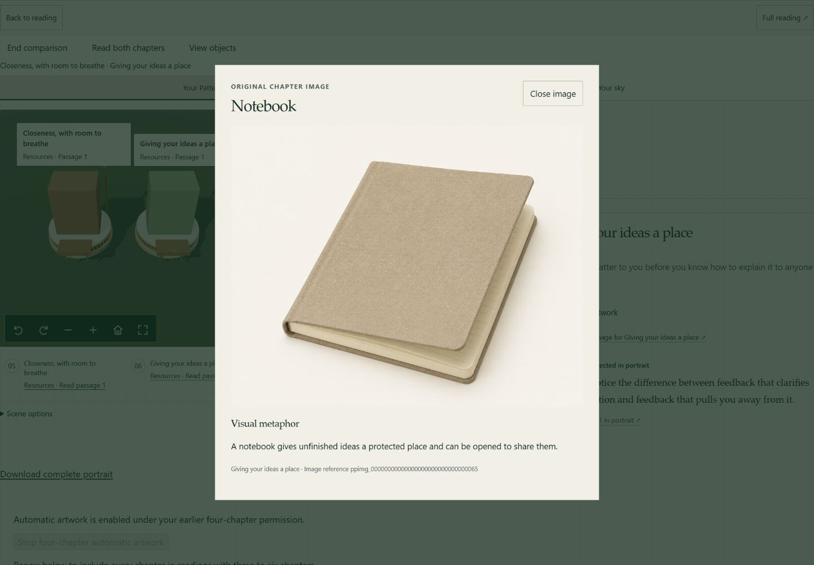
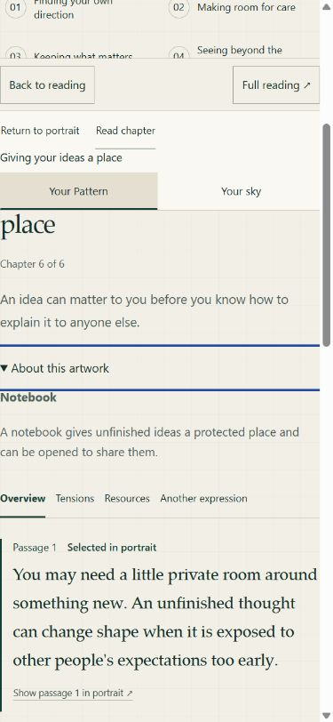

# Adaptive artwork v2: local implementation evidence

September 11, 2026. Verification base: local `main` at `59404a26ee8140ce0125acd06ef49493195c473b`. The implementation was checked locally before publication. Existing Dockerfile edits and earlier review outputs were preserved.

## Delivered behavior

V2 creates an image for every chapter in a supported three-, four-, five-, or six-chapter Pattern. Explicit automation permission also creates a model for every chapter. The reserved count, chapter identity, source and revision stay bound through claims, completion, progress and complete downloads. V1 artwork and clients retain their existing format. Earlier four-chapter permission requires explicit renewal for adaptive generation.

The Observatory now offers a named image action for either compared chapter, exposes **About this artwork** beside the reading, explains stations and courtyard at entry, and removes the fixed four-chapter sky sentence.

## Verification

- All workspace TypeScript checks passed on Node 22.23.2.
- The full workspace build passed, including the production Worker dry run. The final API edits also passed a fresh production dry run; neither command deployed.
- Final image, mesh and GLB API tests: **70/70**. They include counts 3/4/5/6, compatibility, malformed completion, consent and source fences, private downloads, and completion or recovery with new generation disabled.
- Broad API suite: **153 files, 2,685 tests passed**, followed by the separate compatibility test passing **1/1** and all **36** operator-script tests passing.
- New v2 schema fixtures, policy checks and both OpenAPI documents passed. Populated migration tests: **7/7**; local D1 setup exercised all 33 migrations and the populated forward upgrade.
- Shared portrait tests: **18/18**. Focused runner image, mesh, compiler, preview and scheduler tests: **112/112**. The frozen v1 graph fingerprint and v1 contract files were preserved.
- Web suite: **891/894** initially passed. The three failures expected no artwork lookup for non-four-chapter readings, an expectation intentionally replaced by v2. After updating that assertion to require one v2 read and retain the GET-only check, all **4/4** connected-reading cases passed. The other 60 files were unchanged by this test correction.
- The final repository run exercised all **894** web tests and reported four timing failures in the Explorer and scene runtime suites under default parallelism. Both affected files then passed a focused rerun: **102/102**, using `--maxWorkers=2 --testTimeout=15000`. No runtime assertions were weakened.

The broader repository gate is not green. Shared tests include one unrelated runtime-health CLI exit-code failure; the runner suite passed 171/179, with remaining text-runner, installed-artifact and canary failures. The content lane passed 44/79 and failed on corpus evidence hashes, Windows path checks and release-fixture setup. Full contract validation reported 30 existing M7 fixture byte/hash mismatches. Spec renderer checks passed 4/5, with a committed-artifact reproducibility mismatch; both migration smoke scripts passed. These failures were recorded without changing unrelated implementations or weakening the gates.

## Browser evidence

The browser used the real account Observatory with fictional v2 responses, existing sample images and synthetic compiled models. It did not use an account or call an image provider. Last-chapter images opened at counts 3, 4, 5 and 6. Comparison could inspect chapters five and six independently; Escape restored the named image action and retained Resources and comparison state. The three-chapter sky used the corrected sentence. Fictional automation renewal updated the displayed permission.

Desktop viewport: 1440 × 1000. Phone viewport: 390 × 844; document width was 375 pixels, with no horizontal overflow in the checked reading. The artwork disclosure worked by keyboard. No errors appeared in the checked browser console. This is not a physical-device or complete accessibility audit.

New adaptive admission remains **off** in configuration. Migration 0033, runner installation, production generation, live provider quality and production behavior have not been deployed or verified. Follow `docs/deploy/adaptive-portrait-artwork.md` and obtain the required merge-gate evidence before release.
